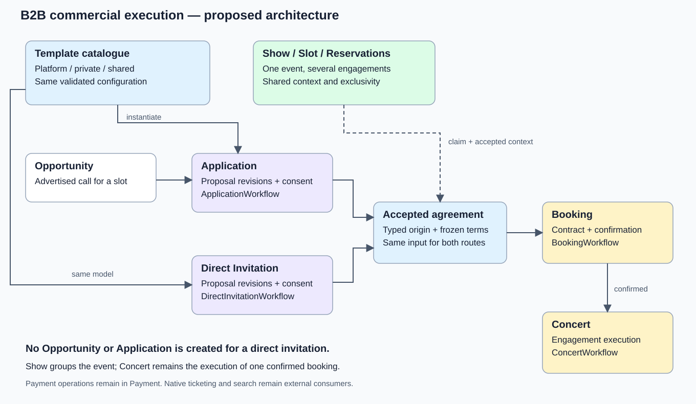
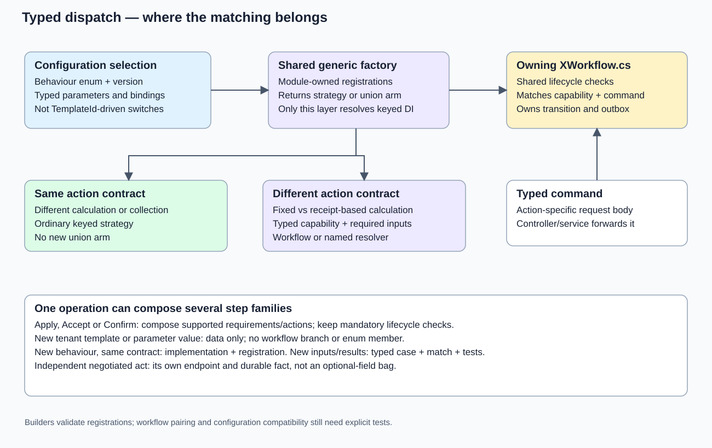

# B2B commercial execution: architecture and coordinated delivery plan

Status: **PostgreSQL persistence architecture approved on 9 September 2026 after independent source-based review: relational composition and typed references, bounded TPH families and immutable JSONB snapshots. AgreementSnapshot is the agreed immutable DTO name. Concrete provider/model and remaining executable-contract qualification are still required. This checkpoint authorises plan reconciliation, not application implementation or migration execution.**

This is the B2B-owned successor to the direct-offers draft, not a second plan running alongside it.
It covers B2B commercial configuration, templates, both booking entry paths, event/resource context and
the B2B PostgreSQL migration. Shared-package changes and foreign contract consumers are dependencies.
It does not own Payment, Customer, Search or Auth implementation or provider migrations.

Next action: [the progress ledger](COMMERCIAL_EXECUTION_PROGRESS.md#next-steps).

For the concrete entry-flow approval review, start with [section 16](#16-entry-workflow-approval-walkthrough).
For the wider architecture, read the [configuration and entity sketches](#keep-lifecycle-sections-make-their-connections-explicit),
[factory and capability matching](#matching-belongs-in-the-owning-workflow),
[operation catalogue and Application flow](#the-operation-catalogue-and-owned-facts), and
[existing-code migration map](#source-to-target-migration-of-existing-responsibilities).

## Read this first

Deal remains the concrete, editable commercial arrangement. Every Deal has a Template and supplies its
own negotiated commercial values; the Template is the reusable configured capability composition.
Its configuration is organised by reusable workflow configurations and typed configured steps, not a
second configuration body on Deal. Modules own lifecycle prerequisites and their enforcement; the
template does not author another lifecycle requirement graph. Section 3 records the current structure.
Application and Direct Invitation negotiate independently and hand one immutable accepted agreement
shape to Booking. Each lifecycle retains its own orchestration and typed capability matching.
Show groups the event and its engagements; it does not replace PR633's per-booking Concert lifecycle.

**A new template is usually data. A new capability implementation is code. A new legitimate action
contract may earn a keyed-union arm. These are three different kinds of change.**

The entity names and contracts below are proposed target names, not claims that they already exist.
"Agreed" means explicitly established in the conversation or current product decisions. "Recommended"
means the design proposed here. Sections marked "Decision" must not be treated as approved by merely
reading this plan.

D29 now records Tommy's acceptance of the independent PostgreSQL recommendation and the concrete
persistence design in section 7. D30 retains Deal's configuration ownership and each module's runtime
workflow/guard/implementation ownership. D23-D27 remain agreed; D28 and the identified commercial
policy gates remain open. The target is relational composition with bounded TPH typed families and
immutable JSONB AgreementSnapshot/ProposalSnapshot values. No provider-dependent interim is needed.
The original workstream retains this plan and its sole progress ledger; the approval authorises this
documentation reconciliation, not runtime implementation or a second planning owner.

Section 3 owns the entity relationships; section 7 owns physical mappings, constraints, DTO/request
shapes, ownership/version rules, loading, worked cases and retained-data migration. Section 16 consumes
those snapshot boundaries. Its remaining replay/authority and executable input/result contracts still
need qualification, including the older null-forgiving/replay collaborator excerpts. Architecture
approval is not evidence that those snippets compile or that all product decisions are resolved.

### Contents

1. [Authority, baseline and established constraints](#1-authority-baseline-and-established-constraints)
2. [The architecture at a glance](#2-the-architecture-at-a-glance)
3. [Configurations, templates and capability identities](#3-configurations-templates-and-capability-identities)
4. [Where keyed strategies and keyed unions earn their place](#4-where-keyed-strategies-and-keyed-unions-earn-their-place)
5. [Proposed entities and database ownership](#5-proposed-entities-and-database-ownership)
6. [Acceptance, reservations and the common Booking input](#6-acceptance-reservations-and-the-common-booking-input)
7. [Catalogue ownership, authoring and execution efficiency](#7-catalogue-ownership-authoring-and-execution-efficiency)
8. [Validity, amendments and recovery](#8-validity-amendments-and-recovery)
9. [Financial scenarios and missing capabilities](#9-financial-scenarios-and-missing-capabilities)
10. [B2B PostgreSQL migration](#10-b2b-postgresql-migration)
11. [Contracts, consumers and service boundaries](#11-contracts-consumers-and-service-boundaries)
12. [Coherent delivery slices](#12-coherent-delivery-slices)
13. [Verification and observable completion](#13-verification-and-observable-completion)
14. [Decisions for review](#14-decisions-for-review)
15. [Evidence and existing-owner reconciliation](#15-evidence-and-existing-owner-reconciliation)
16. [Entry workflow approval walkthrough](#16-entry-workflow-approval-walkthrough)

## 1. Authority, baseline and established constraints

### Source authority

The implementation baseline is the monorepo's merged B2B source, not the older extracted B2B checkout:

| Evidence | Inspected identity | Consequence |
|---|---|---|
| PR633 | Merge 516f4cc25936289744babef3f98b1a297035fbb6 | Opportunity/Application/Booking/Concert ownership is established, not work to reinvent |
| Initial investigation baseline | ed5c0fce602fc6a2e9aaa65cfe74970c51dc7c90 | Includes subsequent Application contract packaging and confirmed-term polymorphic serialization |
| Authoring refresh | f72431d7b6800b72f855706cd7fa1469681406de | PR947 adds owner-local migration/setup tooling; no lifecycle runtime change relative to the investigation baseline |
| Discussion refresh | 3826320d1cd171705dffe1a74340e62b9a1e14c2 | Later host/package/CI changes inspected; Application/Booking/Concert/Deal runtime source remains unchanged from the authoring refresh |
| Entry-contract refresh | ef8d505fdb0133d8b967d58634022192169e90e1 | Comparison from 3826320d changes startup-test/CI guidance and package pins, not the inspected entry/Booking/Deal runtime files |
| Union/version clarification refresh | 5b367c5a4e3d63d1fcc185379adff90db35e03da | Checked 9 September: subsequent hosting, package, test and extraction changes do not change the inspected lifecycle contracts or keyed builder; B2B already pins Dunet 1.16.2 and uses it for ConfirmedBookingTerms |
| Independent design discussion refresh | 64b3dccec2c48bf1327ce93f229a6628ccf1c325 | Previously inspected during this discussion: PR951 changes Payment reconciliation, not the four B2B financial formulas; the later comparison from 2df4105989ce462644cc9bc764138aeb0ecc958d changes package pins only. This planning checkout is not automatically current runtime source |
| Independent PostgreSQL review, 9 September 2026 | Monorepo a7323c3617e65d539f92160fa17623cdb3ef4835; local comparison base 5ad10d72763695eba12327aa5e1703ea44188885 | Fresh source/PR633 comparison found later hosting/package and confirmed-booking serialization changes; no change to the inspected Deal mapping, financial formulas or keyed builders. The final successor delta adds architecture tests, not B2B runtime changes |
| Extracted Concertable/b2b main, rechecked during review | fded052cdbf6f0f4c8f55ef7414c13ffc19ab33c | Still older than PR633 at the independent review; monorepo source remained authoritative. Requalify ownership/tips before delivery |
| Concertable/docs main | 99ad353b9cb26921ad8914e0f1449202574e330e | Includes docs PR11; no newer remote docs found during authoring |
| Organiser research, not merged policy | Docs/Organiser-Commercial-Research at 5ac4048a6f4145f1e8f22d1e043aff33da47ba3f | Sixteen scenarios and five worked arrangements inform the design; demand, funding permissions and disputed-outcome authority remain unproven |

The independent review verified PR633's merge identity and the empty B2B runtime diff from that commit
to planning HEAD b7af7d697499f8ef49779cc8089e8b9c01231fab. It separately inspected the current monorepo
and extracted-repository tips above; the planning checkout is not automatically runtime authority.
The subsequent documentation reconciliation rechecked the same clean owner branch/worktree and no
owning PR. Source links and first-party provider evidence in sections 7 and 15 preserve the basis of
the decision; no new market research or current product-policy approval is implied.

The plan lives inside the authoritative B2B subtree so it travels with B2B when extraction is qualified.
Before every delivery slice, re-resolve which repository/branch owns its current source and published
contracts. This plan is not permission to overwrite the retained B2B repository with an older snapshot.

### Established direction

- Opportunity -> Application -> Booking -> Concert.
- Direct Invitation -> Booking -> Concert.
- Applications and invitations own their acceptance/counteroffer histories. No synthetic Opportunity
  or Application is created to support an invitation.
- Stages own workflows when they have orchestration to perform. Behavioural variation selects reusable
  capabilities; genuinely different contracts use discriminated types.
- Configurable commercial execution is the selected direction. B2B comes first; external ticketing
  remains a workable route. Future discovery/native ticketing is not discarded.
- Mixing and matching semantically compatible capabilities is the objective, including within an
  operation. Restrictions must describe real dependencies, not recreate whole-deal preset bundles.
- One coordinated architecture may require multiple coherent PRs and producer/consumer gates.
- PostgreSQL is a prerequisite baseline for the deal-configuration refactor, as Tommy explicitly
  clarified. The earlier provider-migration material is dependency/cutover context, not permission to
  implement PostgreSQL now or choose SQL Server as this refactor's target.
- Planning is authorised. Application changes, migration execution, deployment and data destruction are not.

Durable product ownership remains in [SYSTEM](https://github.com/Concertable/docs/blob/main/SYSTEM.md),
[configurable workflows](https://github.com/Concertable/docs/blob/main/product/CONFIGURABLE_DEAL_WORKFLOWS.md),
[booking and settlement](https://github.com/Concertable/docs/blob/main/product/BOOKING_AND_SETTLEMENT.md)
and [accounts and operations](https://github.com/Concertable/docs/blob/main/product/ACCOUNTS_AND_OPERATIONS.md).
This plan applies those decisions to B2B; it is not a replacement product specification.

## 2. The architecture at a glance

The diagram's central relationship is:

~~~text
                              Show
                     /          |          \
                 venue hire  headliner    support
                     |          |          |
                  BookingSlot / resource claims
                     ^                     ^
                     |                     |
               Opportunity          Direct Invitation
                     |
                Application
                     \                     /
                       accepted agreement
                               |
                            Booking
                               |
                            Concert
~~~

This is a relationship diagram, not an additional mandatory linear lifecycle.
A person starting with "invite an artist" can create the real Show/Slot context in the same interaction;
there is no need to force them through a separate show-planning wizard.

### Ownership inside B2B

| Owner | Target responsibility |
|---|---|
| Tenant | Legal business, memberships, business capabilities, explicit representation grants and configurable defaults |
| Venue | Venue business profile, premises and rooms |
| Artist | Artist/performer profile and its stable resource identity |
| Show, new module | Show, assigned spaces, booking slots, slot claims, resource reservations and shared revenue/cost evidence |
| Opportunity | Advertised call for one slot, eligibility, visibility and open/filled/withdrawn lifecycle |
| Application | Artist-originated negotiation and consent for an opportunity |
| DirectInvitation, new module | Addressed negotiation and consent without an opportunity/application |
| Deal | Concrete commercial arrangements and negotiated values; reusable workflow-scoped Templates and composition validation against module-published configuration contracts |
| Booking | Accepted origin and contract revisions; confirmation/cancellation before handoff; booking-stage actions |
| Concert | Operational execution after confirmation, completion/cancellation, settlement and concert-stage actions |

"Deal" continues to mean the commercial arrangement, not an empty catalogue wrapper or the owner of every lifecycle.
Callable capabilities, implementations and registrations remain in the module executing the action.
The factory machinery is shared and generic; a central descriptive catalogue must not become a
cross-module service locator.

Concert remains the execution of one confirmed commercial engagement. A Show can group several Concerts.
Venue hire must not invent an artist account to fit the old pair of columns. The target execution has a
typed subject (performance or venue hire), explicit parties and supply direction. Whether the user-facing
word for a non-performance Concert should be "engagement" is an open naming decision, not a reason to
move PR633's orchestration back into Deal or Show.

## 3. Configurations, templates and capability identities

### Agreed Deal and Template design

**D29/D30: the logical structure below and section 7's relational/TPH/snapshot architecture are
approved. The excerpts still require compiled EF/Npgsql and database qualification.** Deal owns the concrete arrangement and its required Template relationship; modules own executable
workflows. Terms is the selected commercial noun. WorkflowConfiguration and StepConfiguration distinguish
stored selections from running workflows/steps. The sketches omit Entity/Definition suffixes and
redundant Template prefixes; this is not authorisation for a repository-wide naming refactor.

The central boundary is:

| Concept | Owns | Does not own |
|---|---|---|
| Deal | One concrete commercial arrangement: identity, tenant authorship, required Template and actual negotiated commercial values | Another copy of the editable template composition; every lifecycle or its executions |
| DealTemplate | A reusable composition selecting workflow configurations and typed commercial-term declarations | Every customer's negotiated amounts; exclusive ownership of every reusable workflow; executable services |
| WorkflowConfiguration | One identified, reusable configuration for a supported workflow kind, containing typed configured steps | A runtime workflow/state machine; an exclusive TemplateId; actual deal values |
| Term | Named, typed negotiable input and its constraints; shared declaration identity in the current logical model | A particular deal's amount or percentage; an executable step argument object |
| Issued proposal | Entry-owned immutable offer document, context and exact consent target | A live view of Deal or current template metadata |
| Accepted agreement | Booking-owned immutable accepted document and acceptance evidence | A dependency on the latest template or mutable offer |
| Step execution | Executing module's durable action identity, pinned behaviour, prepared inputs, result and progress | Another provider financial ledger; a fresh charge identity for every attempt |

Every Deal has a required Template. Multiple Deals can use the same Template: this is many-to-one, not
one-to-one. The navigation is named Template, not TemplateReference. There is no second required
Deal.Configuration body, optional-template fallback, shared Configuration root or mandatory
DealTemplateRevision entity in this initial model.

Deal is not an empty wrapper. For example, two arrangements can both use Flat Fee while one offers
GBP 500 and another GBP 900. Editing or negotiating those amounts belongs to their respective deals,
not the shared template. The target must retain existing commercial metadata such as PaymentMethod
with its current meaning until its exact placement is qualified; this refactor does not discard it.

### Commercial declarations and actual values

Use Term for a declaration and DealTerm for the value supplied by a concrete deal. Initial primitive
shapes discussed are MoneyTerm/PercentageTerm and MoneyDealTerm/PercentageDealTerm. These are not
FlatFeeTerms/VenueHireTerms/VersusTerms entity subtypes for every possible commercial combination.
Keep Parameters, CommercialTerm, DealParameterValueEntity and blanket Definition suffixes out of the
selected naming. Typed executable argument records are a separate boundary from persisted terms.

| Place | Flat Fee example |
|---|---|
| Term selected by the template | Fee is required Money, with supported currency and positive-amount constraints |
| Deal's actual commercial value | Fee = GBP 500 |
| FixedCalculationConfiguration.Fee | Named reference to the required MoneyTerm declaration |
| Server-prepared executable request | Validated payer, payee, amount, operation identity and other inputs needed by that interface |

The first row declares what can be negotiated; the second supplies a particular agreement's value.
They are not two definitions of the deal. The working relational model gives declarations an identity
and stores one typed value per (DealId, TermId); section 7 selects the bounded TPH mappings and constraints.
A second fee creates another MoneyTerm identity and value, not another primitive type or whole-deal
subclass. The same term identity within a deal means the same negotiated input; equal labels or equal
amounts do not make different term identities interchangeable.

Workflow reuse requires correcting the earlier template-exclusive term ownership too. In the current
logical model, Term has no exclusive TemplateId: templates select shared immutable declarations, and
configured steps refer to those same declarations. Actual DealTerm values remain deal-owned. Every
referenced term must belong to the template's selected declaration set, have the required type and be
usable by the selected workflow. Section 7 defines discriminator-aware FKs, shared-declaration ownership
and membership checks together; provider compilation and invalid-row tests must qualify their implementation.

A suggested default, if admitted, is an authoring convenience copied when creating the deal; it is
never a live fallback that changes existing values when a template default changes. A configured
constant or a step-output connection is also different from an editable economic term. Do not bury
another independently editable copy of Fee in each workflow's settings.

### Keep lifecycle sections, make their connections explicit

The selected grouping preserves workflow hierarchy while allowing shared configurations:

~~~text
Deal
+-- Template -> DealTemplate
+-- Terms (actual DealTerm values)
    +-- Fee = GBP 500

DealTemplate
+-- Terms -> shared Term declarations
|   +-- Fee: Money, required, positive
+-- Workflows -> reusable WorkflowConfiguration records
    +-- Application
    |   +-- Steps
    |       +-- PaymentMethod: Authorise@1
    |           +-- Typed amount source -> Fee
    +-- DirectInvitation
    |   +-- Its own configured steps
    +-- Booking
    |   +-- Steps for confirmation/cancellation
    +-- Concert
        +-- Steps for completion/cancellation
~~~

This is the logical template shape, not four concurrently executing workflow instances. Application and
Direct Invitation remain alternatives; one concrete negotiation follows one entry route and converges
into Booking. A template may support both routes. Opportunity publication, Show/resource management
and other modules do not automatically become template sections merely because they have workflows.

The concrete logical relationships to carry forward are:

| Relationship | Cardinality / content | Important distinction |
|---|---|---|
| Deal -> DealTemplate | Required many-to-one; Deal.TemplateId and Template navigation | Deal stores its values, not a duplicate configuration body |
| DealTemplate <-> WorkflowConfiguration | Many-to-many; association table containing TemplateId and WorkflowId | Remove the earlier exclusive WorkflowConfiguration.TemplateId |
| WorkflowConfiguration -> StepConfiguration | One-to-many; StepConfiguration.WorkflowId | Reusing a workflow reuses its contained configuration; no separate step-library aggregate is required initially |
| DealTemplate <-> Term | Many-to-many; selected declaration membership | Shared declarations have no exclusive TemplateId in this working model |
| Typed step -> typed Term | Named references such as Fee/Guarantee -> MoneyTerm and Share -> PercentageTerm | Not a generic argument bag or a copied deal value |
| Deal -> DealTerm -> Term | Deal owns multiple typed values; one value per (DealId, TermId) | Values must match selected declarations, primitive types and constraints |

These are logical entities/relationships, not a claim that every C# inheritance level needs a table.
Association tables need not gain standalone C# join classes unless they have real additional data or
constraints. Validate one supported workflow configuration per kind within a template, duplicate business
identities and all term membership/type requirements; a HashSet or a simple pair-of-IDs join does not
enforce those invariants by itself. Shared configuration is reusable only where its complete selections
and declared inputs are compatible. It is not a generic workflow silently rebound to unrelated inputs.

TemplateOperationEntity, OperationStepEntity, generic StepInputBindingEntity/InputBindings and a
template-authored RequirementEntity lifecycle graph are withdrawn from the initial model. The earlier
generic WorkflowPoint field is not part of the current base-step shape. Named typed term references
replace the generic argument-table sketch. Module-published configuration contracts own the valid timing
and prerequisites; template authors cannot independently move or remove mandatory guards.
Apply, Accept, Checkout, Confirm, Complete and Cancel are workflow actions, not evidence that every method
needs another entity or factory family. Fixed workflow code owns orchestration and mandatory transitions.
For example, selecting Authorise@1 entails its module-defined usable-authorisation requirement before
Accept; there is no separately editable BeforeAccept requirement row. Booking may consume the resulting
persisted commitment without owning or duplicating the entry workflow. Future typed step-output references
or calculation composition require an explicit supported input/output contract; they are not approval for
an arbitrary data-authored control-flow graph. Their exact schema is not yet agreed.

Within the owning module, use normal EF relationships and FK constraints. Collections use `IReadOnlySet<T>`
backed by `HashSet<T>` with `ReferenceEqualityComparer.Instance`. A set expresses unordered membership, not
execution order, business-key uniqueness or deep immutability. Enforce uniqueness in the domain/database
and preserve explicit order where behaviour requires it. Final constraints and validation must reject
incompatible term membership, duplicate identities and invalid source alternatives.

`ImmutableArray<T>` remains a suitable choice for immutable DTO/value collections and issued/accepted
document snapshots. It is complementary to the EF navigation shape, not replaced by `IReadOnlySet<T>`:
entities use supported mutable backing collections for EF, while snapshot mapping produces immutable
values rather than retaining tracked entity references. `ImmutableArray<T>` does not make mutable element
objects or database rows immutable; seal persistence separately and qualify serializer round-trips.
Preserve explicit execution order where relevant, and canonicalise unordered members before hashing
an agreement rather than treating HashSet enumeration order as stable.

### Concrete typed relationship members

The following consolidates the members discussed, without choosing TPH, TPT, TPC or JSONB. Constructors,
mutation/publication methods, validation, access metadata and aggregate concurrency are intentionally not
shown; none is waived. Guid is the proposed identity for new definition records; the existing Deal int Id
is retained. No migration or compiled EF model has qualified this sketch.

~~~csharp
internal sealed class Deal
{
    private readonly HashSet<DealTerm> terms = new(ReferenceEqualityComparer.Instance);

    public int Id { get; private set; }
    public Guid TenantId { get; private set; }
    public Guid TemplateId { get; private set; }
    public DealTemplate Template { get; private set; } = null!;
    public PaymentMethod PaymentMethod { get; private set; }
    public uint EditToken { get; private set; }
    public IReadOnlySet<DealTerm> Terms => this.terms;
}

internal sealed class DealTemplate
{
    private readonly HashSet<Term> terms = new(ReferenceEqualityComparer.Instance);
    private readonly HashSet<WorkflowConfiguration> workflows = new(ReferenceEqualityComparer.Instance);

    public Guid Id { get; private set; }
    public IReadOnlySet<Term> Terms => this.terms;
    public IReadOnlySet<WorkflowConfiguration> Workflows => this.workflows;
}

internal sealed class WorkflowConfiguration
{
    private readonly HashSet<StepConfiguration> steps = new(ReferenceEqualityComparer.Instance);

    public Guid Id { get; private set; }
    public WorkflowKind Kind { get; private set; }
    public int ContractVersion { get; private set; } = 1;
    public IReadOnlySet<StepConfiguration> Steps => this.steps;
}

internal abstract class Term
{
    public Guid Id { get; private set; }
    public TermKind Kind { get; private set; }
    public string Name { get; private set; } = null!;
}

internal sealed class MoneyTerm : Term
{
    public string Currency { get; private set; } = null!;
    public decimal Minimum { get; private set; }
    public bool MinimumInclusive { get; private set; }
}

internal sealed class PercentageTerm : Term
{
    public decimal Minimum { get; private set; }
    public decimal Maximum { get; private set; }
}

internal abstract class DealTerm
{
    public int DealId { get; private set; }
    public Deal Deal { get; private set; } = null!;
    public Guid TermId { get; private set; }
    public TermKind Kind { get; private set; }
    public Term Term { get; private set; } = null!;
}

internal sealed class MoneyDealTerm : DealTerm
{
    public decimal Amount { get; private set; }
    public string Currency { get; private set; } = null!;
}

internal sealed class PercentageDealTerm : DealTerm
{
    public decimal Percentage { get; private set; }
}

internal abstract class StepConfiguration
{
    public Guid Id { get; private set; }
    public Guid WorkflowId { get; private set; }
    public WorkflowConfiguration Workflow { get; private set; } = null!;
    public int Version { get; private set; } = 1;
}

internal abstract class CalculationConfiguration : StepConfiguration
{
    public CalculationBehaviour Behaviour { get; private set; }
    public BehaviourKey<CalculationBehaviour> Key => new(this.Behaviour, this.Version);
}

internal sealed class FixedCalculationConfiguration : CalculationConfiguration
{
    public Guid FeeId { get; private set; }
    public MoneyTerm Fee { get; private set; } = null!;
}

internal sealed class RevenueShareCalculationConfiguration : CalculationConfiguration
{
    public Guid ShareId { get; private set; }
    public PercentageTerm Share { get; private set; } = null!;
    public RevenueBasis Basis { get; private set; }
}

internal sealed class GuaranteeShareCalculationConfiguration : CalculationConfiguration
{
    public Guid GuaranteeId { get; private set; }
    public MoneyTerm Guarantee { get; private set; } = null!;
    public Guid ShareId { get; private set; }
    public PercentageTerm Share { get; private set; } = null!;
    public RevenueBasis Basis { get; private set; }
}
~~~

Ownership and inheritance are different relationships. WorkflowConfiguration.Steps contains a concrete
FixedCalculationConfiguration instance. StepConfiguration -> CalculationConfiguration ->
FixedCalculationConfiguration are inheritance levels of that same object, not three nested configuration
objects. The template does not store the negotiated amount in FixedCalculationConfiguration.Fee.

CalculationBehaviour/Basis and WorkflowKind are typed contract vocabulary; final enum members, supported
combinations and persistence encoding must be qualified against the module registrations and current
semantics. The family key is typed, not a general int/string chosen by the client. Use Version, not
ImplementationVersion, for the persisted executable selection: it defaults to exactly 1 and is not an
edit counter. A configuration edit token, document schema version and immutable identity serve different
purposes and must not be conflated with it.

The named property proves the intended C# relationship type; it does not prove that any persisted GUID
targets the correct subtype. Validate both write and load/preparation boundaries and qualify actual FK,
discriminator, uniqueness and check-constraint enforcement for the selected provider/mapping. In particular,
a TPH FK to a base Terms table does not alone prove Money versus Percentage.

Preparation resolves those declarations against the selected Deal's values, validates them and produces
the exact input required by the callable case: FixedFeeTerms, RevenueShareTerms or GuaranteeShareTerms
in section 4's calculator proposal. One module registration must describe both the configuration/input
compatibility and executable case. The shared builders do not currently supply all that metadata; this
is an extension to qualify, not a second hand-maintained behaviour-to-input dictionary.

The full payment/preparation/collection/settlement/cancellation configuration subclasses have not been
specified or approved merely by showing the calculation family. Their named required inputs must be
designed with the same discipline. Additional fee/share combinations reuse supported input contracts;
genuinely new calculation composition needs a defined typed contract, not another whole-deal subtype.

### The hierarchy of available behaviour stays in code

Tommy's original hierarchy is retained:

~~~text
Workflow
+-- Step family, resolved through a shared factory
    +-- Capability interface
    |   +-- Implementation
    |   +-- Implementation
    +-- Another capability interface
        +-- Implementation

ApplicationWorkflow
+-- PaymentMethod family, using the shared union factory
    +-- IPaymentMethodSetupStep
    |   +-- SavePaymentMethodStep
    |   +-- VerifyPaymentMethodStep
    +-- IPaymentAuthorisationStep
        +-- AuthorisePaymentStep
~~~

A template stores selections from this hierarchy, not copies of all possible interfaces and
implementations. Several implementations sharing an honest interface use a strategy family; genuinely
different callable contracts use a union. One configured step selects one supported behaviour/version;
several configured steps may compose compatible responsibilities.

Preserve D19-D21 exactly: PaymentMethodStep is the runtime union; Save and Verify share its
PaymentMethod case and IPaymentMethodSetupStep, while Authorise uses PaymentAuthorisation and
IPaymentAuthorisationStep. `BehaviourKey<TBehaviour>` uses the family-specific enum and default Version = 1.
Omission means exactly 1, never latest; persist the effective version explicitly. Undefined enum values,
zero/default keys and unsupported pairs are rejected.

Both creation routes use the same shared `IKeyedStrategyFactory<TKey, TStrategy>` and
`IKeyedUnionFactory<TKey, TUnion>` abstractions and their validated builders. No bespoke per-family factory,
UseUnion database flag, factory/interface/implementation tables, reflection-based type names, parallel
handwritten registration map or second whole-deal engine is introduced. The existing enum-key builder
needs its already-planned direct composite-key support; this document does not claim that API exists today.

### DealEntity and DealDto remain data, not the execution engine

The DTO/request content below is the established boundary, not a final compiled wire contract:

| Boundary | Required content |
|---|---|
| Deal (current code: DealEntity) | Existing int Id; tenant ownership; required TemplateId/Template; typed DealTerm values; existing commercial metadata; aggregate concurrency protection |
| DealDto | Deal identity; selected Template identity/appropriate data-only template view; typed Money/Percentage term-value cases and expected edit token; no duplicate editable configuration body |
| Preset creation request | Selected permitted TemplateId and typed term values keyed by declaration identity; no client-chosen payer authority or executable classes |
| Future custom creation request | Supported workflow configurations/typed step selections and declared terms plus actual values; validate/create a private Template, then create an ordinary Deal against it |
| Issued/accepted document | Exact resolved composition, values, applicable context/parties and explicit supported versions, plus its document identity/hash |

Use immutable DTO/value collections such as ImmutableArray of immutable typed cases at these boundaries;
do not expose tracked EF objects or replace Money/Percentage with an object dictionary. Exact request type
names, serializers, schema versions, read/detail projections and error contracts still require review.

There is no nullable Template navigation on the custom route. A builder creates a private, initially
unlisted instance of the same Template type, not a CustomTemplate subtype or one shared catch-all Custom
row. Starting from a preset does not mutate that shared preset. Later making the custom template reusable
changes its catalogue availability/metadata; public publication and sharing remain separately authorised
future features. None of that builder UI is required for the initial four arrangements.

Template resolution occurs when creating/validating a deal and again when preparing its exact issued
proposal. Its immutable ProposalSnapshot, not a fresh live-template resolution, is the acceptance target.
Booking owns the frozen accepted authority; Concert consumes the immutable confirmed payload. These
ownership-handoff snapshots are deliberate historical facts, not competing editable configurations on Deal.

Deal and Template share the Deal module's persistence ownership under D30. Use their ordinary required
FK/navigation relationship; section 7 specifies the selected keys, value mappings and concurrency enforcement.
Executing modules consume published configuration views or immutable documents, not tracked WorkflowConfiguration
navigations into Deal's context. No second context owns or migrates these configuration tables.

### Editing, acceptance and retry examples

| Case | Behaviour |
|---|---|
| Choose Flat Fee and supply GBP 500 | Create a Deal using the Flat Fee Template and its own Fee value; no copied editable template composition |
| Negotiate GBP 650 before acceptance | Change the authorised draft deal/offer values and issue a new proposal revision; previous issued revisions and consents stay immutable. It is still Flat Fee, not custom |
| Share one workflow configuration between templates | Both reference the same sealed workflow and its contained typed steps. Deals keep separate values for the shared declarations; no per-template override mutates the shared workflow |
| Change selected capabilities or their connections | Create new affected sealed workflow/term identities and a different Template composition, reusing unchanged compatible records; revalidate the draft/proposal. A permitted draft updates its non-key TemplateId FK and replaces/revalidates values atomically while retaining DealId |
| Edit or retire a template after acceptance | Sealed composition is unchanged. A changed composition gets a new Template identity; retirement affects new selection, not the accepted document or its eligible executions |
| Build custom, then save for reuse | Create a private Template and an ordinary Deal; later expose that same sealed composition in the owner's reusable catalogue without publishing it publicly by implication |
| Retry partially completed finance | Resume the same durable step execution with its pinned behaviour/version, prepared inputs and business/payment operation ID; skip completed work and reconcile uncertainty before any new collection |

An advertised Deal is not a shared counteroffer scratchpad: drafting another party's offer requires the
appropriate author-owned editable state. A post-acceptance change requires the supported amendment/consent
path; editing a template or a mutable Deal cannot alter an accepted agreement.

Sealing is a real persistence invariant covering the entire template composition, not a private setter
or an IReadOnlySet promise. It includes shared WorkflowConfiguration, contained steps and referenced term
declarations. Published records cannot be edited in place through another template. Referenced definitions
cannot be cascade-deleted by removing one template; retirement affects future availability, not historical
authority. Reuse the existing lifecycle-seal owner's design where applicable. No mandatory TemplateRevision
or WorkflowRevision aggregate is selected merely to preserve the old composition.

For the discussed Versus example, the template selects a GuaranteeShareCalculationConfiguration with
GuaranteePlusShare@1, Guarantee -> MoneyTerm and Share -> PercentageTerm. A Deal supplies Guarantee =
GBP 500 and Share = 10%; preparation produces the typed calculation input plus the approved revenue basis.
The guarantee and percentage are not stored again inside the step. Changing GBP 500 to GBP 650 is value
negotiation; changing GuaranteePlusShare to HigherOfGuaranteeOrShare is a capability/semantics change and
is not the existing Versus preset. The latter behaviour remains a proposed extension, not a fifth initial
arrangement or permission to alter existing semantics.

Keep identities and versions purposeful:

| Field or identity | Reason |
|---|---|
| DealId | Identifies the concrete commercial arrangement while its permitted draft values evolve |
| TemplateId | Identifies one sealed composition; a changed composition uses a new identity |
| WorkflowConfigurationId | Identifies a reusable sealed workflow configuration independently of its selecting templates |
| Configured StepId and commercial declaration identity | Distinguish instances and bind exact inputs/results; not implementation selectors |
| `BehaviourKey<TBehaviour>.Version` | Pins executable semantics independently of template identity; default is 1 |
| Published workflow slot/checkpoint identity | Pins the meaning and timing of supported configuration points; incompatible changes need a distinct contract identity/version and outstanding-work handling |
| Proposal/contract identity and revision/hash | Identifies the exact offered/accepted document and what consent covers |
| Document schema version | Selects a qualified reader for a persisted/wire shape, not an implementation |
| Aggregate edit token | Detects stale edits across root and child changes; an EF row token on an unchanged root alone is insufficient |
| Step execution / business operation ID | Preserves one logical financial action across retries; attempt number is separate |

### Compatibility and deliberate workflow-configuration coupling

Typed contracts prevent a method-setup request from pretending to carry an amount-bearing authorisation,
and distinguish Money, Percentage and evidence-backed inputs. Persisted data still needs whole-composition
validation: source identity/type, supported behaviour/version, currency/party roles, reachable checkpoints,
cycles, result dependencies and compatible funding/settlement semantics. A saved method is not a captured
authorisation, and final unknown revenue is not an amount available for an earlier authorisation.

Several individually valid fees/guarantees/shares do not determine whether they are additive, alternatives
or advance credits. That meaning must be represented by supported capabilities and connections, otherwise
the composition is unavailable. Validation must also reject duplicate charging and incompatible crediting.
Mandatory authority, consent, reservation/exclusivity and lifecycle invariants are never optional steps.

**D30 is agreed: keep the explicit workflow hierarchy and its ownership in Deal.** The old DealType
model left implementation selection inside each consuming module. The new template stores those
selections against the modules' supported configuration points. Deal therefore becomes aware of that
configuration structure; do not claim that its former complete workflow ignorance is preserved.

This is deliberate standardisation of configurable behaviour. Participating modules share the
workflow-configuration/typed-step model and generic selection machinery, but need not have identical states,
actions, step families or internal implementations. A family may use a strategy or a union according to
its callable contracts. ApplicationWorkflow consumes the template's Application configuration;
BookingWorkflow consumes its Booking configuration. WorkflowConfiguration is stored configuration, not the
runtime workflow or another definition of its state machine.

| Authoritative module contract and implementation | Template-owned selection |
|---|---|
| Supported workflow configuration points and step families | Configured instances at those points |
| Callable interfaces, input/output types and allowed behaviour/version pairs | Selected typed behaviour/version and settings |
| Semantic restrictions and result availability | Named typed term references and supported data dependencies |
| Legal states, mandatory checks, transitions and placement of execution hooks | Selection only within published contracts; no independently authored lifecycle requirements or guard placement |

Templates must not reproduce complete handler sequences or transition tables. Removing the old
per-DealType selection matrix is part of the cutover; keeping it beside the template would create two
authorities. New presets using existing capabilities change template data, not module registrations.

The dependency boundary is:

~~~text
Host -> Deal infrastructure + lifecycle-module infrastructure
Deal + lifecycle modules -> data-only commercial configuration contracts
Lifecycle modules -> shared generic strategy/union factories
Deal -X-> lifecycle runtime assemblies or their DbContexts

Module-owned declaration -> runtime registrations
                         -> descriptive authoring/compatibility catalogue
Template + catalogue -> composition validation

ApplicationWorkflow -> Application configuration -> configured selection
                    -> shared closed-generic factory -> module-owned implementation
~~~

The module owns the meaning of its published configuration points even when their shared data vocabulary
lives in Deal.Contracts. The host composes module contributions into an immutable descriptive catalogue;
Deal validates against that catalogue, not by querying foreign contexts or locating workflow services.
Each module declaration supplies registrations and their descriptive projection. There is no separately
editable catalogue table or hand-maintained second mapping of behaviours to implementations.

The existing DI builders do not infer business meaning. Checkpoint timing, named inputs/outputs, result
availability and financial compatibility need explicit module-authored descriptors and enforcement tests.
For example, the Application section can select Authorise@1 with its typed amount source referring to Fee.
That module contract requires usable authorisation before Accept; template authors do not separately
configure that lifecycle guard. Checkout dispatches the configured step; Accept must check the required
persisted fact before state mutation or accepted handoff. An integration contract test must prove that a
missing, expired or otherwise unusable authorisation prevents acceptance and emits no accepted handoff.
Moving the check after acceptance must fail that test even when every DI registration remains valid.

Configuration points are a supported compatibility surface. Refactoring internal handlers must leave
templates unchanged. A new step family changes its owning module's published contract and implementation;
a new preset using supported families changes data only. Pinning Authorise@1 alone is insufficient if a
release moves its required checkpoint or changes execution order. Preserve the meaning of published
slots/checkpoints; incompatible changes need a distinct contract identity/version and explicit handling
of outstanding agreements and prepared execution. Section 7 pins WorkflowConfiguration.ContractVersion
separately from each behavior's Version; neither adds a mandatory template-revision entity or whole-deal engine.

The Payment/readiness/collection grouping proposed during discussion is not the selected replacement:
if it merely maps those names back to fixed module slots in code, it hides rather than removes the
workflow relationship. A separate composition module would preserve a narrower Deal, but would retain
the same workflow-contract coupling and introduce another ownership/consistency boundary. It is not
selected. Neither is a per-module-template plus meta-template design.

The accepted cost is a larger, stable configuration surface, semantic-validation work and less freedom
to change exposed workflow points incompatibly. The future builder is constrained to supported points
and compatible behaviours; it cannot redefine module lifecycles. Strong structure is required regardless
of which qualified leaf values use JSONB; untyped payloads do not provide this contract.

Section 7 now selects the physical PostgreSQL architecture, constraints and DTO/request/snapshot boundaries.
Remaining qualification includes the compiled mapping, complete executable family input/result contracts,
module descriptors and compatibility/version tests. The first four arrangements, separate entry routes
and frozen execution remain requirements. Implementation needs explicit authority.

## 4. Where keyed strategies and keyed unions earn their place

**Yes: the keyed union factory is valuable as requirements become more distinct, specifically when a shared
action acquires genuinely different required inputs or results. It is not necessary for each new template.**

| Change | Mechanism | New union arm? |
|---|---|---|
| Change £500 deposit to £750 | Typed configuration parameter | No |
| Reuse a receipt-approval policy in 100 tenant templates | Composition of existing capabilities | No |
| Select one of several calculators with the same input/output contract | Keyed strategy behind a named resolver | No |
| Calculate a fixed fee versus a receipt-based fee | Distinct typed calculation inputs behind a named resolver; union if the caller needs the heterogeneous capability family | A contract boundary, not a template boundary |
| Require an independently negotiated agent approval | Its own action/endpoint and durable approval fact | Not an excuse to add optional fields to Accept |
| Another signatory or a schedule selection | Model the actual independent act or genuinely changed input/result | Not required merely because a template is custom; neither is an assumed initial acceptance arm |

### Workflow, action, configured step, capability and implementation

| Level | Responsibility | Application example |
|---|---|---|
| Workflow | Owns lifecycle orchestration and transitions | ApplicationWorkflow |
| Workflow action | A business action, not automatically an entity or strategy interface | ApplyAsync or AcceptAsync |
| Configured steps | Selected responsibilities and named typed inputs at module-published configuration contracts | Entry payment preparation whose module-owned contract requires usable evidence before Accept |
| Step family | One independently varying responsibility inside the operation | Payment commitment preparation |
| Capability interface | Honest required inputs and result for that responsibility | IPaymentMethodSetupStep |
| Implementation | Compiled behaviour satisfying that interface | SavePaymentMethodStep or VerifyPaymentMethodStep |
| Execution instance | Durable progress for one configured action on one agreement | Advance collection action with its attempts |

An operation may compose several step families. One IConfirmStep implementation per combination of
funding, rider approval and timing would reproduce the whole-deal explosion below a different name.
Mandatory authorisation, current consent, exclusivity and idempotency cannot be removed by configuration.
Do not force every operation to have an artificial common step interface or a union.

At 3826320d the actual ApplicationWorkflow has ApplyAsync and AcceptAsync, but selects IApplyStep and
ICommitmentReferenceStep, not IAcceptStep. AcceptedApplication is one accepted snapshot, not a union.
The generic keyed-union infrastructure has no current lifecycle consumer; its retained capability is
not evidence that Apply or Accept needs a new union immediately.

Callable interfaces, runtime union types, implementations and registrations stay in the executing module.
Shared generic factories provide selection; they do not own the module's business operations.
Deal owns persisted composition and catalogue validation under D30; executing modules own the
supported configuration contracts and their implementations. This does not move implementations into Deal.
Keep that vocabulary data-only: no module entities, DbContexts, scoped services or imports of runtime
interfaces into definition contracts. Module declarations expose descriptive compatibility metadata
to validation; they do not expose a cross-module service locator. Qualify the concrete Contracts graph
against the agreed boundary before moving types so no Deal-to-Application-to-Deal assembly cycle is introduced.

The existing service-internal KeyedStrategies library remains the shared selection mechanism. Evolve
the DealType-bound DealStrategyFactory/DealUnionFactory wrappers into shared generic factories, rather
than adding a bespoke factory implementation for each family or retaining a second DealType engine.
Each workflow injects the closed generic factory for the family it consumes:

~~~csharp
public interface IKeyedStrategyFactory<TKey, TStrategy>
    where TKey : notnull
    where TStrategy : class
{
    TStrategy Create(TKey key);
}

public interface IKeyedUnionFactory<TKey, TUnion>
    where TKey : notnull
{
    TUnion Create(TKey key);
}
~~~

One shared implementation serves each mechanism. A different closed generic dependency is not another
hand-written factory class. Homogeneous contracts use the strategy factory; heterogeneous contracts use
the union factory. Workflows never inject IKeyedServiceProvider or reproduce keyed resolution themselves.
The shared library knows TKey, not Deal.Contracts; the typed definition keys are supplied by its consumers.
Section 4's versioning design specifies the bounded shared-builder changes needed for composite keys.
Neither customers nor templates register CLR implementations.

### Step names and the future acceptance union

ICommitmentReferenceStep is a source-code name, not a target step contract. Its entire callable contract
is PaymentOperationReference Resolve(ApplicationEntity). It resolves an identifier; it does not perform
Apply, Accept, method setup or amount authorisation. The target reads the immutable reference from the
owned commitment record. Do not retain a redundant resolver, rename it into an acceptance step, or make
it a union. References to the old name elsewhere in this plan identify the source being replaced.

For the proposed entry families, name the executable selection for its responsibility:

| Thing | Proposed name | Meaning |
|---|---|---|
| Acceptance operation | AcceptAsync | The workflow action, including mandatory shared checks and transition |
| Distinct acceptance contracts, if required | IAcceptXStep / IAcceptYStep | Placeholder names for genuinely different callable capabilities |
| Their union | AcceptStep | One selected executable capability, not an acceptance request or result |
| Its selection mechanism | Shared IKeyedUnionFactory closed over the actual acceptance key and AcceptStep | No bespoke acceptance factory; only needed once distinct acceptance contracts exist |
| Payment-preparation union | PaymentMethodStep | The payment-method setup or payment-authorisation capability in section 16.9 |
| Its factory dependency | `IKeyedUnionFactory<BehaviourKey<PaymentMethodBehaviour>, PaymentMethodStep>` | One use of the shared generic factory; unrelated to the former reference resolver |

If acceptance later earns distinct callable contracts, its Dunet declaration would be:

~~~csharp
[Dunet.Union(EnableImplicitConversions = false)]
internal abstract partial record AcceptStep
{
    public partial record X(IAcceptXStep Step);
    public partial record Y(IAcceptYStep Step);
}
~~~

X/Y are illustrative, not new approved behaviours to implement. Replace X/Y with
the actual responsibility when distinct contracts exist. A common IAcceptStep is appropriate when all
implementations share an honest invocation contract; it is not an artificial parent needed by the union.
Do not create a one-member acceptance enum or register a speculative acceptance family now.
Several implementations may inhabit IAcceptXStep without adding union cases. ApplicationWorkflow owns
the match on IAcceptXStep / IAcceptYStep and passes the corresponding required typed input. It does not
match on concrete implementation classes, template IDs or the former whole-deal DealType. With Dunet,
that match unwraps the case's Step property; native syntax may eventually match the contained interface.

The [Dunet documentation](https://github.com/domn1995/dunet), checked 9 September 2026, describes partial
record cases and generated matching. Interface-valued cases use explicit construction callbacks, as in
the existing keyed builder examples; do not depend on implicit conversions from interfaces. The B2B
source already uses Dunet 1.16.2 for ConfirmedBookingTerms, with explicit JSON discriminators. Qualify
generated matching and diagnostics against that pinned version; these sketches are not compilation proof.

The existing KeyedUnionBuilder<TKey, TUnion> leaves TUnion unconstrained, so a native struct union does
not itself require redesigning the builder or widening its enum key constraint. Registration callbacks
construct the native union instead of record wrappers; the shared generic factory still resolves keyed DI.
Keep the existing overlap check: an implementation must not satisfy two cases of the same family.
Qualify non-empty factory results and missing-case compiler diagnostics when adopting native syntax.
Changing the authoring representation alone does not change the persisted behaviour's semantics version.

Microsoft's [union reference](https://learn.microsoft.com/en-us/dotnet/csharp/language-reference/builtin-types/union)
and [C# 15 specification](https://github.com/dotnet/csharplang/blob/main/proposals/csharp-15.0/unions.md),
checked 8 September 2026, permit interface cases and matching on their contained values. This is a future
language-target illustration, not a claim that the current checkout compiles it or an SDK-upgrade task.
The union holds executable services; persisted configuration remains data and contains no such services.

### Matching belongs in the owning workflow

Controllers bind an action-specific request, invoke the application service and map the response.
Services expose reads and use cases; workflow methods own lifecycle transitions.
The shared generic factory returns the module's selected typed capability.
The owning workflow matches that capability with the typed command when invocation contracts differ,
and owns shared checks, state transitions and persistence/outbox boundaries. A named pure calculation
resolver owns calculation dispatch; callers do not repeat that match in every workflow.

For example, ApplicationWorkflow and DirectInvitationWorkflow each own their entry lifecycle.
BookingWorkflow owns confirmation/cancellation before confirmation; ConcertWorkflow owns downstream
execution. ShowWorkflow owns reservation/evidence lifecycle operations where orchestration is warranted.
There is no universal DealWorkflow switching over every action in every module.

The initial draft's standard-versus-schedule-selection acceptance example is superseded. The research
does not establish a need to choose a schedule during acceptance when the proposal already specifies it.
The following researched calculation family instead demonstrates the mechanism. These are proposed
types. Case/UseScoped/Build follow the existing builder; the explicit supported-key constructor and
composite-key support below are planned shared-infrastructure changes, not existing APIs.

~~~csharp
public enum CalculationBehaviour
{
    Fixed = 1,
    RevenueShare = 2,
    GuaranteePlusShare = 3,
    HigherOfGuaranteeOrShare = 4
}

internal interface IFixedFeeCalculator
{
    Money Calculate(FixedFeeTerms terms);
}

internal interface IRevenueShareCalculator
{
    Money Calculate(RevenueShareTerms terms, ApprovedRevenueBasis revenue);
}

internal interface IGuaranteeShareCalculator
{
    Money Calculate(GuaranteeShareTerms terms, ApprovedRevenueBasis revenue);
}

[Dunet.Union(EnableImplicitConversions = false)]
internal abstract partial record CalculationCapability
{
    public partial record Fixed(IFixedFeeCalculator Calculator);
    public partial record RevenueShare(IRevenueShareCalculator Calculator);
    public partial record GuaranteeShare(IGuaranteeShareCalculator Calculator);
}

var fixedFee = new BehaviourKey<CalculationBehaviour>(CalculationBehaviour.Fixed);
var revenueShare = new BehaviourKey<CalculationBehaviour>(CalculationBehaviour.RevenueShare);
var guaranteePlusShare = new BehaviourKey<CalculationBehaviour>(CalculationBehaviour.GuaranteePlusShare);
var higherOf = new BehaviourKey<CalculationBehaviour>(CalculationBehaviour.HigherOfGuaranteeOrShare);
var builder = new KeyedUnionBuilder<BehaviourKey<CalculationBehaviour>, CalculationCapability>(
    services, [fixedFee, revenueShare, guaranteePlusShare, higherOf]);

builder.Case<IFixedFeeCalculator>(calculator => new CalculationCapability.Fixed(calculator))
    .UseScoped<FixedFeeCalculator>(fixedFee);

builder.Case<IRevenueShareCalculator>(calculator => new CalculationCapability.RevenueShare(calculator))
    .UseScoped<RevenueShareCalculator>(revenueShare);

builder.Case<IGuaranteeShareCalculator>(calculator => new CalculationCapability.GuaranteeShare(calculator))
    .UseScoped<GuaranteePlusShareCalculator>(guaranteePlusShare)
    .UseScoped<HigherOfGuaranteeOrShareCalculator>(higherOf);

builder.Build();
~~~

Both guarantee/share implementations occupy the SAME capability case. The key chooses the implementation;
the case tells the caller which input contract it must satisfy. A new customer template changes neither.
GuaranteeShareTerms contains the guarantee, percentage and defined revenue basis. ApprovedRevenueBasis is
an internal fact tied to this contract/evidence revision, with its approved eligible amount and currency;
it is not a client assertion, raw import, optional context or unrestricted promoter P&L.

Fixed and revenue calculations have different required inputs. Higher-of versus additive calculations
can share the guarantee/share input contract. Preparation must prove that the approved basis matches the
configured basis; it cannot swap net receipts for gross merely because both contain Money.

CalculationBehaviour and BehaviourKey belong to the data-only definition vocabulary; the callable
interfaces and union remain runtime-owned. The resolver injects
`IKeyedUnionFactory<BehaviourKey<CalculationBehaviour>, CalculationCapability>`, with no dedicated factory
class. A definition-binding boundary resolves the typed terms and required facts, rejecting mismatches
before invocation. Its prepared inputs have explicit shapes:

~~~csharp
[Dunet.Union(EnableImplicitConversions = false)]
internal abstract partial record CalculationInput
{
    public partial record Fixed(FixedFeeTerms Terms);
    public partial record RevenueShare(
        RevenueShareTerms Terms, ApprovedRevenueBasis Revenue);
    public partial record GuaranteeShare(
        GuaranteeShareTerms Terms, ApprovedRevenueBasis Revenue);
}
~~~

CalculationInput is an internal invocation value, not another persisted configuration or a user request.
The binding operation returns a typed pending/rejection outcome if required evidence is unavailable.
No nullable receipt argument is added to fixed-fee calculation to manufacture a shared header.

Inside the named resolver, returning Result<Money, CalculateEntitlementError>, the match is:

~~~csharp
var capability = calculationFactory.Create(selection.Behaviour);

return (capability, input) switch
{
    (CalculationCapability.Fixed(var calculator), CalculationInput.Fixed(var terms)) =>
        calculator.Calculate(terms),
    (CalculationCapability.RevenueShare(var calculator), CalculationInput.RevenueShare(var terms, var revenue)) =>
        calculator.Calculate(terms, revenue),
    (CalculationCapability.GuaranteeShare(var calculator), CalculationInput.GuaranteeShare(var terms, var revenue)) =>
        calculator.Calculate(terms, revenue),
    _ => new CalculateEntitlementError.IncompatibleInput()
};
~~~

Here selection is the already validated calculation selection, input is the prepared union above, and
IncompatibleInput is the proposed operation-owned mismatch error. The supported semantics version must
already have been resolved by the factory boundary. These are separate branches, not three calculations
executed for one fee. Statement preparation freezes the selected definition, inputs and output afterward.
Explicit coverage tests must accompany the rejection arm: it prevents unsafe invocation but cannot prove
that a newly added valid combination was implemented.

Where a workflow itself needs different capability contracts, use the same factory/case mechanism there
and match with the action-specific command. A capability/command mismatch is a domain rejection, not a
fallback to another template. A URL, discriminator or action link never proves eligibility.

Use action links and typed request bodies for distinct actions, consistent with the existing checkout UI.
A wire discriminator mapping at the boundary is representation mapping, not duplicated business dispatch.
Do not create endpoints, switches or interfaces per template or per tenant.

The shared keyed-union builder already validates declared cases/coverage and lifetimes. It does not
automatically prove every capability/command pair is handled in a workflow, or validate JSON configuration
dependencies. Add explicit pairing/negative tests and composition checks for those separate obligations.
Do not promise a current C# compile-time guarantee supplied only by speculative future tooling.

### Typed behaviour keys, default version and shared selection

The agreed key is `BehaviourKey<TBehaviour>`: a readonly record struct containing a family-specific enum
and a positive semantics version. Omitting the version when supplying the behaviour means version 1.
Section 16.3 owns its declaration and PaymentMethodBehaviour's stable values. The key identifies an
execution contract, not a CLR class, deployment, template revision, configured requirement, operation
attempt or EF concurrency token.

~~~csharp
var verify = new BehaviourKey<PaymentMethodBehaviour>(PaymentMethodBehaviour.Verify);
var explicitVersionOne = new BehaviourKey<PaymentMethodBehaviour>(PaymentMethodBehaviour.Verify, 1);
var versionTwo = new BehaviourKey<PaymentMethodBehaviour>(PaymentMethodBehaviour.Verify, 2);
~~~

The first two keys are equal. The third is a different selection. Omission NEVER means latest, the only
registered implementation, or an automatically upgraded default after V2 ships. Version 1 therefore
needs no repeated argument or V1 class/namespace suffix during the initial implementation.

The behaviour-taking constructor's optional argument is not the all-default struct value.
`default(BehaviourKey<TBehaviour>)` and parameterless construction have zeroed fields and are invalid.
Reject undefined enum values, nonpositive/unsupported versions and definition/family mismatches at the
invariant boundary; no invalid selection receives a fallback implementation.

Persist the effective version explicitly before issuing, hashing or signing a configuration. If an API
permits an omitted version, its validated ingress normalises omission to 1 and tests that behaviour with
the pinned serializer. Do not assume C# optional parameters alone define JSON or EF materialisation.
Legacy documents missing a version require a schema-qualified mapping; corrupt or unknown versions do
not silently become 1. Keep persisted enum values stable and never reuse a retired numeric value.

These enums select reusable compiled behaviour, not whole deals or customer templates. Template IDs
remain ordinary IDs. A new template using existing behaviour changes no enum, registration or deployment.

#### When a version changes

| Change | Treatment |
|---|---|
| Refactoring, logging, provider SDK replacement with equivalent observable behaviour | Keep the key; replace the implementation after compatibility verification |
| Fix that restores the already documented contract | Normally keep the key; assess affected completed work separately and do not replay it automatically |
| Fee, percentage, due date, agreed mandate text or other supported commercial parameter changes | Change the typed configuration/proposal under the consent rules; not a code version per parameter value |
| Incompatible meaning, calculation, precondition or result interpretation for the same responsibility | Publish a new semantics version; existing issued/accepted work remains pinned unless explicitly resolved |
| A genuinely different responsibility offered alongside the old one | Give it a distinct behaviour identity and honest input/result contract; do not hide it as a cosmetic version bump |
| Dunet wrappers replaced by qualified native unions with the same wire and execution contracts | No semantics bump solely for changing C# representation |

An explicit numeric version is not mandatory in DI or EF. Immutable new identities for every incompatible
contract could also pin meaning. The selected design keeps a stable family enum value plus a version;
it makes compatibility explicit without another enum member for every incompatible generation.
Only incompatible changes need parallel executable revisions; routine releases do not accumulate copies.

#### One shared factory mechanism, with the composite key used directly

The existing builders/catalogue constrain TKey to struct, Enum and use Enum.GetValues/IsDefined for
validation. Direct composite keys therefore require a bounded change in the shared KeyedStrategies
infrastructure. This is now the chosen approach, superseding the earlier per-family adapter and separate
persisted-key-to-runtime-enum translation. Do not introduce bespoke family factories or binding dictionaries.

Generalise the shared factory/catalogue key to notnull and add an explicit supported-key set to the
builders. Preserve existing enum consumers' exhaustive coverage; composite-key consumers declare the exact
supported behaviour/version pairs. Do not infer a cartesian product of all enum members and all versions.
Each module's declarative registration source supplies the key, capability case, implementation and
compatibility metadata; authoring/validation and runtime registration consume projections of that source.
There is no second hand-maintained translation table and no loss of current composition checks.

The shared union factory keeps the existing selection algorithm; its key is no longer hard-coded to
DealType. This is the proposed shared implementation, not a family-specific factory:

~~~csharp
internal sealed class KeyedUnionFactory<TKey, TUnion> : IKeyedUnionFactory<TKey, TUnion>
    where TKey : notnull
{
    private readonly IKeyedServiceProvider services;
    private readonly KeyedUnionCatalog<TKey, TUnion> catalog;

    public KeyedUnionFactory(
        IKeyedServiceProvider services,
        KeyedUnionCatalog<TKey, TUnion> catalog)
    {
        this.services = services;
        this.catalog = catalog;
    }

    public TUnion Create(TKey key)
    {
        var caseType = this.catalog.GetCaseType(key);
        var implementation = this.services.GetRequiredKeyedService(caseType, key);
        return this.catalog.Create(key, implementation);
    }
}
~~~

The shared strategy counterpart resolves `GetRequiredKeyedService<TStrategy>(key)` directly. Both factories
are scoped, preserving scoped capability resolution; shared immutable catalogues describe supported keys.
Only this infrastructure uses keyed service resolution. Workflows inject the typed factory, not a service
provider, CLR type name or dictionary. A missing runtime binding is a composition invariant failure;
unsupported persisted selections must already have produced a typed rejection during preparation.

#### What a genuine future V1/V2 split changes

There is no identified second payment-verification contract to implement for launch. Initially register
VerifyPaymentMethodStep with the Verify key and its omitted version 1, as in section 16.9. Do not add
speculative V2 classes, .V1 namespaces everywhere, archived runtime loaders or PaymentMethodStep2 names.

If incompatible verification semantics later require coexistence, there are two actual leaf classes,
each implementing IPaymentMethodSetupStep. For Application, their full namespaces may be:

- Concertable.B2B.Application.Infrastructure.Strategies.PaymentMethodVerification.V1
- Concertable.B2B.Application.Infrastructure.Strategies.PaymentMethodVerification.V2

Each namespace contains VerifyPaymentMethodStep with its own StartAsync implementation. Group by
responsibility, then version; no generic Versioning bucket is needed. The original class may move into
V1 at that point without changing stored keys. Registration, not the namespace, determines the version.
Both leaves can share unchanged lower-level mechanics; the old leaf must still implement the old contract.

The following is a future registration example, conditional on real approved V1/V2 implementations.
It is not an instruction to invent those semantics now; the explicit supported-key constructor is new
shared infrastructure:

~~~csharp
var save = new BehaviourKey<PaymentMethodBehaviour>(PaymentMethodBehaviour.Save);
var verifyV1 = new BehaviourKey<PaymentMethodBehaviour>(PaymentMethodBehaviour.Verify);
var verifyV2 = new BehaviourKey<PaymentMethodBehaviour>(PaymentMethodBehaviour.Verify, 2);
var authorise = new BehaviourKey<PaymentMethodBehaviour>(PaymentMethodBehaviour.Authorise);
var builder = new KeyedUnionBuilder<BehaviourKey<PaymentMethodBehaviour>, PaymentMethodStep>(
    services, [save, verifyV1, verifyV2, authorise]);

builder.Case<IPaymentMethodSetupStep>(step => new PaymentMethodStep.PaymentMethod(step))
    .UseScoped<SavePaymentMethodStep>(save)
    .UseScoped<PaymentMethodVerification.V1.VerifyPaymentMethodStep>(verifyV1)
    .UseScoped<PaymentMethodVerification.V2.VerifyPaymentMethodStep>(verifyV2);

builder.Case<IPaymentAuthorisationStep>(step => new PaymentMethodStep.PaymentAuthorisation(step))
    .UseScoped<AuthorisePaymentStep>(authorise);

builder.Build();
~~~

| Factory selection | Selected leaf | Returned union case |
|---|---|---|
| `Create(new BehaviourKey<PaymentMethodBehaviour>(PaymentMethodBehaviour.Verify))` | PaymentMethodVerification.V1.VerifyPaymentMethodStep | PaymentMethodStep.PaymentMethod |
| `Create(new BehaviourKey<PaymentMethodBehaviour>(PaymentMethodBehaviour.Verify, 1))` | The same V1 leaf | The same case |
| `Create(new BehaviourKey<PaymentMethodBehaviour>(PaymentMethodBehaviour.Verify, 2))` | PaymentMethodVerification.V2.VerifyPaymentMethodStep | The same case |

Both revisions occupy the same case if their required input/result shapes honestly match. Versioning
does not cause the second union case: amount authorisation has its own required input contract already.
A genuinely incompatible invocation shape needs a distinct typed contract and case, not nullable fields,
a cast or a version test inside ApplicationWorkflow.

Sharing stable mechanics below two leaves is appropriate; duplicating workflows, repositories and
provider clients is not. Do not silently dispatch an old key to the latest semantics. A reviewed
compatibility alias is acceptable only when the replacement fulfils the complete old contract, including
recovery and side effects. Such compatibility must be proved, not inferred from identical signatures.

Validate duplicate composite keys, explicit-key coverage, preserved enum coverage, descriptor/case/definition
pairing, supported versions, declared/inhabited cases, implementation overlap and consistent lifetimes at
composition time. Separately test default/explicit version equivalence, definition binding and workflow/input
pairing. Adding a tenant template changes no registration or workflow match. The shared direct-key change
does not justify widening every unrelated generic constraint or changing other services' strategy designs.

The union catalogue is scoped by its closed generic type, but the underlying keyed DI registration is
(case interface, key). Validate conflicts across contributing registrations, not only within one builder.
Different union types do not isolate competing implementations registered under the same interface/key.
Use the same callable contract deliberately for genuinely shared behaviour; module-owned contracts remain
distinct otherwise. A shared short type name does not prove cross-workflow implementation reuse.

#### Retirement: keep history, remove code only when safe

| State | New selections | Existing pinned work |
|---|---|---|
| Available | May select after compatibility and authority checks | Exact-version execution allowed |
| Execution-only | No new publication/issuance selecting this version | Previously issued/accepted work may progress within the explicit support policy |
| Executor removed | Rejected | No reachable work may still need that executor; historical records remain readable |

This is a recommended support policy, not three additional business status enums required by the sketches.
Template retirement and executor retirement are separate. Editing a template does not mutate any issued
proposal or accepted configuration. Unissued drafts must upgrade before issuance once their version is
execution-only; previously issued offers need an explicit acceptance/support deadline or reissue policy.
That deadline must be established before withdrawing support, not guessed from an arbitrary retention period.

Before removing an executor, produce an auditable dependency report covering reachable unstarted actions,
in-flight sessions, unknown outcomes, scheduled work, messages, retries, reconciliation and any configured
cancellation, compensation, recovery or re-preparation paths. Check still-valid offers as well as accepted
contracts, and prevent new references while assessing/removing support. A historical contract reference
alone does not prove execution is still needed: a completed entry payment-method setup may never be invoked
again even while its Concert is active. Its completed fact and the downstream ability to read it must survive.

Drain or finish pending work. Where necessary, expire/reissue an unaccepted offer, apply a verified
semantics-preserving migration, or obtain the authorised amendment for changed obligations. Never mutate
an accepted agreement or reinterpret a completed action merely to delete old code. If old work genuinely
still requires incompatible semantics and cannot be resolved, retain support for those semantics. There
is no versioning trick that removes that maintenance cost. If security or provider availability prevents
safe execution, suspend with an actionable resolution path rather than run unsafe code or select latest.

Persist the selected key, immutable prepared input, action/attempt identity, provider references and
authoritative outcomes. Reconciliation resumes the same operation identity after an unknown outcome;
it must not issue a fresh collection under V2 because V1 was retired. Completed charges, transfers and
payouts are distinct facts and are not rerun to demonstrate compatibility. Subsequent stages execute
their own pinned definitions while consuming the recorded results they are authorised to use.

Retain signed configurations, evidence, outcomes and necessary schema readers under the established
retention requirements. Retaining those records does not require retaining every executable DI leaf
forever, storing binaries in the database or dynamically loading historical code. Audit calculations may
need retained explainable inputs/results or isolated supported replay; an audit reader must not replay
payment side effects. Git history alone is not an operational recovery guarantee. Remove the DI leaf and
exact-key registration only after the dependency gate passes; retain stable persisted enum values and a
tombstone/descriptor sufficient to identify the historical contract and reject new execution. Hosting
retention and replay requirements remain to be qualified with section 10's retained-data decision and
B1's cutover gate, rather than assuming databases can be recreated.

### The operation catalogue and owned facts

This is the target traceability map, not a claim that every new endpoint already exists. Each admitted
operation must have its exact request/result union, definition schema and pending/error outcomes approved
before its implementation slice. An implementation agent must not invent the missing commercial contract.

| Operation / owner | Configuration consumed and required inputs | Result and persisted owner | Failure / consumer |
|---|---|---|---|
| Publish / Opportunity | Real slot, advertised proposal, visibility/eligibility and owner authority | Opportunity publication/state; commercial defaults reference | Ineligible owner/context rejected; Application consumes a real published opportunity |
| Apply / Application | Application entry Apply definition; opportunity/artist/principal; submitted consent; any configured entry prerequisite | Application, first issued proposal and attributed consent | Duplicate/closed/unsupported entry or unmet requirement; artist and organiser see the next authorised action |
| Send / DirectInvitation | Invitation Send definition; actual sender/recipient principals and slot; offered configuration | Addressed invitation and issued proposal; no synthetic Application | Visibility/authority/recipient validation; recipient-only negotiation access |
| Counter / actual entry | Expected proposal revision, proposed replacement configuration and actor | New immutable proposal revision with attributable changes | Stale revisions and incompatible changes rejected; prior consent does not sign replacement terms |
| Accept / actual entry | Exact proposal revision/hash, required consent, configured commitments, parties and resource context | Accepted source + Show claim + Booking/contract + outbox under the section 6 transaction | Stale consent, missing authority/prerequisite or competing claim; returns the same Booking on a valid replay |
| Confirm / Booking | Accepted Confirm definition, current booking facts, configured requirement/funding actions | Booking actions/attempts and confirmed handoff once required facts hold | Pending funding or approval remains visible; provider outcome processors resume the owning action |
| Submit/approve requirement / owning stage | Named requirement and version, responsible actor, evidence or exact statement revision | Submission/approval/waiver fact with authority; shared raw evidence stays in Show | Wrong actor/revision rejected; waiting stage reevaluates readiness |
| Calculate / Concert resolver | Named typed calculation and precisely bound approved evidence/costs/credits | Explainable statement revision; no provider movement | Missing facts remain pending or rejected; approval UI consumes the exact statement |
| Collect/release / current stage | Due obligation/action, authorised payer/recipient, approved amount, commitment and source-funds prerequisites | Stage action identity; correlated Payment operation outcomes | Authentication, collection, transfer and payout failures stay distinct; no new collection for an unknown prior outcome |
| Amend/cancel / current stage | Accepted revision, affected parties/resources, incident/changed terms and completed actions | New contract revision or attributed consequence, obligation adjustments and resource changes | No deletion of earlier consent/payment; disputes and unrecoverable amounts retain a responsible actor |

ApplicationWorkflow and DirectInvitationWorkflow each own their entry. BookingWorkflow and
ConcertWorkflow own their stages. Show orchestrates shared resource/evidence operations where needed.
Independent submission/approval actions are not forced into an Accept command merely to give it more arms.

Apply's recommended flow is common creation plus selected prerequisite checks. The current
VenueHireApplyStep's distinguishing work is payment-method validation before the same ApplicationEntity
creation. Extract that responsibility; select it because the configured commitment requires it, with the
actual payer, not because an enum says VenueHire. Reuse the existing payment-session validation contract.
Retain an IApplyStep only when a remaining Apply variation genuinely earns that contract.

Accept loads the entry-owned issued proposal, checks its expected revision and consent, and consumes
recorded commitment facts. Section 16 chooses persisted operation references: the old
ICommitmentReferenceStep is removed from acceptance after historical references have been converted or
made readable. It is not redesigned into a union. Starting a commitment is the genuinely varying
operation, with concrete method-setup and amount-authorisation inputs and matching in 16.9.

The complete Apply/Accept business cores and their transaction/replay boundary are in 16.6-16.7.
Neither route accepts the other's entity or a nullable ApplicationOrInvitationContext. A saved
reference alone is not proof that payment setup, authorisation or funding succeeded.

Confirmation is requested, then progresses when its prerequisites become true. For example, collect a
configured advance after acceptance, observe its funding result, obtain the configured rider approval,
and confirm when both required facts hold. Do not require the advance to be funded before allowing the
only operation that can request its collection. The readiness/dependency model must reject such cycles.
Provider calls and human decisions are not awaited inside a long-lived database transaction.

Completion similarly coordinates due calculations, approvals and individually identified financial
actions. A statement can become ready while collection still awaits authentication. A failed bank payout
does not make the payer's already fulfilled collection due again. A timer/worker resumes the same action
identity; it does not re-run all preceding steps or construct another completion payment.

### Source-to-target migration of existing responsibilities

| Existing source at 3826320d | Target responsibility / change |
|---|---|
| Application StandardApplyStep / VenueHireApplyStep | Common creation plus configured payment-method prerequisite; remove the subject-name payment decision |
| Application commitment steps and ApplicationCheckoutService | Configured commitment family and party-aware action links; preserve legacy operation references when reading migrated agreements |
| Booking FlatFeeConfirmStep | Capture capability consuming the identified authorisation and amount; no FlatFeeContract cast to discover financial behaviour |
| Booking VenueHireConfirmStep | Supported collection/deposit capability using agreed payer/recipient and amount; venue hire is a supply subject, not its dispatch key |
| Booking VerifiedConfirmStep | No additional financial action where none is configured; mandatory verification/confirmation prerequisites still apply |
| Booking per-deal contract factories | Freeze one accepted configuration/parties/consent payload; preserve existing terms and historical meaning during conversion |
| Concert settlement amount resolvers | Typed calculation families and statement preparation, including exact receipt/refund/deduction semantics |
| Concert DealPayeeResolver families | Explicit agreement party bindings; new routing/representative mandates only when separately authorised |
| Concert PayoutCompleteStep / ReleaseEscrowCompleteStep | Reuse supported Payment operations per identified obligation/action; remove the one-completion-payment assumption |
| Booking/Concert cancellation steps | Supported consequences evaluated from cancellation terms and actual completed financial facts, not a blanket deal-type refund branch |
| Deal mapper/updater and four TPT subclasses | One editable root and component-level discriminated configuration; changing issued terms creates a new proposal rather than editing its history |
| ConfirmedBookingTerms and public/read contracts | Freeze the new accepted payload once and qualify producer/consumer cutover; do not mirror a new subtype hierarchy in Concert |
| Validators, eligibility, repositories, state machines | Retained owners extended for configuration/authority/version/claim checks; not replaced by the template catalogue |
| Outbox and outcome processors | Stable per-action correlation, duplicates/reordering/unknown outcomes and stage-specific resume; preserve Payment ledger authority |
| Frontend four-deal forms and action links | Built-in preset regression surface, then guided supported composition; state/actor/configuration-driven typed actions and readable previews |

The existing four arrangements first map to explicit equivalent configurations. Preserve additive
Versus, supply direction, commitment meaning and operation correlation. Do not leave DealType execution
running permanently beside custom execution. A temporary compatibility reader/converter has a named
removal/retention condition and cannot silently reinterpret previously signed agreements.

| Initial preset | Current terms and payer | Application-path commitment | Booking / Concert behaviour to preserve |
|---|---|---|---|
| Flat Fee | Fee > 0; venue pays artist | Amount authorisation before acceptance | Capture during confirmation, release at completion |
| Door Split | ArtistDoorPercent in [0, 100] of the existing revenue basis; venue pays artist | Payment-method verification before acceptance | No collection at confirmation; calculate and collect settlement later |
| Versus | Guarantee >= 0 PLUS revenue share with ArtistDoorPercent in [0, 100]; venue pays artist | Payment-method verification before acceptance | No guarantee prefunding at confirmation; calculate and collect the additive total later |
| Venue Hire | HireFee > 0; artist pays venue | Artist payment-method setup before Apply | Collect during confirmation, release at completion |

The inspected ConcertEntity revenue basis is TicketsSold * TicketPrice + DoorRevenue. Door Split uses
that basis * ArtistDoorPercent / 100m; Versus adds Guarantee to that share, not max(Guarantee, share).
BeginSettlement captures SettlementGrossAmount once and reuses the stable settlement operation identity
on retry; the persisted amount is configured with precision (18, 2). In the inspected shared Kernel,
Money.Gbp constructs Money without rounding; ToMinorUnits explicitly rounds away from zero. Do not
assume every Money-producing component rounds, or split one current settlement into separately persisted
or paid components without fractional-cent parity tests. These facts constrain migration, not the choice
of authoring storage or permission to replay completed payments.

These are source-parity requirements, not newly selected finance policy. Existing Cash/Transfer metadata
is not the payment-method setup/authorisation capability. Preserve revenue-basis, currency, rounding and
cancellation meaning explicitly. Invitation definitions use Send/Accept instead of Apply/Accept and bind
the same payer requirement without creating synthetic Application records.

Cutover introduces four preset definitions, maps the existing values, updates the four forms and all
contract consumers, then removes whole-deal dispatch once parity is verified. Preset identity does not
select workflow implementations; typed behaviour keys do. Retained agreements must be read/converted from
their frozen accepted terms, with original IDs and payment references preserved; never recompute them from
an edited Deal or replay completed actions. Database recreation remains subject to the retention gate.

### Compatibility is more than a list of permitted presets

| Combination | Required decision |
|---|---|
| Fixed fee + credited advance + post-performance balance | Supported when amount, timing, credit and cancellation rules are explicit |
| Fixed fee + production or revenue-evidence approval | Potentially valid: approval can gate performance/release without determining the fee |
| Revenue share + fixed pre-event advance | Potentially valid: define credit, funding and cancellation treatment; the final share can remain unknown |
| Pre-event percentage of unknown final receipts | Reject or require an explicitly supported provisional basis; no guessed final amount |
| Fixed-fee terms bound to a revenue-share calculation | Reject typed reference/input mismatch |
| Net receipts plus a duplicate deduction of already-netted fees | Reject/reconcile the economic basis; individually valid components can still double-count |
| Mandatory approval due only after an action which itself requires that approval | Reject the dependency cycle or impossible due order |
| Application and invitation entry branches in one accepted entry instance | Reject; different negotiations may still compete for the same real slot |

Three layers are required: typed callable contracts, structural/semantic validation of persisted
references and dependencies, and live execution checks for evidence, authority, funding and availability.
Validated configuration is not proof of future funds. Database checks/unique/exclusion constraints defend
storage and races; PostgreSQL cannot prove the meaning of a customer-authored commercial composition.

## 5. Proposed entities and database ownership

The agreed Deal/Template hierarchy is in section 3. The earlier commercial-entities.svg illustration
is withdrawn as a persistence specification because its template/revision/configuration grouping no
longer represents that design. The downstream inventories below remain proposals, not a requirement
to introduce every entity in the initial four-preset cutover.

There is one B2B database, with separately owned module schemas/contexts. These are not new services.
Within a module, use ordinary foreign keys and navigations. Across modules, contracts carry primitive IDs
and snapshots; modules call facades or consume facts, never query another module's context.

The following tables are the proposed logical model. Physical naming follows each module's Schema and EF
conventions. Keep existing integer IDs during conversion; new long-lived catalogue/show/revision/action
identities can be UUIDs. Provider migration must not renumber existing public identities.

### 5.1 Businesses, profiles, premises and authority

| Entity | Main fields/relationships | Invariant |
|---|---|---|
| Tenant, existing | Id, legal/tax identity | One business identity; no parallel Organisation aggregate |
| TenantMembership, existing | TenantId, UserId, Role | One user can belong to several tenants; permission changes take effect on later requests |
| TenantBusinessCapability, proposed | TenantId, capability (venue/promoter/artist) | Business activity is not a membership role or agreement role |
| RepresentationGrant, proposed | RepresentedTenantId, delegate user/tenant, allowed actions, validity, scope, revocation | Explicit authority, independently validated when acting |
| Venue, existing profile | Id, TenantId, public business/profile data | A business profile is not a premises or room |
| Premises, proposed in Venue | Id, VenueId, address/location | One venue business may operate several premises |
| Room, proposed in Venue | Id, PremisesId, name, capacity, active state | Stable reservable physical resource |
| Artist, existing | Id, TenantId, performer/profile data | Reservations use stable performer identity, not the representative's tenant |

TenantBusinessCapability is a closed supported vocabulary, not a dynamic plug-in system.
Additional performing groups/profiles per business require explicit profile cardinality and authority;
do not disguise representatives as duplicate artists.

A grant's live authorisation and the immutable authority evidence attached to a signature serve different
purposes. Revocation prevents later acts; it does not erase the historical fact of a valid signature.
The exact delegation policy and legal wording need product/legal approval.

### 5.2 Show and resource planning

| Entity, all owned by Show | Main fields/relationships | Invariant |
|---|---|---|
| Show | Id, OrganiserTenantId, name, time zone, lifecycle state | One event context, many commercial engagements; not automatically public |
| ShowSpace | Id, ShowId FK, RoomId reference, occupied interval | One assigned room/time context within a show |
| BookingSlot | Id, ShowId FK, optional ShowSpaceId FK while unplaced, subject kind, role/label, proposed period, state | A requirement to be filled, not a proposal |
| SlotClaim | Id, SlotId FK, AcceptanceOperationId, state, expiry | At most one active claim per slot |
| ResourceReservation | Id, ShowId FK, holder (ShowSpace or slot), ResourceKind/ResourceId, interval, state, expiry | No overlapping active reservations for the same real resource |
| ExternalTicketingChannel | Id, ShowId FK, provider, external event/reference, link/import authority | Linking, importing, publishing and collecting money are separate permissions |
| EvidenceRevision | Id, ShowId FK, source/channel, category, supersedes ID, provenance, content hash | Immutable revenue or cost evidence revision |
| EvidenceLine | EvidenceRevisionId FK, source transaction/reference, category, minor-unit amounts and currency | Explicit refunds/adjustments/deductions; not sold-count times today's price |

Show 1:N ShowSpace; Show 1:N BookingSlot; a ShowSpace can serve many performance slots.
Headliner/support are performance roles or labels, not separate payment algorithms.
VenueHire is a different typed slot subject with a required room/space reference.
A physical discriminator/check constraint enforces subject-specific required fields; draft placement
optionality must not make accepted context optional.

A room reservation belongs to ShowSpace once. All performers using that space refer to it rather than
each competing to reserve it again. Performer reservations belong to their individual slots.
The resource conflict key must not include the acting tenant: changing representative must not allow a
second booking of the same performer/room.

ShowSpace placement must be authorised by the room owner or a valid venue-hire entitlement. A promoter
cannot reserve another business's room merely by knowing its ID. Venue-hire confirmation can establish
that entitlement. If conditional performer bookings before room confirmation are supported, the condition,
deadline and failure consequence must be part of the accepted configuration; default binding requires
valid placement.

Recurring nights create separate Shows and configurations from a template. A recurrence/group identifier
may help navigation, but it is not one mutable agreement covering every future night.

### 5.3 The two negotiations

| Owner/entity | Main fields | Relationships and constraints |
|---|---|---|
| Opportunity.Opportunity | Id, SlotId reference, owner, advertised terms, eligibility/visibility/state | Listing for a real slot; applications only |
| Application.Application | Id, OpportunityId and SlotId references, applicant party, state, current revision, acceptance operation | Entry root remains an application |
| Application.ProposalRevision | Id, ApplicationId FK, revision number, author, configuration JSONB/hash, context snapshot | Unique (ApplicationId, Revision); immutable issued revisions |
| Application.ProposalConsent | ProposalRevisionId FK, party, actor, authority snapshot, signed hash/text references, timestamp | Consent is for a specific revision and role |
| DirectInvitation.DirectInvitation | Id, SlotId reference, inviter/invitee parties, state, current revision, acceptance operation | No ApplicationId or OpportunityId |
| DirectInvitation.ProposalRevision | Id, InvitationId FK, revision number, author, configuration JSONB/hash, context snapshot | Same reusable value shapes, separately owned history |
| DirectInvitation.ProposalConsent | ProposalRevisionId FK, party, actor, authority snapshot, signed hash/text references, timestamp | Same rules; not stored in Application tables |

Share the pure proposal/configuration/consent value types and rules where both paths genuinely need them.
Do not create a third mandatory "Agreement acceptance" lifecycle or a shared context over both modules.
Each entry owns its root and child rows; Booking consumes their common accepted result.

Duplicate protection is separate from exclusivity. Prevent duplicate active applications for the same
opportunity/artist and duplicate active invitations for the same slot/addressed party as product policy
requires. Cross-route negotiations may coexist; the shared SlotClaim, not either entry's index, decides
which can become binding. Prefer surfacing an existing negotiation rather than creating confusing duplicates.

Initially, addressed parties must resolve to a real B2B business/profile before binding. Inviting an
unregistered contact requires an explicit onboarding/claim flow; an email address is not payment authority.

### 5.4 Booking, accepted contracts and downstream execution

| Owner/entity | Main fields | Invariant |
|---|---|---|
| Booking.Booking | Id, AcceptanceOperationId, SlotClaimId/ShowId/SlotId references, origin kind/entry/revision, state | Unique acceptance operation and accepted entry revision; no mandatory ApplicationId for invitations |
| Booking.ContractRevision | Id, BookingId FK, revision number, prior revision ID, accepted configuration/hash, context/party snapshots, legal versions | Immutable accepted agreement; initial revision and later amendments are distinct rows |
| Booking.ContractParty | ContractRevisionId FK, role, TenantId reference, accepted legal identity | Explicit payer, supplier, recipient and represented parties |
| Booking.ContractConsent | ContractRevisionId FK, party/actor/authority evidence, signed hash/artifact | Immutable acceptance evidence copied at the ownership handoff |
| Booking.BookingAction | Id, BookingId FK, ContractRevisionId FK, configuration action key, operation reference, state, amount/currency | Booking-stage confirmation/cancellation action; stable operation identity |
| Booking.BookingActionAttempt | ActionId FK, attempt number, outcome/provider references | Attempts do not turn an uncertain operation into a new collection |
| Concert.Concert | Id, BookingId/ShowId/SlotId references, active contract revision, typed engagement subject, lifecycle state | One execution per confirmed booking; not the whole public show |
| Concert.SettlementStatement | Id, ConcertId FK, contract/evidence revision references, calculation inputs/results, approval state | Approved calculation is frozen before collection/release |
| Concert.EvidenceApproval | ConcertId FK, contract revision, evidence revision, approving party/actor | Show evidence is not automatically approved for every private agreement |
| Concert.Obligation | Id, ConcertId FK, contract revision/action key, payer/recipient references, due condition, amount/currency, state | One commercial obligation can require several separately tracked actions |
| Concert.ExecutionAction/Attempt | ObligationId FK, action key/type, operation reference, expected result, state; attempt children | Collection, transfer and bank payout are not one undifferentiated Paid flag |

Booking-stage completed deposits are carried forward as immutable financial facts/references, not
re-created as fresh Concert collections. Later obligations have their own stable IDs. Payment remains
the authority for provider operations, balances and ledger facts; B2B owns why an obligation exists.

Initial ContractRevision rows are created with the accepted Booking. Later amendments are negotiated by
the stage that currently owns the engagement, using the same consent rules. That stage calls a narrow
Booking contract-history facade to append the accepted revision, then records its own active-revision
reference and obligation adjustments. A confirmed/sealed Booking row is never reopened or overwritten.

For physical origin storage, a single OriginKind with EntryId/EntryRevisionId and an application-only
OpportunityId is acceptable if CHECK constraints enforce the valid combinations. The public contract is
a discriminated ApplicationOrigin or DirectInvitationOrigin, never a bag of unrelated nullable IDs.
Cross-module source integrity is validated through the source facade and retained history, not through
an ORM navigation into another module.

## 6. Acceptance, reservations and the common Booking input

### The accepted input

Proposed AcceptedBookingAgreement is an immutable cross-module input owned by Booking.Contracts:

| Field group | Required content |
|---|---|
| Identity | AcceptanceOperationId; typed origin with source revision |
| Context | ShowId, SlotId, SlotClaimId; accepted period/time zone/room snapshot |
| Parties | Role bindings to business/profile IDs and accepted legal identity |
| Agreement | Frozen resolved composition and negotiated values, template identity for traceability, document schema and explicit behaviour versions, content hash |
| Consent | Required signatures, actor/represented party/authority evidence, legal document versions |
| Commitment | Typed payment-method/mandate/authorisation references and their scope |

It contains no ApplicationEntity, OpportunityEntity, DbContext or provider secret.
Both entry workflows produce equivalent accepted economics for equivalent terms.

### Atomic acceptance

1. Load the entry's current proposal and verify expected revision/hash and actor authority.
2. Validate required consents, configured prerequisites and the proposed context.
3. Generate or reuse the acceptance operation identity; a repeated key with a different payload fails.
4. Through Show's facade, claim the slot and required resources under a single B2B transaction.
5. Seal the accepted entry, create Booking and its immutable contract, and persist the outbox facts.
6. Commit. Dispatch external financial work after commit. Return the resulting Booking identity.

All participating module contexts must enlist in one local B2B connection/transaction. They keep their
own mappings and facades. No Payment call, cross-service transaction or distributed lock is used as the
atomicity mechanism.

Competing application/invitation acceptance must leave exactly one active claim and Booking. A losing
acceptance reports a typed availability conflict; unrelated pending proposals may be closed/notified
afterward, because the authoritative claim already prevents them winning.

Pre-acceptance authorisation holds need expiry/void reconciliation when a competing acceptance wins.
A Booking pending financial confirmation may hold the slot under a bounded, visible policy. Sending a
proposal is not itself a hard reservation.

### PostgreSQL constraint shape

Use half-open UTC occupied intervals [start, end), including configured setup/turnaround time where
required. Store the event's time-zone identity for display and recurring scheduling.

- Partial unique SlotClaim(SlotId) for active states.
- Unique AcceptanceOperationId and unique accepted origin/revision on Booking.
- Exclusion constraint on ResourceKind equality, ResourceId equality and occupied-range overlap,
  for active reservations, using the appropriate GiST/btree_gist support.
- CHECK constraints reject empty/unbounded/invalid required intervals and invalid subject/origin shapes.
- Explicit workflow transitions release/expire claims. A partial index predicate must not depend on
  the changing value of now().
- Resource conflicts are global to the resource; access responses must not disclose another tenant's
  private agreement.

A date/room amendment acquires the replacement claims atomically before releasing the old ones.
Cancellation can release resources once commercially effective while refund recovery remains pending.
An amended acceptance cannot rely only on yesterday's availability projection.

## 7. Catalogue ownership, authoring and execution efficiency

### Approved PostgreSQL persistence architecture

D29 is approved following the independent source-based recommendation and Tommy's acceptance on
9 September 2026: relational composition and named typed references; bounded TPH for Term, DealTerm
and StepConfiguration; immutable JSONB snapshots at proposal, accepted-agreement and prepared-execution
boundaries. Deal, DealTemplate and WorkflowConfiguration remain ordinary entities. This is the permanent
target, not an interim awaiting polymorphic JSON support. PostgreSQL adoption precedes this refactor.

The approval chooses this architecture for the established requirements. It is not a claim of a
universally optimal database design, a compiled EF mapping, measured performance or implementation
readiness. The concrete excerpts are design contracts to qualify against the supported provider.
Do not reopen the target merely because an ORM feature becomes available; a change would need a
demonstrated architectural reason and an explicit decision.

The selected immutable DTO name is AgreementSnapshot. It is a data snapshot, not an openable document
or a separate agreement entity. ProposalSnapshot adds proposal-specific content/hash/rendering facts.
Legal documents, signature artifacts and PDFs remain documents with their existing meanings.

| Relational authority | Immutable JSONB value |
|---|---|
| Definition identity, owner, availability, membership and concurrency | Fully resolved proposed commercial content |
| Named step input references, typed behavior selection and explicit Version | Accepted terms, composition, parties, context and legal-version references |
| Deal's actual negotiable values | Receiving module's frozen agreement snapshot |
| Proposal/acceptance identity and lifecycle state | Exact prepared execution request and versioned result/evidence detail |
| Obligations, actions, amounts/currency, operation references, due state and progress | Supporting data that does not drive indexed operational queries |

Identity-rich shared definitions belong in relational tables. Issued content and prepared financial
inputs need to survive independently of later catalogue changes. Snapshot duplication across owning
modules is intentional historical isolation; another editable Deal.Configuration is still forbidden.

### Why this target and what it costs

TPH gives each bounded typed family one identity space, real principal tables and a mixed-type query
without inheritance joins or unions. A nullable physical fee column does not make the Fee property
optional on FixedCalculationConfiguration: a discriminator-aware check enforces that concrete shape.
StepConfiguration -> CalculationConfiguration -> FixedCalculationConfiguration remains one object
stored as one step row; C# inheritance levels do not each create a table.

| Alternative | Reason it is not the selected default |
|---|---|
| TPT throughout | Converts C# inheritance levels into joins and multi-row write dependencies. Strong typing does not require this physical hierarchy |
| TPC throughout | Mixed workflows require UNION ALL; there is no common principal table for abstract references or hierarchy-wide uniqueness. A header added to restore those properties reintroduces joins and leaf-completeness enforcement |
| Whole workflow/configuration JSONB | Shared declaration identity, named FK enforcement and template membership become harder. Extracted reference columns or side tables reconstruct much of the relational graph |
| Header plus arbitrary JSON payload and generic bindings | Creates two representations to reconcile and risks recreating the rejected argument bag |
| Table per template or whole-deal combination | Schema and execution grow with customer compositions instead of supported typed contracts |

These are structural conclusions, not measured latency or throughput differences. The fixed DealType
mapping is simpler to resolve in memory; the configurable model earns its cost through composition
scalability and explicit contracts, not a claim of faster requests.

Meaningful disadvantages are accepted:

- A genuinely new input shape needs a schema migration, DTO/domain contract, discriminator checks,
  serialization, compatibility metadata and code. JSONB could admit new fields without that DDL.
- The steps table accumulates nullable columns. Explicit column sharing and shape-check maintenance
  matter as supported contracts grow; convention-generated sibling columns can duplicate storage.
- Cross-row membership, publication and semantic compatibility need more than ordinary foreign keys.
  Narrow database triggers and application validation are part of the design.
- Frozen snapshots duplicate selected data and require durable schema readers. Canonical signed bytes
  and human-readable artifacts can add storage beyond the JSONB representation.
- Shared declarations trade convenient reinterpretation for exact reuse: changed currency/constraints
  require new identities and revalidation of affected compositions.
- Incompatible executable versions must remain available while unfinished/recoverable work needs them.
- Catalogue loading, validation, permissions and cache management add work compared with fixed presets.

A new template using supported shapes adds rows, not a new subtype, table, enum value or factory.
A new implementation version usually adds registration/code without changing input columns. A new
primitive term kind or genuinely different callable-input contract is an explicit schema change.

### Provider qualification and the absence of an interim

The independent review checked the current first-party sources on 9 September 2026 against the
inspected EF Core 10 baseline; source pins included EF Core 10.0.3 and Dunet 1.16.2.

| Capability | Evidence and consequence |
|---|---|
| EF TPH, TPT and TPC | Supported inheritance strategies; TPH is selected for these bounded identity-bearing families |
| Ordinary typed JSON | EF 10/Npgsql 10 support complex-property JSON mapping and querying; Npgsql also supports older owned ToJson shapes |
| Polymorphic complex values | EF complex-type inheritance remains unsupported; issue 31250 was open/backlog with no release commitment |
| EF complex-type entity references | Complex values have no entity navigations or independent identity; inheritance support alone would not map MoneyTerm Fee inside JSON |
| EF 11 complex properties on TPT/TPC entities | Does not mean inheritance of the contained complex values is supported, and is not a stable EF 10 capability |
| Explicit polymorphic serialization | System.Text.Json/Npgsql can serialize supported polymorphic values today; this does not grant EF document-navigation/FK/query semantics |
| Selected frozen snapshot mapping | Explicit immutable value conversion to jsonb is sufficient now; operational fields remain relational |

Use ToJson for an ordinary self-contained typed complex value only where it is actually useful.
Do not represent the shared entity graph as complex values merely to use that feature. Do not persist
CLR implementation names, executable interfaces or arbitrary object dictionaries.

No genuinely necessary missing feature blocks this target, so no TPC/TPT stopgap or automatic future
JSONB conversion is selected. If a claimed mapping problem emerges during implementation, first qualify
the specific mapping against the selected stable provider; do not call unrelated JSON inheritance a blocker.

First-party evidence:
[EF inheritance](https://learn.microsoft.com/en-us/ef/core/modeling/inheritance),
[EF complex types](https://learn.microsoft.com/en-us/ef/core/modeling/complex-types),
[complex inheritance tracker](https://github.com/dotnet/efcore/issues/31250),
[Npgsql JSON mapping](https://www.npgsql.org/efcore/mapping/json.html),
[Npgsql 10](https://www.npgsql.org/efcore/release-notes/10.0.html),
[Npgsql JSON serialization](https://www.npgsql.org/doc/types/json.html) and
[EF 11 development features](https://learn.microsoft.com/en-us/ef/core/what-is-new/ef-core-11.0/whatsnew).

### Entity graph and module-owned tables

Solid arrows below describe owner-local relationships. Dotted arrows are immutable contract handoffs,
not cross-module EF navigations or foreign keys.

~~~mermaid
flowchart TB
  subgraph D["Deal module"]
    Deal -->|"required TemplateId"| Template
    Template --> TemplateWorkflow
    TemplateWorkflow --> WorkflowConfiguration
    WorkflowConfiguration --> StepConfiguration
    Template --> TemplateTerm
    TemplateTerm --> Term
    Deal --> DealTerm
    DealTerm --> Term
    StepConfiguration -->|"named Fee / Guarantee / Share"| Term
    StepConfiguration -->|"named calculation input where required"| StepConfiguration
  end
  subgraph A["Application module"]
    Application --> ApplicationProposal
    ApplicationProposal --> ApplicationConsent
    ApplicationProposal --> ApplicationCommitment
    ApplicationProposal --> ApplicationAcceptance
  end
  subgraph I["Invitation module"]
    Invitation --> InvitationProposal
    InvitationProposal --> InvitationConsent
    InvitationProposal --> InvitationCommitment
    InvitationProposal --> InvitationAcceptance
  end
  Deal -. resolved proposed content .-> ApplicationProposal
  Deal -. resolved proposed content .-> InvitationProposal
  subgraph B["Booking module"]
    Booking --> ContractRevision
    ContractRevision --> ContractParty
    ContractRevision --> ContractConsent
    Booking --> BookingAction
    BookingAction --> BookingAttempt
  end
  ApplicationAcceptance -. AcceptedBookingAgreement .-> Booking
  InvitationAcceptance -. AcceptedBookingAgreement .-> Booking
  subgraph C["Concert module"]
    Concert --> AgreementSnapshotRow
    AgreementSnapshotRow --> Obligation
    Obligation --> ConcertAction
    ConcertAction --> ConcertAttempt
  end
  ContractRevision -. ConfirmedBookingSnapshot .-> AgreementSnapshotRow
~~~

One B2B PostgreSQL database contains module-owned schemas, contexts and migrations. Deal owns the whole
reusable configuration graph. Tenant/party IDs from other modules are primitive references validated
through contracts, not navigations to their runtime entities or FKs into their read projections.

| Table | Concrete key, columns and relationship constraints |
|---|---|
| deal.deals | Existing int id; tenant_id; required template_id FK; payment_method; editing/sealing metadata and aggregate concurrency token |
| deal.templates | UUID id; owner; publication/retirement metadata; composition immutable after sealing |
| deal.workflows | UUID id; kind; contract_version default 1; owner; seal metadata; unique (id, kind) |
| deal.template_workflows | PK (template_id, kind); workflow_id; FK template_id; composite FK (workflow_id, kind) -> workflows |
| deal.terms | UUID id; kind TPH discriminator; owner; name; money currency/minimum/inclusivity or percentage minimum/maximum; unique (id, kind) |
| deal.template_terms | PK (template_id, term_id); ordinary FKs to template and declaration |
| deal.steps | UUID id; workflow_id FK; shape discriminator; family; family-specific typed behavior column; version default 1; named input columns; type-witness columns/checks |
| deal.deal_terms | PK (deal_id, term_id); deal_id FK; kind discriminator; money amount/currency or percentage; FK (term_id, kind) -> terms |
| application.proposals / invitation.proposals | Separate owner-local tables; entry FK; proposal UUID; revision; author; replacement link; immutable ProposalSnapshot/hash; lifecycle/concurrency metadata |
| application.consents / invitation.consents | Proposal FK; party/principal/actor/hash and immutable signature/authority evidence; uniqueness for the consent contract |
| application.commitments / invitation.commitments | Proposal FK; configured-step identity; payer; stable operation reference; frozen preparation and correlated readiness/outcome |
| application.acceptances / invitation.acceptances | Unique accepted entry/proposal and operation identity; exact request fingerprint and resulting Booking reference |
| booking.contracts | Preserve existing int Contract identity; Booking FK; revision and prior revision; immutable AgreementSnapshot, source/hash, parties and consent evidence; unique (booking_id, revision) |
| booking.actions / booking.attempts | Booking and exact contract-revision FKs; configured occurrence/purpose; stable operation reference; frozen inputs; state and append-only attempts/outcomes |
| concert.agreement_snapshots | Concert-owned frozen confirmed agreement, exact originating Contract ID/revision and schema/hash; no FK to Booking's runtime table |
| concert.obligations / concert.actions / concert.attempts | Owner-local snapshot/obligation/action relationships; exact financial intent, amount/currency, due state, operation identity, prepared input and attempt/outcome history |

ContractRevision is the accepted agreement itself. Evolve the existing contract table rather than adding
parallel Agreement, AcceptedConfiguration and ContractRevision roots with the same facts. Snapshot rows
in Concert are receiver-owned immutable copies, not separately negotiable agreements. Actions pin the
exact local snapshot/revision they execute; a newer revision never automatically retargets old work.

An obligation and an action need not be identical: one agreed obligation may require several external
effects. Do not manufacture action rows for every pure calculation or no-op confirmation. Payment owns
provider execution and financial ledger facts; B2B records its obligations, requests and observations.

### Concrete typed configuration and EF constraints

Section 3 owns the entity members. Retain the required Template navigation, typed Money/Percentage
declarations/values, named Fee/Guarantee/Share references and reference-equality HashSet/IReadOnlySet
relationships. EF uses those backing fields; DTOs and snapshots use ImmutableArray of immutable values.

The Step shape discriminator identifies the input contract, not a template or executable version.
Several implementations may occupy the same input shape. Keep behavior-enum keys family-specific;
CalculationBehaviour and PaymentMethodBehaviour do not become a common string/int chosen by a client.
Family is a relational type witness for typed incoming step references, with checks tying it to Shape.

| Initial configuration contract to qualify | Required named input and execution boundary |
|---|---|
| Fixed calculation | Fee : MoneyTerm |
| Revenue-share calculation | Share : PercentageTerm and typed RevenueBasis |
| Guarantee-plus-share calculation | Guarantee : MoneyTerm, Share : PercentageTerm and typed RevenueBasis |
| Save/verify payment method | Agreed payer role; no artificial amount |
| Authorise payment | Amount : MoneyTerm; payer/recipient roles; mandate/validity contract |
| Capture authorisation | Agreed authorisation from the entry handoff and expected money input |
| Deposit into escrow | Agreed saved method, money input and payer/recipient roles |
| Release/refund escrow | Identified Booking escrow and relevant agreed financial obligation |
| Pay calculated amount | Named calculation-step reference, agreed payment commitment and party roles |

The non-calculation rows are bounded design requirements to qualify, not already implemented or fully
specified subclasses. Booking and Concert consume named accepted commitment contracts. There is no
template-authored generic graph of ports, arbitrary timing, selectable mandatory guards or expressions.
For the initial contract, each entry route must establish the commitments its downstream configuration
needs; a template supporting both routes must validate both paths.

Map Term and DealTerm Kind with stable explicit enum values, Money = 1 and Percentage = 2. Terms have
unique (Id, Kind). The named MoneyTerm navigation alone does not make a base-table FK type-safe.
Use a discriminator-aware principal key and an infrastructure-only fixed kind witness:

~~~csharp
modelBuilder.Entity<Term>()
    .HasDiscriminator(x => x.Kind)
    .HasValue<MoneyTerm>(TermKind.Money)
    .HasValue<PercentageTerm>(TermKind.Percentage);

modelBuilder.Entity<Term>()
    .HasAlternateKey(x => new { x.Id, x.Kind });

modelBuilder.Entity<StepConfiguration>()
    .Property<TermKind>("MoneyKind")
    .HasDefaultValue(TermKind.Money);

modelBuilder.Entity<FixedCalculationConfiguration>()
    .HasOne(x => x.Fee)
    .WithMany()
    .HasForeignKey(
        nameof(FixedCalculationConfiguration.FeeId),
        "MoneyKind")
    .HasPrincipalKey(nameof(Term.Id), nameof(Term.Kind))
    .OnDelete(DeleteBehavior.Restrict);

modelBuilder.Entity<DealTerm>()
    .HasKey(x => new { x.DealId, x.TermId });

modelBuilder.Entity<DealTerm>()
    .HasOne(x => x.Term)
    .WithMany()
    .HasForeignKey(x => new { x.TermId, x.Kind })
    .HasPrincipalKey(x => new { x.Id, x.Kind })
    .OnDelete(DeleteBehavior.Restrict);

modelBuilder.Entity<Deal>()
    .Property(x => x.EditToken)
    .IsRowVersion();
~~~

The relevant PostgreSQL fragments are:

~~~sql
UNIQUE (id, kind)

money_kind integer NOT NULL DEFAULT 1 CHECK (money_kind = 1)

FOREIGN KEY (fee_id, money_kind)
    REFERENCES deal.terms (id, kind)

PRIMARY KEY (deal_id, term_id)

FOREIGN KEY (term_id, kind)
    REFERENCES deal.terms (id, kind)
~~~

These fragments belong to their respective tables, not one combined CREATE TABLE statement.
Apply the same Money witness to Guarantee and a Percentage witness to Share. The root witness exists
on every step row with its checked constant; inactive subtype input columns remain null. Shadow property
CLR types must match the principal enum types, with the same numeric provider conversion. Witnesses
are not editable business input, another behavior key or a version.

A named calculation-step reference can target unique (Id, WorkflowId, Family), with the referencing
WorkflowId and a checked Calculation family witness. It proves both the required base family and the
same-workflow ownership. Treat step ownership/family as immutable key facts; changing the workflow
creates a new configured step identity.

Map sibling ShareId/Basis properties to shared columns explicitly where they have the same meaning;
do not accept accidental convention-generated duplicates. Do not create one table per C# inheritance
level or one type per behavior version. Configure required relationships, enum conversions, backing-field
access, discriminator values, checks, indexes and deletion restrictions explicitly in the generated model.

For the current GBP presets, existing money and percentage input columns have decimal scale two.
Validate allowed precision before persistence; do not let a database conversion silently round a user's
negotiated input. Prepared payments also retain the exact integral minor-unit amount sent to Payment.
A future currency with another scale needs an admitted currency contract, not an assumption that every
currency divides by 100. Preserve the existing decimal calculation and rounding boundary during cutover.

[EF foreign/principal keys](https://learn.microsoft.com/en-us/ef/core/modeling/relationships/foreign-and-principal-keys)
covers composite and shadow properties; [EF navigation collections](https://learn.microsoft.com/en-us/ef/core/modeling/relationships/navigations)
covers reference equality/backing collections. Provider-model compilation and direct invalid-row checks
remain implementation gates.

### DTOs, creation requests and immutable snapshots

The read shape is concrete Deal plus typed component values. It is not a DealType union for every
composition and never serializes tracked EF entities or their navigation cycles.

~~~csharp
public sealed record DealDto(
    int Id,
    Guid TemplateId,
    uint EditToken,
    PaymentMethod PaymentMethod,
    ImmutableArray<DealTermDto> Terms);

public sealed record DealTemplateDto(
    Guid Id,
    ImmutableArray<TermDeclarationDto> Terms,
    ImmutableArray<WorkflowConfigurationDto> Workflows);

public sealed record WorkflowConfigurationDto(
    Guid Id,
    WorkflowKind Kind,
    int ContractVersion,
    ImmutableArray<StepConfigurationDto> Steps);

public abstract record DealTermDto(Guid TermId);

public sealed record MoneyDealTermDto(
    Guid TermId,
    decimal Amount,
    string Currency) : DealTermDto(TermId);

public sealed record PercentageDealTermDto(
    Guid TermId,
    decimal Percentage) : DealTermDto(TermId);

public sealed record CreateDealRequest(
    Guid TemplateId,
    PaymentMethod PaymentMethod,
    ImmutableArray<DealTermRequest> Terms);

public sealed record CreatePrivateTemplateRequest(
    string Name,
    ImmutableArray<TermDeclarationRequest> Terms,
    ImmutableArray<WorkflowConfigurationRequest> Workflows);

public sealed record AgreementSnapshot(
    int SchemaVersion,
    Guid TemplateId,
    BookingOrigin Origin,
    BookingContextSnapshot Context,
    ImmutableArray<TermDeclarationDto> Declarations,
    ImmutableArray<DealTermDto> Terms,
    ImmutableArray<WorkflowConfigurationDto> Workflows,
    ImmutableArray<AgreementParty> Parties,
    LegalDocumentVersions LegalDocuments);

public sealed record ProposalSnapshot(
    AgreementSnapshot Agreement,
    string ContentHash,
    string RenderedTerms);
~~~

AgreementParty, BookingOrigin, BookingContextSnapshot and legal/consent contracts are qualified at their
section 16 ownership boundaries. AgreementSnapshot is the resolved immutable data: exact template identity,
declarations once, actual values once and named step references resolving inside that same snapshot.
Do not copy Fee into every step or re-resolve it from live Deal values during acceptance/execution.
Workflows includes the selected entry route and required Booking/Concert configuration; the unused
alternative entry route is not an executable part of this agreement.

Request cases and DTO cases have explicit whitelisted wire discriminators and retain their named inputs.
Fixed calculation carries FeeId; revenue-share carries ShareId/Basis; guarantee/share carries
GuaranteeId/ShareId/Basis, the family enum and explicit Version. Reuse the shared keyed strategy/union
infrastructure for preparation and runtime; the future private builder only creates the same definitions.

A preset creation request contains the selected template and actual typed values:

~~~json
{
  "templateId": "01992d74-7290-7000-8000-000000000001",
  "paymentMethod": "transfer",
  "terms": [
    {
      "$type": "money",
      "termId": "01992d74-7290-7000-8000-000000000002",
      "amount": 500.00,
      "currency": "GBP"
    }
  ]
}
~~~

The future builder may select permitted existing workflows or create new typed ones with explicit
declaration IDs. It seals a normal private template and then calls the same CreateDealRequest path.
Money-only negotiation is a value change, not a custom-template conversion.

Store an immutable snapshot using an explicit serializer/value converter to jsonb:

~~~csharp
builder.Property(x => x.Snapshot)
    .HasConversion(
        snapshot => AgreementJson.Serialize(snapshot),
        json => AgreementJson.Deserialize(json))
    .HasColumnType("jsonb");
~~~

For ProposalSnapshot use the corresponding typed serializer; for accepted contract content use
AgreementSnapshot. The property is treated as one immutable value, without promising transparent LINQ
navigation through polymorphic JSON. Do not mutate collection elements behind the value converter.
Use System.Text.Json explicit derived-type registrations or qualified Dunet converters; reject unknown
types/schema versions. If using Npgsql dynamic POCO serialization instead of a string conversion, its
EnableDynamicJson setup is additional serialization configuration, not EF relationship mapping.

JSONB may reorder properties. Configure the pinned System.Text.Json reader to accept out-of-order
metadata where polymorphic metadata requires it, and test database round trips. ImmutableArray is
appropriate here; reject default/uninitialized required collections at ingress.

[EF value conversions](https://learn.microsoft.com/en-us/ef/core/modeling/value-conversions) and
[System.Text.Json supported types](https://learn.microsoft.com/en-us/dotnet/standard/serialization/system-text-json/supported-types)
support these choices. Legal documents and signature artifacts retain their own document identifiers;
the immutable DTO is consistently named AgreementSnapshot.

### Ownership, identities, resolution and freezing

A shared declaration is the same semantic input, not a reusable label. Two workflows referencing the
same TermId consume the same negotiated value in a Deal. Equal names or amounts do not establish that
identity. Two independently negotiable fees require separate declarations and values.

A declaration owns its type, currency and admissible constraints. A template cannot narrow or
reinterpret them through an override. Reuse requires the exact declaration identities and compatible
meaning. A GBP-bound workflow cannot simply be reused as EUR. Term and WorkflowConfiguration have
their own owner; neither has an exclusive owning TemplateId. A configured step belongs to one workflow,
with no independent reusable step-library aggregate initially.

| Identity/version | Exact meaning |
|---|---|
| DealId | Retained integer identity of one concrete negotiating arrangement/candidate |
| TemplateId | Exact immutable composition selected by the Deal; not an alias resolving to a newer template |
| WorkflowId | Exact reusable workflow configuration including its contained configured steps |
| StepId | One configured occurrence in a workflow; provenance used by prepared execution |
| TermId | Identity of one negotiated input declaration |
| (DealId, TermId) | Actual typed value of that input in this Deal |
| Behavior enum + Version | Exact compiled semantics selected by the shared generic factory |
| Workflow ContractVersion | Version of the module's exposed configuration/checkpoint contract; default 1 |
| EditToken / owner-local RowVersion | Opaque aggregate concurrency token; not a business or semantics revision |
| ProposalId and revision | Exact candidate content to which consent and payment preparation attach |
| ContractId and revision | Accepted agreement identity/revision; actions pin the exact accepted contract |
| SchemaVersion | Snapshot serialization/reader contract, not executable semantics |
| ObligationId | Durable agreed business obligation, independent of how many external actions fulfil it |
| Action/execution ID | One durable external-effect intent/configured occurrence |
| Payment operation ID/reference | Existing financial idempotency/correlation identity; preserved through retries and migration |
| Attempt number | Another attempt to complete the same intent, not another charge |
| Content hash | Binding to canonical commercial content; not a mutable catalogue alias |
| Tenant/party/profile IDs | Authorship, legal principals or real marketplace profiles under their separate contracts; never interchangeable |
| Origin and source proposal/acceptance IDs | Application or Invitation provenance, exact acceptance replay identity and resulting Booking correlation |

Retain existing integer Deal, Booking, Concert and Contract IDs. New definitions, proposals and external
intent identities use UUIDs. Optional predecessor metadata can show definition lineage, but there is no
mandatory TemplateRevision aggregate. A document's owning proposal/contract identity is sufficient;
do not invent an independent snapshot aggregate ID without an actual lifecycle need.

Keep behavior-enum numeric values stable and never recycle retired values. The behavior-taking
BehaviourKey<TBehaviour> constructor defaults Version to exactly 1. Normalize omitted ingress versions
to 1 before persistence, hashing or issuance; reject explicit zero/default, undefined enums and
unsupported pairs. Do not infer a cartesian product of all behaviors and all versions or use latest.

Section 4 owns the shared builder/factory extension: notnull keys, explicit supported pairs, preserved
enum exhaustiveness, case coverage, overlap, duplicate and lifetime checks. The same module registration
declaration feeds runtime registration and compatibility metadata. Factories remain scoped; immutable
catalogues may be singleton. No bespoke family factory or second whole-deal dispatcher is introduced.

Draft Deal.TemplateId remains a non-key FK. A permitted draft composition change updates that FK and
replaces/revalidates values atomically while retaining DealId. Do not add an EF alternate key
(DealId, TemplateId) merely to enforce value membership: EF alternate keys are read-only and obstruct
that operation. Use the membership enforcement below.
[EF keys](https://learn.microsoft.com/en-us/ef/core/modeling/keys)

Deal remains the one editable commercial candidate. Creating a proposal resolves and freezes its
ProposalSnapshot, even while the proposal's lifecycle state is Draft. Draft means private/unissued;
it does not mean its hashed content can change in place. A revision creates another proposal identity,
preserving the currently issued replacement target, old consent and old preparation. The current issued
pointer changes only at successful issuance; private revision creation never withdraws the current offer.

Acceptance freezes the accepted candidate and creates ContractRevision as Booking's accepted agreement.
An amendment begins an explicit new candidate and produces a new accepted revision. The old revision,
consent, completed financial effects and prepared attempts remain immutable. No independently editable
proposal configuration duplicates Deal, and no new contract revision silently retargets old actions.

Concert receives an immutable accepted/confirmed snapshot through its contract. It can settle without
reading live Deal or Booking state. This historical receiver copy is intentional, not a third negotiation
owner or another editable agreement.

### Publication, access and initial scope

Publication seals the dependency closure: template memberships, selected workflows, contained steps
and declarations. Changed sealed content gets new affected identities, reusing unchanged dependencies.
Retirement/listing metadata is separately mutable. Metadata that affects signed meaning belongs in
the immutable content, not an unversioned display override.

| Definition scope | Authoring and permitted dependencies | Use/retirement boundary |
|---|---|---|
| Platform | Platform-authorized maintainers; cannot capture tenant-private definitions | Same four published presets for eligible B2B tenants initially; current actor/capability authority still applies |
| Tenant-private, later authoring | Authorized tenant author/publisher; platform or same-tenant dependencies | Separate author/use permissions; reuse within the existing permitted scope does not imply public publication |
| Explicit tenant sharing, deferred | Would require explicit grants, provenance and dependency-access rules | Revocation affects future selection, not frozen accepted execution |
| Public community, deferred | Would require deliberate moderation/publication policy | Not enabled simply by setting a visibility enum |

A counterparty's right to inspect an issued proposal/agreement does not grant access to the originating
private catalogue. Apply visibility before list results and counts; do not leak private definitions
through compatibility errors. Current active-tenant/representation authority comes from the existing
tenant infrastructure, not client-supplied owner IDs, token role claims or indiscriminate query-filter bypass.

The first UI remains Flat Fee, Door Split, Versus and Venue Hire with familiar amount/percentage fields.
The later builder, private publication, sharing grants, tags and tenant capability-entitlement tables
are not prerequisites for B5. Store only ownership/availability metadata needed by the admitted scope.
Compatibility metadata derives from supported module registrations, not a second persisted catalog of
executable services or template-authored requirements.

Retirement blocks new template selection. Already issued proposals remain eligible until their existing
expiry or explicit withdrawal; retirement alone does not revoke them. Accepted/prepared work stays pinned.
If old execution becomes impossible because of safety/provider constraints, suspend and resolve affected
work explicitly; do not replace its formula. Detailed retention, replay and executor-removal policy
continues under D22, independently of document-reader retention.

### Database truth and application validation

| Database enforcement | Invariant |
|---|---|
| Required Deal.TemplateId FK | Every Deal selects a real template |
| Join-table PKs and template/workflow-kind uniqueness | No duplicate membership or conflicting workflow selection |
| Discriminator-aware term/step FKs | Required typed references target the right subtype/family and owner |
| TPH shape checks | Active required inputs populated; irrelevant subtype columns null |
| Scalar checks | Valid type encoding, positive Version, numeric/currency shape and primitive bounds |
| Immutable-content and child-mutation triggers | Sealed definitions and frozen commercial/prepared content cannot change |
| Deferred membership checks | Final Deal/template/term state is valid after an atomic edit |
| Owner-local uniqueness | Exact accepted entry/proposal, contract revision, business action and operation identities |
| Relational runtime constraints/indexes | Valid action states and efficient due-work/reconciliation queries |

CHECK predicates must handle null deliberately. For Fixed, require fee_id IS NOT NULL and require
irrelevant inputs to be null; an equality alone or a nullable composite FK is insufficient. PostgreSQL
CHECK accepts a null result. A base-table FK alone does not enforce a derived C# navigation's type.
Ordinary CHECK constraints cannot safely enforce other-table membership/constraints.
[PostgreSQL constraints](https://www.postgresql.org/docs/current/ddl-constraints.html)

At template sealing:
1. Extract every named term reference from all selected workflow steps.
2. Prove every reference belongs to template_terms and matches the required declaration kind/meaning.
3. Reject incompatible constraints and declarations with no admitted commercial purpose.
4. Validate each supported entry route against the selected Booking/Concert commitments and timing.
5. Seal all new dependencies and membership rows atomically.

A derived read-only SQL view can UNION the named reference columns for membership validation. It is
not a stored StepInputBinding table or an editable argument bag. Every FK remains named and typed.

At Deal writes, prove every value belongs to the currently selected template, has the correct
kind/currency/range and supplies all required inputs. Deferred owner-local constraint triggers check
the transaction's final state; application validation reports useful errors earlier. A draft transaction
may replace TemplateId and values without exposing an invalid committed intermediate state.

Sealing and child mutation must lock the same parent/root rows. Protect child rows and joins as well
as the sealed parent, use deterministic lock order, and restrict deletion of referenced history.
Otherwise a concurrent writer can change a step while another transaction publishes its workflow.
[PostgreSQL constraint triggers](https://www.postgresql.org/docs/current/sql-createtrigger.html)

Npgsql maps uint EditToken/RowVersion to xmin through IsRowVersion. A child edit does not automatically
advance its aggregate root token. Compare/update the root first and hold its lock through child writes;
flush that root mutation before saving children. Child-write triggers also touch the root for writes
outside the normal EF path. Return the resulting token after the transaction's writes. A root token
alone is not proof of aggregate concurrency.
[Npgsql concurrency](https://www.npgsql.org/efcore/modeling/concurrency.html)

Application/module validation additionally owns:
- Exact supported behavior/version and configuration/callable-input compatibility.
- Capability admission at the module's fixed checkpoint and required downstream commitments.
- Agreed payer/recipient, currency, calculation and cancellation compatibility.
- Current actor/signatory/payer authority and required live readiness.
- No missing, foreign, duplicate or unusable typed input, including IDs inside received snapshots.
- No unsupported compositions enabled through a client key or stored enum.

For example, a MoneyTerm FK does not prove a GBP 500 authorisation can fund a GBP 650 capture, or that
a saved payment method belongs to the agreed payer. Those checks use the same module-authored descriptor
contract as DI registration, not a database-authored state machine. Validate again at receiving/preparation
boundaries; valid storage does not prove that every historical selection is executable by this deployment.

Canonicalize before hashing: stable field/enum encoding, explicit effective versions and deterministic
ordering for set-derived collections. Reject duplicate JSON input keys before JSONB discards them.
Preserve the exact canonical bytes used for consent/hash and original signed artifacts where required;
never hash jsonb::text as a substitute. JSONB changes whitespace/order and collapses duplicate keys.
Snapshot immutability includes the schema/hash binding; do not update a reader projection in a way that
changes original consent evidence.
[PostgreSQL JSONB](https://www.postgresql.org/docs/current/datatype-json.html)

### Mixed-workflow loading, batching and caching

Browse authorized template metadata first with stable bounded/keyset pagination. Load bodies for
selection/details, not every list row. Relational indexes cover owner/visibility/state and actual common
filters; add search or JSONB indexes for evidenced query shapes rather than a GIN index on every payload.

A bounded cold batch of selected templates uses four set-based queries:
1. Template headers.
2. Template/workflow memberships joined to workflow headers.
3. Template/term memberships joined to typed declarations.
4. All StepConfiguration rows for the resulting WorkflowIds.

Loading the selected Deals and their values adds two queries. Statement count does not grow with the
number of concrete step types; row count, payload size and the number of bounded batches still grow.
TPH materializes mixed step/value subtypes from each root table without a per-leaf UNION or join.

~~~csharp
var steps = await context.StepConfigurations
    .AsNoTracking()
    .Where(x => workflowIds.Contains(x.WorkflowId))
    .ToListAsync(cancellationToken);

var values = await context.DealTerms
    .AsNoTracking()
    .Where(x => dealIds.Contains(x.DealId))
    .ToListAsync(cancellationToken);
~~~

Assemble immutable DTOs from the batched IDs/results; do not rely on fixup between separate no-tracking
queries or lazily query each Fee/Share navigation. Execute sequentially on one DbContext. Avoid a giant
Include across sibling collections, which multiplies rows. Split/explicit queries trade that multiplication
for round trips and require deliberate consistency. Sealed graphs are stable across the reads; mutable
draft reads need the aggregate token/transaction isolation appropriate to the operation.
[EF single/split queries](https://learn.microsoft.com/en-us/ef/core/querying/single-split-queries)

Cache immutable definition DTOs by exact Template/Workflow/Term identity. Cache compatibility results
against the deployed descriptor-catalogue fingerprint as well. Revalidate availability and authority
at selection/issuance; cached composition is not cached permission. Never cache tracked entities,
scoped executors or service-provider scopes.

Accepted execution normally loads only the owner's frozen snapshot, relevant obligations/actions,
prepared input and known outcome: zero live template joins. Index state/due-time/owner/operation fields
relationally and batch due work through the existing owner-local recovery/outbox mechanisms. A cache
does not become another persisted configuration source or a global execution engine.

| Growth | Expected structural change |
|---|---|
| More templates using supported contracts | Definition/membership rows; no schema, enum or factory change |
| More deals | Deal/value rows and later lifecycle history |
| Another implementation version with the same input shape | Code/registration and explicit Version selection, usually no new columns |
| New input contract | DTO/domain type, columns, checks and compatibility rules |
| New primitive term kind | Term/value mapping and validation changes |
| More execution history | Immutable snapshots and operational records under a deliberate retention policy |

No throughput, memory or latency improvement/regression was measured. Implementation qualification
should measure actual query count, graph size, serialization/validation cost and cache behavior to
detect regressions, not postpone the architecture decision or assume null columns make TPH slow.

### Worked creation, negotiation, acceptance and retry cases

**Flat Fee preset and negotiation.** The sealed template declares a GBP MoneyTerm with minimum greater
than zero. Creating a GBP 500 Deal supplies that value through CreateDealRequest. Application or
Invitation selects its own entry configuration and freezes a ProposalSnapshot. A GBP 650 counter changes
the authorized candidate and creates another proposal identity/hash. It cannot overwrite the opportunity's
advertised Deal or inherit consent/payment readiness to GBP 500. An existing GBP 500 authorisation stays
attached to its original proposal and is explicitly reconciled/voided rather than relabeled as GBP 650.

**Acceptance and replay.** The entry owner verifies the exact proposal/hash, consents, live authority,
eligibility and recorded commitment readiness. Creating a checkout session is not readiness. Reserve the
shared resource claim, record acceptance, create Booking/ContractRevision and persist outbox facts in one
local PostgreSQL transaction. Participating contexts enlist on the same connection/DbTransaction; several
connections are not assumed to become one local transaction. Provider calls run outside it through
persisted preparation and observation. Exact acceptance replay returns the same Booking, without a second
entry owner or a second accepted-agreement aggregate.
[Npgsql transactions](https://www.npgsql.org/doc/basic-usage.html#transactions)

Application and Invitation retain different submission/authority/payer-at-keyboard timing. They converge
through AcceptedBookingAgreement; neither creates synthetic records belonging to the other route.

| Initial preset | Financial behavior preserved from source |
|---|---|
| Flat Fee | Venue authorisation before acceptance; Booking captures the identified hold; Concert releases the identified escrow |
| Venue Hire | Artist method setup before application; Booking collects/deposits artist -> venue; Concert releases escrow |
| Door Split | Venue verification; verified Booking confirmation performs no collection; later off-session revenue-share settlement |
| Versus | Same verification/confirmation pattern; later guarantee PLUS revenue share |

For guarantee GBP 500, share 10%, 100 tickets at GBP 20 and declared door revenue GBP 300:
GBP 500 + (100 x GBP 20 + GBP 300) x 10% = GBP 730. Missing required door revenue is not zero.
Do not silently change this to higher-of or split the GBP 730 into separately rounded/charged components.
Frontend "vs" display wording must be reconciled with the inspected additive backend meaning.

**Edit and retire.** Changed sealed content gets a new Template identity and only the changed dependency
identities. Earlier deals/proposals retain the old identities/snapshots. Retirement prevents new selection;
existing issued proposals retain their expiry/withdrawal rules. Accepted execution continues with its
exact contract and versions. No execution follows a current/latest catalogue alias.

**Custom to reusable.** Once the builder is admitted, it seals a normal private template using supported
typed contracts, then uses ordinary Deal creation. Listing that same template for reuse within its
permitted scope changes discovery metadata. Promotion into platform/public/shared scope is a separate
publication decision that must resolve every dependency's ownership/access. Advanced schedules are not
enabled simply because the storage model can represent further typed contracts.

**Partial financial retry.** For a later admitted GBP 600 arrangement, GBP 150 may already be paid and
a GBP 450 balance attempt may have unknown outcome. The balance action freezes its contract revision,
configured occurrence/purpose, evidence/calculation result, payer/recipient, currency, exact minor units,
behavior/version and Payment operation ID/reference. Reconcile that same operation before retrying.
Do not recollect the GBP 150 or create a fresh GBP 450 intent. If collection succeeded but payout failed,
Payment's authoritative progress determines the remaining action; B2B does not duplicate its ledger.

Existing Concert.BeginSettlement already preserves SettlementOperationId and SettlementGrossAmount.
New preparation extends that invariant. Attempt count, lease acquisition or retry never changes the
financial intent. A new action ID is justified by a genuinely new agreed obligation/effect, not timeout.

### Migration from actual B2B code and qualification gates

The independent review's source authority is recorded in section 1. The planning checkout matches PR633
for B2B runtime source; current monorepo successors add packaging/hosting/confirmed-booking JSON changes,
and the inspected extracted repository remains older. Re-resolve ownership before delivery; do not
implement against the planning checkout merely because it carries this plan.

| Current implementation | Required target change |
|---|---|
| Abstract Deal with four TPT leaves | Concrete Deal preserving IDs/metadata and required Template plus typed values |
| DealType DTOs/mappers/updaters | Concrete Deal contracts with typed component unions |
| DealType strategy wrappers | Shared generic strategy/union factories using family enum + Version |
| Application live-content fingerprinting | Frozen proposal content and exact consent/preparation binding |
| One typed Contract per Booking | Immutable accepted ContractRevision rows and component configuration |
| Four Concert subtypes with financial variants | Concrete Concert, owner-local accepted snapshot and typed preparation/execution |
| Required Application/Opportunity provenance | Typed Application or DirectInvitation origin |
| Embedded single settlement/cancellation progress | Owner-local action/attempt records preserving existing operation references and frozen facts |

The consumer cutover includes Opportunity create/update/sync, Application checkout/fingerprint/DTOs,
dashboard projections, Booking contracts/confirmed-booking serialization, Concert creation and legacy
settlement resolvers, and frontend deal forms/defaults/summaries. The existing generic builders constrain
keys to struct, Enum and the wrappers bind DealType; preserve their current validation as the key is
generalized. No permanent old DealType dispatcher remains beside custom execution.

Backfill four reproducible sealed presets with explicit stable IDs. Code-authored installation and future
data authoring write the same rows. Preserve existing Deal IDs, tenant/party identities, PaymentMethod
metadata, values and scale. PaymentMethod Cash/Transfer is not the new Save/Verify/Authorise behavior key.

Migrate accepted Contracts and Concerts from their stored frozen facts, never from the current Deal.
Preserve every existing financial operation ID/reference, frozen amount, state and known outcome.
Preserve original signed hashes/bytes/artifacts; a schema-qualified legacy reader or conversion for
execution does not rewrite consent history. Preserve queued-message compatibility across the producer/
consumer package cutover. A migration reader is a boundary, not a second permanent financial engine.

Acceptance requires result-aware transaction handling: a normally returned failure Result must not
commit partial acceptance. Replace the current acceptance-to-Booking creation path coherently; never
run both the old implicit creation handler and the new explicit accepted-input facade.

PostgreSQL is already adopted before B5. For retained data: deploy compatible readers; quiesce affected
writers/dispatch; transform; verify counts, identities, FKs, values, snapshots and operation references;
then enable new writes. Before new writes, rollback can restore the old local state; after financial
execution begins, reconcile forward because a database restore cannot undo provider effects.
Existing InitialCreate regeneration conventions do not authorize deletion of retained commercial data.
Exact environments, retained data and cutover/rollback remain D10's approval gate.

Implementation must qualify:
1. Compiled EF/Npgsql model, generated owner-local migration, shared columns, discriminator keys and FKs.
2. Direct invalid SQL rows: wrong kind, missing required subtype fields, foreign workflow calculation,
   template membership, duplicate values and invalid numeric/currency/version shapes.
3. Publication/child-edit races, aggregate concurrency and atomic draft template/value replacement.
4. Snapshot JSONB round trips, out-of-order metadata, explicit version 1, unknown/default rejection,
   canonical hashing and retained legacy readers/artifacts.
5. Both entry routes, exact consent/acceptance replay, same-transaction rollback and conflicting resource claims.
6. All four financial parity cases, money rounding, cancellation behavior, frozen-amount retry and
   unknown provider outcomes without recollection.
7. Retired-template/old-version execution, no current-template fallback and no remaining whole-deal dispatcher.
8. Consumer/package compatibility and actual bounded query shapes; no benchmark result is claimed by this plan.

### Approval boundary after the independent recommendation

Tommy accepted the recommended persistence architecture and requested its complete incorporation in the
owning plan, with the AgreementSnapshot name. D29 now records that decision; D30's module ownership and
D19-D27's typed/version/factory/entry parity directions remain intact. The accepted editing/freezing,
shared-declaration constraints, retirement effect and one-engine boundaries above qualify that target.

Remaining decisions are deliberately small and concrete:
- **Initial executable contracts:** finish typed payment/collection/settlement/cancellation input/result
  and checkpoint descriptors for the four existing semantics. Recommendation: admit that bounded set
  first; B6/B7 and the customer builder retain their separate gates.
- **Retained-data and support policy:** inventory actual retained agreements/executions, approve the exact
  cutover and old-executor removal/exception process. Recommendation: preserve identities and history,
  reconcile uncertainty, and retain executors while reachable work requires their semantics.
- **Unresolved commercial/API policy:** resolve D9-D12 and D28 with their existing owners. Recommendation:
  do not treat storage approval as authorization for funding/authority policy or a bespoke HTTP replay layer.

The authoring task updates this plan and its existing index/ledger. No application implementation,
migration execution, published contract change, market research or new ledger is authorized by it.

### Finbuckle decision

Recommendation: retain current tenancy infrastructure for this programme.
Existing TenantContext, membership resolution, context stances and permission mechanisms already cover
the main resolution/isolation requirements. Finbuckle supplies tenant strategies/stores, EF isolation
and per-tenant options; it does not supply commercial catalogue ownership, sharing or user authority.

Adoption would need reconciliation of tenant IDs, membership validation, cross-party access and workers.
Revisit only against a concrete missing requirement such as per-tenant authentication or database placement.
Current first-party references: [EF integration](https://www.finbuckle.com/MultiTenant/Docs/v10.1.3/EFCore)
and [per-tenant options](https://www.finbuckle.com/MultiTenant/Docs/v10.1.3/Options).

The existing tenant-configuration work is an input owner, not a finished runtime dependency. Its defaults
seed proposals; mutable tenant settings cannot retroactively alter signed rates or payment terms.

## 8. Validity, amendments and recovery

| Boundary | Checks |
|---|---|
| Publish template | Known versions, valid typed parameters, actor roles, inputs/results, acyclic prerequisites and supported composition |
| Instantiate/counter | Concrete party/context bindings, currency and amount rules, tenant eligibility, legal/document versions |
| Accept | Latest issued revision, required consents/authority, valid commitments, resource claims and immutable snapshot |
| Execute | Due conditions, approved evidence revision, provider/account readiness and current action's durable state |

Different identities serve different jobs: document schema version, sealed Template identity, proposal revision,
contract revision and capability semantics version are not interchangeable. A metadata-only runtime
upgrade need not change agreement semantics; a changed commercial calculation must not masquerade as one.

JSONB does not preserve original formatting/key order. Hash a specified canonical accepted representation
and preserve the signed text/artifact. Reject ambiguous input (including duplicate JSON keys) at the
boundary. Do not derive a signature hash from a database's later pretty-printing.

Counteroffers supersede prior proposals; prior signatures do not automatically consent to a changed
revision. Accepted agreements never track Template.CurrentRevision.

An amendment has its own proposal/consents and accepted contract revision. It changes outstanding
obligations through explicit deltas, reversals or replacement obligations. Completed operations retain
their original amounts, provider references, evidence and contract version.

Retiring a template prevents new use. Retiring a capability from new authoring does not remove an
executor still needed by reachable work. Follow section 4's exact selection and dependency-gated
retirement policy: retain agreement history and required readers independently of executable DI leaves.
If safety or a provider makes old behaviour impossible, suspend with an operational resolution path;
do not silently substitute a new commercial formula.

Entry commitment and booking financial execution are separate selections. Who sends an invitation,
who accepts last and who pays are distinct. Method setup/verification/mandate/authorisation is not proof
of collection or available funds. Additional authentication may be needed later; expose an actionable
pending state rather than treating a saved method as guaranteed payment.

Retries use one durable business action identity with recorded attempts. Unknown outcomes reconcile the
same provider operation before another charge is created. Completed deposits are not replayed when the
balance fails. A failed bank payout after a successful recipient transfer is not an unpaid payer debt.

## 9. Financial scenarios and missing capabilities

### Organiser research: implementation consequences, not new product policy

The 8 September organiser-commercial-workflows report in Concertable/docs, research commit 5ac4048,
supports constrained reuse for recurring organisers. It does not prove demand for an unrestricted builder,
willingness to pay, access to a particular provider account or authority to adjudicate a dispute.
Its five worked arrangements become design/verification fixtures, with admission boundaries explicit:

| Research fixture | Required model / observable result | Scope boundary |
|---|---|---|
| R1: GBP 600 support, GBP 150 advance, GBP 450 balance through either entry | Distinct negotiation histories; equivalent accepted economics; stale GBP 550 offer rejected; one slot claim; failed balance preserves advance | Core two-route and schedule qualification |
| R2: GBP 1,800 room hire, higher-of headliner and two GBP 350 support fees, Skiddle evidence | One Show with four private agreements; receipts 15,100 less approved costs 3,600; max(3,000, 70% of 11,500) = 8,050; credit 1,000 once, leaving 7,050 | Evidence/import permission and an independently authorised funding route; no implicit custody of ticket proceeds |
| R3: recurring club nights and bar shortfall | Each accepted night retains its own terms; a template edit affects new proposals only; 2,500 minimum less 2,100 eligible bar takings gives a 400 disputed shortfall, not a 2,500 extra charge | Recurrence/template isolation is core; bar-till evidence/shortfall is a later capability unless expressly admitted; unrelated DJ payment follows an agreed partial-release policy |
| R4: DICE postponement after GBP 1,000 reached the artist | New total 5,500 leaves 4,500 after credit; alternatively agreed cancellation entitlement 800 produces a 200 recovery obligation without erasing the payout | Human agreement/dispute authority and refund/reversal availability are explicit; fan-ticket duties remain separate |
| R5: two rooms, limited agent and failed bank payout | Different rooms may coexist; one artist cannot hold overlapping exclusive commitments; signing authority does not confer money-receipt authority; successful 700 transfer is not recollected after payout failure | No implied shared-crew/travel constraint or agency collection mandate |

These examples omit separately disclosed tax and platform/provider fees, as the research does. They are
invented qualification cases, not customer transactions, legal defaults or evidence of prevalence.
R2's higher-of formula is deliberately different from the existing additive Versus and from the
product owner's surplus example below; neither example silently replaces the other's agreed definition.

The report's C1-C16 matrix maps to this plan as follows: entry/claims C1-C2; Show/private agreements C3;
requirements C4; schedules C5; imports/declarations/deductions C6-C8; calculation/statements/disputes C9-C10;
collection/transfer/payout C11-C12; representation C13; amendments/cancellation C14-C15; reuse C16.
An unadmitted capability must return an understandable unsupported/prerequisite reason, not appear as an
executable template. Keep full source research with its docs owner rather than copying its source register.

For first delivery retain the four current arrangements as migration/regression cases. The configured
beta still requires guided changes to supported behaviour: for example advance-before-confirmation versus
approved-evidence settlement, with appropriate approvals and timing. Merely editing an amount or saving
another fixed preset does not complete the endorsed proposition.

Prioritise named obligations, fixed advances/balances, explicit additive/higher-of calculations,
receipt/deduction approval, amendments and recoverable actions. Public/community authoring, arbitrary
formula graphs, cross-event loss pools, complex multi-recipient funding and broad provider automation
remain conditional expansions. A missing connector may use an explicitly approved sourced declaration;
an unknown feed is never silently treated as complete or as zero.

### Same terms, two entry routes

An artist applies and an organiser directly invites under equivalent terms.
Their proposal histories and origin differ; the accepted configuration and downstream action selections
are equivalent. Payer/recipient come from role bindings, never from sender/acceptor or route names.

### Promoter hires a venue, books a headliner and recruits support

One Show has a venue-hire slot, headliner slot and support slot. Each accepted slot has its own Booking
and downstream execution. The room is reserved once; performers reserve their own time.
One external ticketing channel/evidence stream describes the show, not one duplicate ticket inventory
per artist.

The documented example, excluding separately modelled tax/platform-fee effects:

| Agreement | Gross entitlement | Completed deposit | Outstanding |
|---|---:|---:|---:|
| Venue hire | GBP 2,000 | GBP 500 | GBP 1,500 |
| Headliner: GBP 1,000 plus 20% of positive surplus | GBP 2,600 | GBP 500 | GBP 2,100 |
| Support | GBP 300 | GBP 0 | GBP 300 |
| Total | GBP 4,900 | GBP 1,000 | GBP 3,900 |

Revenue GBP 12,000 less venue 2,000, headliner guarantee 1,000, support 300 and production 700 gives
GBP 8,000 surplus. The headliner's percentage is not deducted recursively from its own basis.
Cost evidence and permitted deductions are explicit, versioned inputs, not an unrestricted query across
everyone's private agreements.

A GBP 600 refund before approval reduces surplus to GBP 7,400 and headliner outstanding to GBP 1,980.
Already completed deposits remain completed. A correction after settlement creates an adjustment.

| Financial concept | Meaning here |
|---|---|
| Revenue evidence | The Skiddle/DICE/door statement used to calculate entitlement |
| Funding source | The promoter's authorised payment instrument or other explicitly supported funding route |
| Charge | A particular collection attempt for a specified amount |
| Available funds | Provider-confirmed usable funds; not implied by statement revenue or a saved card |
| Recipient transfer | Movement to the recipient's provider balance |
| Bank payout | Movement from that balance to an external bank account |

External ticketing statements do not give Concertable custody of external ticket proceeds.
Link/manual evidence with provenance is a viable initial route; automated import requires actual
provider access/permission and reconciliation. Do not invent an available Skiddle/DICE settlement API.

If the venue transfer succeeded but bank payout failed, reconcile payout/account details; do not collect
GBP 1,500 again. Stripe documents these distinct lifecycles:
[separate charges/transfers](https://docs.stripe.com/connect/separate-charges-and-transfers?platform=web&ui=elements)
and [connected-account payouts](https://docs.stripe.com/connect/payouts-connected-accounts).

### Recurring club template

The tenant publishes a private template describing deposit, balance and/or receipt-share obligations,
including approval actors. Each occurrence instantiates and negotiates its own configuration.
Changing next month's template does not change this month's deposit or already accepted balance rules.

Two required demonstration arrangements are materially different: fixed deposit plus timed balance,
and approved-evidence share with release conditions. Changing only percentages is not proof of configurable
orchestration.

### Failure and cancellation

Recommended policy: independently funded, undisputed obligations may progress when their own agreed
conditions permit. A failed balance collection remains visible; it does not roll back completed deposits
or automatically block an unrelated funded support payment. All-or-nothing release remains a credible
configuration only when its prerequisites and recovery consequences are explicitly agreed.

A higher-of GBP 400 guarantee or 70% of GBP 1,330 net yields GBP 931, leaving GBP 531 after GBP 400 funding.
If collection of 531 fails, releasing the already funded 400 is a policy decision, not a recalculation.
Current Versus is guarantee PLUS share; higher-of is a new calculator/capability, not a silent change.

Cancellation may trigger distinct non-refundable deposit, refund, transfer-reversal and adjustment
actions. Each has durable status and recovery. Resource release and financial completion are separate.

### What is reusable and what is new

Existing method setup/verification, hold/capture, deposit, release, refund, durable sessions and operation
references are building blocks. Reuse them where their actual contracts satisfy one obligation.

B2B still needs evidence revisions/approval, typed deduction/calculation inputs, schedules/due conditions,
multiple obligations, immutable statements and amendments. These are domain work, not just registrations.

One pooled collection allocated among multiple recipients would require a qualified Payment allocation/
ledger contract. This B2B plan does not implement that service. Prefer separate identified obligations
using supported operations initially; pooled funding remains dependency-gated, not simulated by B2B ledger
rows. Existing commission/recovery owners must be reconciled before consuming their changes.

## 10. B2B PostgreSQL migration

### Why PostgreSQL here

| Requirement | Useful PostgreSQL feature | Limitation to prove |
|---|---|---|
| Versioned definitions | JSONB with selective GIN/expression indexes | Most catalogue queries should hit relational metadata; do not index every body indiscriminately |
| Resource overlap | Range types plus exclusion constraints | Requires the actual shared resource model, active-state semantics and conflict tests |
| Spatial predicates | PostGIS/geography and GiST | Preserve SRID/geodetic units; inspect actual plans and predicate translation |
| Concurrent outbox dispatch | Atomic claims using locking and returning updated rows | The current non-SQL-Server fallback is not that implementation |

SQL Server can enforce exclusivity through appropriate locking/serialization; it lacks PostgreSQL's direct
range/exclusion mechanism. There is no evidence here for a blanket performance or memory multiplier.
Benchmark representative catalogue queries, concurrent acceptance and actual spatial predicates.

Recommended mappings: accepted typed definition at a JSONB boundary; UTC instants as timestamptz plus
explicit event time-zone identity; finite half-open reservation ranges; existing geodetic points explicitly
mapped as geography with SRID 4326. NTS defaults must not silently change geography to planar geometry.

For existing B2B concurrency, Npgsql supports a uint property mapped to xmin with IsRowVersion.
That is an opaque concurrency token, never a business/configuration version or ordering sequence.
The old plan's UseXminAsConcurrencyToken recommendation needs updating; its claim that modern VACUUM FREEZE
rewrites xmin is obsolete. An application-managed token remains an alternative if provider-independent
token semantics are a real requirement.

First-party references:
[JSONB](https://www.postgresql.org/docs/current/datatype-json.html),
[ranges/exclusion](https://www.postgresql.org/docs/current/rangetypes.html),
[Npgsql JSON mapping](https://www.npgsql.org/efcore/mapping/json.html),
[concurrency](https://www.npgsql.org/efcore/modeling/concurrency.html),
[spatial mapping](https://www.npgsql.org/efcore/mapping/nts.html),
[date/time mapping](https://www.npgsql.org/doc/types/datetime.html),
[vacuum freezing](https://www.postgresql.org/docs/current/routine-vacuuming.html).

### Inspected inventory, not old all-service counts

| Surface | Current B2B/shared evidence | Migration work |
|---|---|---|
| Module migrations | 11 migration-owning B2B contexts; 33 migration/designer/snapshot files at inspected baseline | Provider-correct schema for each owner; not the old 24-file B2B count |
| Messaging tables | Shared inbox/outbox own their tables; business contexts borrow mappings | One migration owner per table, Npgsql migration support for B2B, SQL Server support retained for others |
| Concurrency | Application/Booking/Concert byte-array versions through IConcurrencyVersioned plus State concurrency tokens; invoice-sequence rowversion | Update mappings and callers; preserve both token and lifecycle-state conflict protection and invoice allocation correctness |
| Spatial | Artist, Venue, User and ConcertVenueReadModel geography columns | Preserve coordinates, units, SRID and translated queries |
| Provider setup | UseSqlServer registrations, design-time factories, SQL connection/Dapper, AppHost | Npgsql registrations/connection handling and B2B-only PostgreSQL/PostGIS hosting |
| Index SQL | SQL Server filtered-index syntax in lifecycle/invitation mappings | Equivalent PostgreSQL predicates and uniqueness semantics |
| Shared DataAccess | Explicit nvarchar mapping and SqlException duplicate classification | Provider-aware classification/mapping without changing other consumers' behaviour |
| Shared Messaging | SQL Server lease/claim/reclaim query; non-SQL fallback lacks equivalent claims | Atomic PostgreSQL claim/reclaim plus concurrent/crash tests |
| Transactions | Shared ambient TransactionScope and multiple module contexts | Prove a single local connection/transaction, including outbox atomicity |
| Fixtures/seeding | SqlClient, MsSql Testcontainers, Respawn SQL Server, identity-insert/reset helpers | PostgreSQL fixtures/sequence handling; no projection-table shortcut seeding |
| Lifecycle protection | Separate seal plan is not implemented in this baseline | Carry the approved immutability intent into provider-correct guards/tests; do not claim existing database protection |
| Owner operations | PR947 added B2B-local initial-migrations.ps1 and migrations.psd1 | Update the B2B manifest/entrypoint; do not invoke the all-owner dispatcher accidentally |

The B2B contexts are User, Tenant, Admin, Artist, Venue, Opportunity, Application, Booking, Concert, Deal
and Conversations. Shared inbox/outbox contexts are additional owners, not two extra B2B business modules.

Npgsql supports ambient transactions, but simultaneous connections can require distributed transactions
with limited recovery/platform support. Do not make that the production consistency guarantee.
See [Npgsql transaction documentation](https://www.npgsql.org/doc/basic-usage.html#systemtransactions-and-distributed-transactions).

The shared compatibility prerequisite must classify PostgreSQL errors by their actual constraint and SQLSTATE
(for example unique versus exclusion conflicts), preserve SQL Server behaviour, and supply atomic leased
outbox claims with safe reclaim/ownership checks. Test two dispatchers, crash after claim, late completion
after lease replacement and idempotent consumption.

Lifecycle guards must prohibit modifying an already sealed source row while allowing its sealing write.
Append-only contract revisions and mutable execution records are distinct. PostgreSQL RLS filtering alone
is not a substitute for a tested immutability guard; privileged roles/bulk writes/deletes and application
interceptors need explicit coverage.

### Retention and cutover

Existing docs require retention-aware erasure and preservation of financial/contract evidence.
They do not establish that every database is empty or disposable. **Default: retain data until the actual
environment inventory proves otherwise.** User confirmation is still outstanding.

Before choosing the executable migration procedure:

1. Name every B2B environment, database owner, release, data categories, volumes and retention obligations.
2. Identify agreements/signatures, invoices, memberships, provider references, attachments and pending
   inbox/outbox/action records that must survive. Include webhook/retry continuity.
3. Rehearse backup/restore and, where retained, export/import with unchanged identities and verified
   row counts, money totals, document hashes, relationship integrity and sequence next values.
4. Quiesce relevant writers/dispatchers for the cutover window; do not introduce unqualified dual-write.
5. Reconcile in-flight provider outcomes and messaging after switch. Keep the old database protected
   for the agreed rollback/retention window; no automatic deletion.
6. Define rollback before reopening writes. Once new-provider writes occur, pointing back to the old
   snapshot alone is not a lossless rollback.

A fresh PostgreSQL initial schema can coexist with a controlled retained-data import.
Regenerating InitialCreate source files is not permission to recreate a retained database.
If retained data requires departing from the repository's disposable-data assumptions, approve that
migration procedure explicitly before executing it.

Other services keep their existing providers. Shared compatibility is not a requirement to remove
SqlClient, SQL Server packages/containers or SQL migrations globally. Infra/Config owners supply the
qualified B2B destination and secret references; this plan never provisions cloud resources implicitly.

## 11. Contracts, consumers and service boundaries

These are proposed consumption contracts. The implementation slice must qualify their exact versioned
artifact before a dependent consumer can deliver.

| Boundary | Proposed payload/use | Consumers and delivery condition |
|---|---|---|
| Deal -> entry stages | Validate/instantiate a typed configuration; compatible actions and structured validation issues | Application and DirectInvitation; same semantics for built-in/custom templates |
| Show -> entry/Booking | ClaimSlotAndResources input includes acceptance ID, expected slot/context version, parties and period; result is an immutable claim/context snapshot or typed conflict | Entry workflows within one B2B transaction; no Show DbContext access |
| Entry -> Booking | AcceptedBookingAgreement from section 6 | BookingWorkflow; replace application-only assumptions and preserve source provenance |
| Booking -> Concert | Confirmed agreement snapshot with BookingId, ShowId, SlotId, typed origin, contract revision/configuration and completed booking-action facts | Concert creation; duplicate/reordered delivery is idempotent |
| B2B -> Payment | Stable financial operation reference, explicit payer/recipient, amount/currency, valid commitment and commission binding as supported | Existing Payment APIs where sufficient; new allocation functionality remains a separately owned dependency |
| Payment -> B2B | Correlated durable operation outcome with provider/ledger reference and outcome state | Current owning action processor; never infer an ApplicationId from an invitation operation |
| B2B -> Customer/Search | Versioned public Show publication/change/cancellation fact with ShowId, public space/time/lineup and explicit legacy identity mapping where applicable | Foreign owners prepare projections and simulators before new publication is enabled; no private terms/evidence |
| Customer -> B2B, future qualified receipt input | Source event/transaction identity, Show reference, actual minor-unit revenue/refund facts and currency | Show evidence ingestion; sold count alone is not this contract |
| B2B HTTP -> B2B UI | Separate entry resources, typed action requests/results, role-aware action links; paged template summaries/detail | B2B shared feature contracts and relevant artist/organiser surfaces; no per-template frontend code |

Application and invitation resources keep their distinct routes. A shared frontend proposal viewer/action
component is reasonable; forcing invitations through application URLs/types is not.

Origin/configuration/public-event changes may affect published packages even when current in-service
consumers use ProjectReference. Inspect real consumers and package publication at the exact slice baseline.
B2B-owned source is not permission to bypass a published contract gate.

For public event migration, preserve old customer-facing identities through an explicit alias/mapping,
not an arbitrary choice of one artist's Concert as the permanent show identity. Initially map each
existing independent event to its own Show; do not infer historical multi-booking groups from similar dates.
Do not emit duplicate public listings for every member engagement. New multi-engagement publication stays
disabled until foreign consumers are qualified.

This plan specifies B2B producer obligations and foreign consumption gates only. It does not move
Customer ticketing, Search projections, Auth identity or Payment ledger ownership into B2B.

## 12. Coherent delivery slices

**Proposed sequence, subject to design review and explicit implementation authority.**
The complete target model above is designed together. These are delivery boundaries, not separate
architectures and not a promise of one enormous PR.

The recommended order is shared compatibility, B2B provider cutover, context/entry convergence using
existing commercial arrangements, then customer-authored composition and richer execution.
The credible alternative is entry convergence on SQL Server first; it remains safe if necessary but
duplicates provider-specific persistence/constraint work. Neither route requires migrating another service.

### Dependency graph

~~~text
Complete contract/compatibility design + retained-data decision
          |
Shared provider compatibility [external producer owner]
          |
B1 B2B PostgreSQL
          |
B2 parties / premises / rooms
          |
B3 show / slots / reservations + existing route conversion
          |
B4 two entry lifecycles + common accepted contract
          |
B5 configurable definitions + hybrid catalogue
          |
B6 evidence / schedules / obligations
          |
B7 amendments / recovery / qualification

Foreign public-event consumers gate changed publication, not private B2B design.
Payment capabilities gate only actions requiring those contracts.
~~~

Source/API availability determines what can be implemented locally. Publication, generated sync,
consumer deployment and qualified migration procedure determine what can be delivered.
An exact producer artifact can make a consumer locally implementable while still delivery-gated.

Every slice inherits the verification allocation in section 13. Each names its additional focused
proofs and must leave intermediate builds/current supported journeys green. B2/B3 or other adjacent work
may share a PR when their actual scope remains coherent; a required producer publication cannot be folded
away by using an unpublished local dependency.

### Contract-design gate before implementation

This document is the overarching owner, including its code sketches, not a direction to let an
implementation agent invent the missing execution model. Before authorising B4-B7 application work:

1. Pin each admitted operation's definition discriminators/parameters, interface signatures, typed
   requests/results/errors, actor and prerequisite facts, operation identity and persistence owner using
   section 4's catalogue. No unexplained Context, generic object input or unresolved producer output.
2. Pin definition-to-capability input pairing and stage/phase admissibility. Validate the same registry
   metadata used for authoring and execution, including missing inputs, impossible due order and cycles.
3. Trace R1 and R2 from template through both entries, accepted snapshot, confirmation, calculation,
   approval and recovery, naming every output consumer. Retain current four-arrangement golden cases.
4. Resolve the section 14 policies needed by the admitted subset. Mark excluded capabilities unavailable;
   do not silently adopt all later research examples as initial product scope.

The provider and entry/configuration delivery order remains a recommendation; this refresh does not
authorise database work or change another owner's ledger. Exact C# namespace/method refinements may occur
during implementation, but inputs/results, ownership, compatibility and failure meaning are design gates.

Section 16 now specifies the entry/proposal/consent/commitment-start and common Booking acceptance
contracts for review. It does not close the richer B6/B7 financial-operation design gate. Approval and
implementation authority are separate, and each slice must carry its exact admitted subset into its
handoff; a lower-model agent must not infer unspecified financial behaviour from these examples.

### Prerequisite P1: shared provider support, separately owned

- **Owner/dependencies:** current published DataAccess/Messaging/hosting/testing owners; design approval
  and exact package baseline. This B2B ledger records the consumption gate, not their implementation progress.
- **Required contract/persistence:** provider-aware error/mapping support; Npgsql atomic outbox claim/reclaim;
  qualified local transaction enlistment; inbox/outbox migration ownership; provider-capable fixture primitives.
  SQL Server consumers retain their current behaviour.
- **B2B consumption:** reference published compatible packages and provider-specific registration; no
  permanent machine-local feeds or service-specific domain concepts in shared packages.
- **Verification:** producer composition/unit tests; CI against both providers, concurrent outbox/crash
  cases and shared transaction rollback. B2B integration contract tests against an exact artifact.
- **Completion:** immutable published artifacts and successful B2B revalidation; no claim that other
  services migrated.
- **Scope:** cross-package prerequisite with real publication boundaries, not a namespace substitution.

### B1: migrate B2B without redesigning its commercial behaviour

- **Depends on:** P1; environment/data-retention and rollback decision; compatible B2B source ownership.
- **Changes:** the section 10 B2B provider inventory, owner-local migrations, spatial/concurrency mappings,
  runtime/design-time/fixture connections, hosting and lifecycle-protection integration where applicable.
- **Contracts/persistence:** preserve public IDs and economics; new PostgreSQL schema plus proven data path.
  No mandatory public business-contract change just to switch provider.
- **Consumers:** B2B web/worker/AppHost, all 11 contexts, shared inbox/outbox, B2B fixtures; Auth/Payment
  remain their existing provider dependencies.
- **Verification:** existing lifecycle/contract/tenancy/invoice tests on PostgreSQL in CI; transaction/outbox
  rollback and retry; real retained-data rehearsal when applicable; spatial predicate and token conflict tests.
- **Completion:** all current supported B2B arrangements work on the qualified provider, data continuity
  is demonstrated, B2B contains no active SQL Server-only runtime path, other services remain supported.
- **Scope:** large infrastructure slice; separate from entity redesign so provider regressions are attributable.

### B2: business authority and physical location model

- **Depends on:** B1; representation/business-profile policy approval; reconcile existing tenant-config owner.
- **Changes:** Tenant activity capabilities, explicit representation authority, Venue/Premises/Room model,
  relevant organisation/profile UI and authorisation.
- **Contracts/persistence:** module-owned tables from 5.1; role-neutral party/authority/context snapshots;
  preserve existing Tenant/profile IDs and map the existing venue location to a premises/room.
- **Consumers:** Tenant/Venue/Artist facades, B2B identity/permission and profile/shared contracts.
- **Verification:** multi-membership selection, revoked permissions, delegated scope/expiry, cross-tenant
  access denial, multiple premises/rooms, unchanged original business journeys.
- **Completion:** a promoter/venue business and representative can be modelled without shadow accounts;
  current Venue/Artist tenants still function; authority evidence is available to later consent.
- **Scope:** substantive domain/UI change; not a Finbuckle adoption or an Auth role-claim migration.

### B3: shared Show, slots and authoritative reservations

- **Depends on:** B2; P1's transaction guarantee; approved placement/hold semantics.
- **Changes:** Show module and entities from 5.2; existing Opportunity/Application context conversion;
  one resource-claim path for acceptance, even before invitations are enabled.
- **Contracts/persistence:** Show/space/slot IDs, typed claim result, partial unique/exclusion constraints;
  deterministic mapping of existing events; retain historical IDs and original accepted snapshots.
- **Consumers:** Opportunity/Application/Booking/Concert context and availability APIs; B2B calendar/detail UI.
  Foreign consumers gate any changed public-event publication.
- **Verification:** concurrent same-slot acceptance, overlapping/nonoverlapping intervals, room reuse by
  several acts, cross-tenant performer conflicts, expired holds, rollback after claim and before Booking.
- **Completion:** existing application route uses the real shared claim mechanism; one room/show can
  support distinct performer slots without either duplicate room conflicts or double bookings.
- **Scope:** new bounded module plus coordinated context contracts; larger than an index-only change.

### B4: distinct invitations and shared accepted agreement

- **Depends on:** B3; typed origin/consent/commitment contracts approved; existing Payment operations qualified.
- **Changes:** DirectInvitation module, both entry proposal/consent histories, counter/accept/reject/withdraw
  UI/actions, role-based entry commitment and common Booking input. Preserve existing financial arrangements.
- **Contracts/persistence:** 5.3/5.4 initial contract records and section 6 input; application-only event,
  checkout and financial-correlation assumptions removed. Section 16 pins private drafts, consent and
  operation receipts, fresh-scope recovery and the result-aware acceptance transaction. Capability
  contracts/registrations remain stage-owned; explicit Booking facade creation replaces the former
  accepted-event creator. Generalise the existing shared strategy/union factories and builders for direct
  `BehaviourKey<TBehaviour>` selection with an explicit supported-key set and preserved enum-consumer checks.
  Use Dunet for PaymentMethodStep's real setup/authorisation contracts; implement only initial version 1,
  with ordinary class/namespace names and no speculative V2 leaf or bespoke family factory.
- **Consumers:** Booking/Concert, B2B artist/organiser/shared UI, notification/action links and relevant
  published B2B consumers/simulators.
- **Verification:** all supported existing economics through both paths; equivalent accepted inputs;
  invitation creates no Opportunity/Application; stale counter acceptance and revoked authority fail;
  simultaneous cross-route acceptances yield one Booking; retries return that same Booking.
  Qualify generated unions/serialization, exact version selection and descriptor-to-registration pairing.
  Prove omitted-version = explicit 1, stable enum values, rejection of zero/default/unknown keys, scoped
  resolution and retained builder coverage/overlap/lifetime checks. No workflow may locate keyed services.
  Reject conflicting interface/key registrations across catalogues. Contract tests must prove configured
  prerequisite enforcement before state mutation/handoff, not merely successful factory resolution.
- **Completion:** both real entry journeys converge into the same confirmation/cancellation/execution
  behaviours, including differing payer-at-keyboard timing.
- **Scope:** substantial vertical domain/API/UI slice; no general template editor prerequisite.

Use the already designed future configuration/accepted-input boundary even while only the four current
arrangements are enabled. A temporary conversion is a migration boundary, not a separate custom-deal engine.

### B5: persisted configuration and four platform presets

- **Depends on:** B4; supported capability metadata/version policy; provider qualification of D29's approved
  relational/TPH/snapshot mapping and the concrete module configuration contracts under D30.
- **Changes:** one configuration execution model, qualified typed serialization/validation, the four
  existing arrangements as platform presets, and their existing amount/percentage forms.
- **Design consumption:** section 3's entity members, section 7's approved physical/DTO/snapshot design and
  section 4's family/binding catalogue; consume B4's shared generic factories, not another dispatch system.
- **Contracts/persistence:** required Template plus deal-owned negotiated values; hierarchical configured
  reusable workflow configurations and typed steps/term references; one immutable AgreementSnapshot model
  for presets and future combinations. Modules retain lifecycle requirements and guard placement.
  Schema/behaviour versions and checkpoint semantics are pinned; EF/DTO, JSONB and relational constraints
  follow approved D29; compile the EF/Npgsql model and prove its constraints within D30's agreed ownership.
- **Consumers:** both entry proposal editors, Booking/Concert configuration readers and contract renderers.
- **Verification:** all four source-parity rows in section 4; incompatible/unknown versions and invalid
  dependencies rejected; retired templates cannot be newly selected; accepted execution survives template
  changes; no runtime DealType dispatch or current-template fallback remains after conversion.
  Persist canonical explicit versions before hashing/issuance. Prove that permitted pinned work still
  resolves exactly, and executor removal detects outstanding/recoverable work while retaining history.
  Prove internal handler refactors need no template change, new presets need no DI change, and an
  incompatible checkpoint/timing change cannot silently alter an accepted or partially executed agreement.
  Complete section 7's provider, invalid-row, publication/concurrency, snapshot, financial retry and
  consumer/query qualification gates; verify the relational named FKs, not merely C# property types.
- **Completion:** users retain the four familiar preset choices and fields; each produces a validated
  configuration and uses the shared workflows. Agreed terms, payment direction, timing and references
  remain equivalent. The future builder can target that same contract, without a Custom deal subtype.
- **Boundary:** no customer builder, tenant-private publishing/forking, sharing grants or bespoke tenant
  capability rollout in this initial cutover. The later catalogue design in section 7 is not a prerequisite.
  B6/B7 remain separately gated richer commercial execution; the four-preset foundation is not completion
  of the broader configurable beta.
- **Scope:** cross-module data/contract and consumer refactoring, not arbitrary customer code execution.

### B6: evidence, schedules and independently tracked obligations

- **Depends on:** B5; qualified Payment/commission/recovery contracts for each selected financial action;
  approved evidence/deduction/release policies.
- **Changes:** Show revenue/cost evidence, contract-scoped approvals, Concert statements/obligations/actions;
  deposit/balance schedules and approved-evidence share capabilities; structured action UI.
- **Contracts/persistence:** immutable evidence/statement versions, typed calculation inputs/results,
  per-obligation payer/recipient and operation references; completed Booking deposits carried as facts.
- **Consumers:** ConcertWorkflow and operators, both entry configuration editors, Show evidence UI;
  external ticketing starts with supported link/manual evidence, not an assumed API.
- **Verification:** documented promoter/club calculations, refund revisions, due conditions, mismatched
  capability/command pairs, failed collection after deposit, duplicate/reordered provider outcomes.
- **Research fixtures:** R1/R2 calculations and action traces; R3 recurrence isolation. Bar-shortfall
  execution stays disabled unless its evidence/approval/funding policy is separately included.
- **Completion:** demonstrate fixed deposit/balance and approved-receipt-share workflows, each saved as a
  tenant template, with materially different orchestration and visible partial states.
- **Scope:** substantial financial domain work. Pooled multi-recipient funding stays disabled without its
  separately qualified Payment contract; no B2B balance ledger is introduced.

### B7: amendments, cancellation and operational qualification

- **Depends on:** B6; amendment/release policy and operational/legal approvals for enabled arrangements.
- **Changes:** current-stage amendment proposals/consents, append-only contract history, outstanding
  obligation adjustments, reservation replacement and operator recovery views/actions.
- **Contracts/persistence:** accepted amendment input, new contract revision, linked deltas/refunds/reversals;
  sealed lifecycle rows remain unchanged and completed financial references remain attributable.
- **Consumers:** Booking contract-history facade, ConcertWorkflow, Show reservation facade, B2B parties/operators.
- **Verification:** re-sign changed terms, reject stale amendment, conflicting new date, cancellation
  after deposit/transfer, failed payout without recollection, old capability execution after retirement,
  backup/restore with partially completed actions.
- **Research fixtures:** R4 preserves paid advances and explicit recovery; R5 preserves representative
  limits and separates a failed bank payout from the completed payer collection/recipient transfer.
- **Completion:** the full scenario matrix in section 13 passes on the qualified B2B baseline; supported
  external consumers and provider contracts are compatible; no unresolved money is hidden as Paid.
- **Scope:** cross-lifecycle correctness and operations; not a bookkeeping-only final PR.

## 13. Verification and observable completion

### Allocation and commands

Local checks are required generators/invariants, smallest affected build and focused unit tests.
Exact-head draft-PR CI owns full builds, service carve/composition and complete unit/integration matrices.
The merge queue owns selected API/UI E2E. Local integration/E2E is diagnostic after an observed failure,
not a routine pre-merge duplicate run.

Run provider/model generation only after migration authority and retention treatment are resolved.
At the refreshed baseline, B2B's own initial-migrations.ps1/migrations.psd1 is the owner entrypoint.
Its -WhatIf/-Check modes are inspection/drift tools, not authorisation to rebuild a live database.

For example, focused existing Deal tests build from the B2B root using:
~~~powershell
dotnet test src/Modules/Deal/Tests/Concertable.B2B.Deal.UnitTests/Concertable.B2B.Deal.UnitTests.csproj --filter FullyQualifiedName~DealStrategy
~~~

Select similarly focused Application/Booking/Concert/Tenant tests for the slice; new Show/Invitation
unit/integration projects must declare the correct tier. Do not classify database race tests as unit tests.

B2B UI source is still split across monorepo app/b2b/shared and app/web/b2b at this baseline.
Its package scripts are the command owner (for example npm run build for @concertable/web-venue);
refresh paths and the B2B extraction manifest before moving them. Ownership is B2B even where the current
physical frontend folder is outside api/Concertable.B2B.

### End-to-end acceptance matrix

| Scenario | Observable completion |
|---|---|
| Same terms via application/invitation | Equivalent Terms/Booking/Concert selections and economics; distinct Entry/origin/consent facts; no synthetic rows |
| Competing cross-route acceptances | Exactly one active claim and Booking; loser gets a typed conflict; no duplicate collection |
| Adjacent and overlapping bookings | Half-open nonoverlap allowed; real resource overlap denied across tenants/representatives |
| Promoter venue/headliner/support | One Show/room reservation; private agreements; shared permitted evidence; correct amounts |
| Multiple premises/rooms | Independent room use and correctly scoped calendars; no venue-wide false conflict |
| User in several businesses | Explicit active business and current membership; no authority inferred from identity token |
| Representative acting for another party | Valid scoped grant required; actor and represented party visible in consent evidence |
| Tenant template variation | New data-only template; same engine; no extra enum member or deployment |
| Changed proposal | Old signature cannot accept new economics; stale acceptance cannot win |
| Retired template/implementation | New use rejected as configured; existing supported obligations remain readable/executable |
| Partial financial execution | Completed deposit/transfer preserved; failed collection/payout has its own actionable state |
| Cancellation/amendment | New agreed facts/adjustments; no overwritten signed history or reopened sealed row |
| Outbox crash/retry | Claim/reclaim and idempotency preserve one business effect under concurrent dispatch |
| Retained-data migration | IDs, money totals, signed artifacts and in-flight work reconciled; restore/rollback rehearsed |
| Typed definition binding | Wrong term kind, missing reference, other configuration's ID and unsupported capability version rejected before invocation |
| Mixed requirements | Fixed fee with an independent evidence/rider gate can be valid; requiring unknown receipts for a fixed calculation is not manufactured |
| Impossible dependency | Cycle, unreachable mandatory approval or amount unknowable at its due time is rejected with an actionable reason |
| Many implementations in one union case | Both additive and higher-of implementations resolve through the same guarantee/share interface; new template needs no registration |
| Explicit financial semantics | Higher-of, additive, net/gross, advance credit and permitted deductions reproduce their own agreed arithmetic; no double deduction/credit |

Final B2B completion means the supported arrangements are selectable, negotiable, executable, observable
and recoverable through real B2B journeys. It is not satisfied by JSON storage, four built-in dropdown
options, a successful schema migration alone, or an internal demonstration without the consumer UI.

## 14. Decisions for review

| ID | Status | Recommendation / decision still required |
|---|---|---|
| D1 | Agreed | Separate Application and Direct Invitation; converge at Booking; no synthetic entry records |
| D2 | Agreed | Configurable commercial execution, B2B first; external ticketing remains viable |
| D3 | Agreed in this conversation | This implementation plan belongs inside B2B; other services are dependency owners |
| D4 | Agreed catalogue architecture | Hybrid catalogue and ordinary IDs for templates; the agreed typed behaviour-enum selection is recorded in D20 |
| D5 | Recommended | Show + ShowSpace + Slot + claims/reservations; private context created unobtrusively from invitation UI |
| D6 | Agreed initial availability; later authoring deferred | Same four published platform presets for all eligible B2B tenants; no tenant-specific capability entitlements or customer builder required initially. Private/shared catalogue publication and grants belong to a later admitted scope, not B5 |
| D7 | Recommended | Retain current tenancy infrastructure; no Finbuckle migration without an evidenced missing requirement |
| D8 | PostgreSQL prerequisite confirmed; delivery separately gated | PostgreSQL will precede this deal-configuration refactor. Qualify provider/shared compatibility and retained-data cutover with their existing owners; no migration execution is authorised here |
| D9 | Open policy | Independently funded, undisputed obligations may progress; specify when an all-or-nothing policy is allowed |
| D10 | Open evidence/authority | Inventory retained B2B data and approve its exact cutover/rollback procedure; assume retention meanwhile |
| D11 | Open product policy | Delegation scope, signing authority, and conditional bookings before room/funding confirmation |
| D12 | Open naming | Keep internal Concert execution ownership; choose clear user-facing naming for non-performance engagements |
| D13 | Recommended boundary | Supported typed composition, not arbitrary scripts or unrestricted formula graphs |
| D14 | Agreed organisation, typed refinement recorded | Mix compatible capabilities through reusable workflow configurations and named typed inputs; modules own lifecycle prerequisites. No template-authored requirement graph or generic binding bag. Application and Direct Invitation are alternatives, not both executed |
| D15 | Initial technical shape | Workflow actions can compose several step families; strategies where contracts match and unions where they differ. No assumed IAcceptStep, schedule-choice branch or generic TemplateOperation/OperationStep entity |
| D16 | Design gate | Entry/binding contracts are specified for review in section 16; richer B6/B7 operation schemas/signatures and policies still require the same review before implementation. No excerpt is compiled or executed evidence |
| D17 | Snapshot/ownership boundary accepted; executable entry contracts still require qualification | Private entry-local drafts with immutable ProposalSnapshot content and new identity on revision; exact issued-proposal consent; separate invitation minimal-API surface/service/workflow; recorded commitments and atomic result-aware Booking creation |
| D18 | Recommended initial subset | Two legal principals per agreement with explicit representation; additional production/evidence approvals are not extra contract signatures; joint multi-principal contracts remain disabled |
| D19 | Agreed in discussion | Use Dunet for union authoring now; the runtime payment-preparation union is PaymentMethodStep, with PaymentMethod/PaymentAuthorisation cases and IPaymentMethodSetupStep/IPaymentAuthorisationStep contracts; this does not convert today's reference strategy into a union |
| D20 | Agreed key/default design | `BehaviourKey<TBehaviour>` readonly record struct, family-specific enum and optional Version = 1; omission always means 1, never latest; ordinary initial class/namespace names, not V1 everywhere; persist the effective version explicitly |
| D21 | Agreed factory constraint | Evolve shared generic strategy/union factories and builders for direct typed keys; closed generic dependencies per family, no bespoke family factories, translation dictionaries or keyed service location in workflows |
| D22 | Accepted support direction; detailed policy recommended | Only incompatible semantics may need concurrent leaves; keep old execution while reachable work requires it, not merely because history exists. Section 4 specifies the proposed retirement proof; deadlines, retained-data requirements and replay policy still require qualification |
| D23 | Agreed naming | Step parameter objects use Request: PaymentMethodSetupRequest and PaymentAuthorisationRequest. Request is not HTTP-only; these arguments are server-prepared, not client authority over amounts/parties. The extra prepared-argument union/wrapper remains a separate design question |
| D24 | Agreed operation naming | Public HTTP operation Checkout; service/workflow CheckoutAsync. Do not expose the checkout use case as StartCommitment |
| D25 | Required current repository convention | Use inherited GetByIdAsync with a module-local shape specification for consent-inclusive loading, not a hand-written GetWithConsents finder. Keep query predicates in their supported infrastructure boundary and retain parent/tenant authority checks |
| D26 | Agreed bounded-context naming | Keep ApplicationService/ApplicationWorkflow and distinct public root contracts; module-local children may be ProposalEntity, ProposalConsentEntity, CommitmentEntity, AcceptanceEntity and RequestReceiptEntity. Qualify or alias at real cross-context collisions; EF does not require the Application prefix |
| D27 | Agreed initial direction and parity constraint | Keep the four existing preset choices on one configuration engine; customer builder comes later. Preserve additive Versus and existing financial direction/timing/reference meaning. No permanent legacy-type engine beside custom execution |
| D28 | Open implementation selection | Do not assume bespoke idempotency infrastructure. Evaluate a library for HTTP replay separately from durable business/payment operation identity. IdempotentAPI is a candidate, not an approved dependency; raw Guid-header binding and commandJournal naming are not approved contracts |
| D29 | Approved after independent PostgreSQL review | Required Deal.Template and typed values; relational reusable workflows/steps/declarations; bounded TPH for Term, DealTerm and StepConfiguration with discriminator-aware named FKs; immutable JSONB AgreementSnapshot/ProposalSnapshot and prepared execution. No provider-dependent interim, duplicate editable configuration, mandatory TemplateRevision or whole-deal subtype per combination. Section 7 owns the approved code/table/DTO/request shapes, constraints, loading, cases and safe migration; provider compilation and remaining executable contracts still need qualification |
| D30 | Agreed architectural boundary; concrete contract qualification remains | Deal owns stored composition, not running workflows. Accept deliberate configuration-contract coupling; modules retain lifecycles, mandatory guards, supported points and implementations. No template-authored lifecycle Requirements, copied state machine or separate composition owner. One module declaration feeds shared-factory registration and compatibility metadata; tests cover typed inputs, checkpoint timing and pinned versions |

Approval of D29/D30 and the AgreementSnapshot naming does not resolve D9-D12, D28, provider/model
qualification, the remaining executable/API contracts or implementation authority.
After discussion, put accepted product decisions in their existing Concertable/docs owners and reconcile
this plan to them. Do not publish recommendations as already agreed product policy.

## 15. Evidence and existing-owner reconciliation

### Code evidence at the named merged baseline

Paths below are B2B-relative unless explicitly identified as a shared or frontend owner:

- src/Modules/Application/.../Services/ApplicationWorkflow.cs and ApplicationCheckoutService.cs:
  current signatures/fingerprint and acceptance snapshot, payment commitment and artist/venue assumptions.
  Proposal revision history and CurrentProposal are not existing implementation facts.
- src/Modules/Booking/.../Entities/BookingEntity.cs, BookingWorkflow.cs and BookingEntityConfiguration.cs:
  required application/opportunity identities, contract creation, operation matching and unique indexes.
- src/Modules/Concert/.../Entities/ConcertEntity.cs, Contract-derived creation and ConcertAvailability.cs:
  post-confirmation execution, frozen attempted settlement gross and day-based availability.
- src/Modules/Deal and Booking.Contracts: current four terms shapes and keyed strategy/union infrastructure;
  reusable infrastructure is present, not a mandate to invent a union consumer with identical contracts.
- TenantContext.cs, TenantEntity and TenantMembership; VenueEntityConfiguration:
  request membership/permissions, current tenant type and single-venue-per-tenant constraint.
- Shared DataAccess UnitOfWorkBehavior/exception/mapping helpers and Messaging OutboxReader:
  provider/transaction/lease compatibility requirements described in section 10.
- B2B AcceptApplicationPage, ApplyAction and MyConcertPage: action-link/checkout and contract UI are real
  consumer seams; invitations are not already represented by those journeys.
- B2B initial-migrations.ps1 and migrations.psd1 at f72431d7: current owner-local migration tooling.
- B2B KeyedUnionBuilder/KeyedUnionCatalog at 3826320d: enum coverage, many implementations per interface
  case, no overlapping cases and lifetime validation; existing Deal wrappers, not the generic core, bind
  execution to DealType.

These are investigation findings, not claims of fresh runtime/test execution during plan authoring.

### Research followed

Read the current owners in Concertable/docs: SYSTEM; product/CONFIGURABLE_DEAL_WORKFLOWS;
product/BOOKING_AND_SETTLEMENT; product/ACCOUNTS_AND_OPERATIONS; research/LAUNCH_PROPOSITION_DECISION;
research/evidence/2026-09-07-launch-proposition-audit including its 8 September clarification;
research/post-launch/DEAL_SCALE_RESEARCH; research/post-launch/WORKFLOW_DIVERGENCE_DECISION.
Older research remains evidence/alternatives, not authority to reverse the latest entry-path decision.
Some narrative passages still describe pre-PR633 runtime ownership; the named merged source wins.

Additional evidence read: Concertable/docs research/evidence/2026-09-08-organiser-commercial-workflows.md
at local commit 5ac4048a6f4145f1e8f22d1e043aff33da47ba3f, branch Docs/Organiser-Commercial-Research,
based on docs main 99ad353b. At this refresh it is not pushed/merged; its source register and recommendations
are research, not approved product policy. Its verified local checkout is
C:/Users/TommySeery/source/repos/Concertable-docs.worktrees/Docs-Organiser-Commercial-Research.
After publication, follow the docs research index rather than relying on a remembered worktree path.
This update does not edit the research owner's branch or create another research ledger.

### One owner per workstream

| Existing work | Disposition |
|---|---|
| Direct-offers plan/ledger in its named planning worktree | Replaced by this B2B plan and its single ledger; old files removed, old launch entry becomes a routing pointer |
| Older all-services PostgreSQL draft in the main checkout | B2B scope is incorporated here; do not execute its Search-first/all-services sequence for this assignment. Its owning task must reconcile the residual scope; do not edit that unrelated worktree |
| Lifecycle-seal plan | Existing intent/dependency retained; stale pre-PR633 blockers and provider-specific enforcement need its owner to reconcile |
| Tenant configuration surface | Preserve existing owner and changes; consume/reconcile defaults, do not start a second implementation |
| Platform commission phase 2 | Preserve PR847/worktree owner; qualify current binding/gross contracts before consuming them |
| Operation claims/attempts and payment recovery | Existing owner/dependency; do not duplicate provider-operation state or claim completion from this plan |
| B2B vocabulary/action-link/frontend work | Refresh their unmerged diffs at each affected slice; don't overwrite branch-local changes |
| Repository extraction / owner operations | Qualified source and package ownership gate; PR947's merged owner-local scripts are now part of the baseline |

Only B2B execution progress belongs in this ledger. External owners remain responsible for their own
implementation, publication and consumer delivery. This plan names exact consumption requirements and
completion evidence; it does not maintain a second progress history for those owners.

## 16. Entry workflow approval walkthrough

**Proposed code-level design for review, not application implementation.** This section fixes the entry
contracts and the acceptance algorithm more precisely than the earlier architectural sketches. Approval
of it approves these responsibilities and invariants; it does not authorise implementation, a provider
cutover, or every later financial capability. Names below are target names unless expressly identified
as existing. Constructors/usings, routine DTO mapping, EF configuration boilerplate and exhaustive error
Definition mappings are omitted from method excerpts; business ordering and failure boundaries are not.

The initial supported agreement has two legal principals, Buyer and Supplier. Either can act through
explicitly authorised representatives. Each principal consents to the exact proposal. Production/evidence
approvals remain separate requirements, not invented additional contract signatures. Joint contracts
with additional legal principals need an explicit extension; one Show with several two-party contracts
already covers the worked promoter arrangements.

### 16.1 Which classes exist, and which route calls them

| Surface | Application | Direct Invitation |
|---|---|---|
| HTTP edge | Existing ApplicationController, extended | New DirectInvitationEndpoints in DirectInvitation.Api |
| Application API | IApplicationService / ApplicationService | IDirectInvitationService / DirectInvitationService |
| Lifecycle orchestration | IApplicationWorkflow / ApplicationWorkflow | IDirectInvitationWorkflow / DirectInvitationWorkflow |
| Owned persistence | ApplicationDbContext, ApplicationEntity, proposal/consent/commitment children | DirectInvitationDbContext, DirectInvitationEntity and its own proposal/consent/commitment children |
| Capability selection | Shared generic factories with Application-owned capability contracts/registrations | Shared generic factories with Invitation-owned capability contracts/registrations |
| Acceptance destination | IBookingModule, with AcceptedBookingAgreement | The same IBookingModule and input contract |

The current HTTP standard selects minimal APIs for a new edge, hence DirectInvitationEndpoints rather
than a new MVC controller. This is the separate invitation API previously described conversationally as
a controller. It has the same ownership boundary; it is not a new service or a generic entry controller.
Existing ApplicationController remains MVC. New routes must explicitly wire authentication, request
validation, rate limits and Result-to-ProblemDetails handling; MVC filters do not automatically cover them.
Workflow authority checks remain mandatory regardless of either transport's filters.

~~~text
ApplicationController -> ApplicationService -> ApplicationWorkflow ----+
                                                                     |
DirectInvitationEndpoints -> DirectInvitationService ->               +-> BookingModule
                             DirectInvitationWorkflow ---------------+     -> BookingWorkflow
                                                                           -> Concert
~~~

Each module keeps its Contracts/Domain/Application/Infrastructure/Api projects. Callable workflow/step
interfaces are in its Application project; implementations and registrations in Infrastructure; entities
in Domain. Deal.Contracts owns configuration vocabulary. Booking.Contracts owns AcceptedBookingAgreement.
Pure proposal/consent value rules shared by both entry modules belong to a B2B-only agreement library,
with no repository, controller, root entity, runtime locator or separate acceptance lifecycle. Neither
entry module references the other's Domain/Application/Infrastructure. Booking depends on neither entry
entity: origin identifiers are primitive values in its contract.

The dependency direction is explicit: Deal.Contracts owns definition data; Show.Contracts owns
BookingContextSnapshot and SlotClaimRequest; the B2B agreement library may reference those Contracts and
the existing Tenant/Payment Contracts for authority/reference values. Booking.Contracts references those
data contracts, never either entry runtime. Application and Invitation runtime projects consume the
agreement rules and Booking/Show/Tenant/Deal facades. Neither Show.Contracts nor Deal.Contracts references
the agreement library back. ProposalConsentRequest belongs to the shared B2B agreement contract surface;
HTTP signature construction stays at the entry boundary. No shared package outside B2B gains these types.

### Module-local naming and specification queries

The accepted naming preference uses the bounded context: ApplicationService, ApplicationWorkflow and
ApplicationDto still identify the root use case. Domain children and their data-access types are
ProposalEntity, ProposalConsentEntity, CommitmentEntity, AcceptanceEntity, RequestReceiptEntity,
ProposalRepository and ProposalSpecification inside each owning module. Qualify namespaces or use an
alias when one file genuinely consumes both modules; do not duplicate all Application/Invitation prefixes
merely because EF maps the entities.

The current query-shape precedent is BookingSpecification.CreateWithContract(), passed to inherited
GetByIdAsync in BookingWorkflow. The corresponding proposed entry query is:

~~~csharp
internal sealed class ProposalSpecification : SpecificationBuilder<ProposalEntity>
{
    public static ISpecification<ProposalEntity> CreateWithConsents() =>
        new ProposalSpecification().Include(proposal => proposal.Consents);
}
~~~

Its repository inherits the existing entity/key repository interface; do not redeclare CRUD or add a
consent-inclusive finder when this overload expresses the query shape. The workflow still checks the
proposal's actual parent, and the owning query stance still enforces participant/tenant visibility.
Shape specifications are not permission to pass arbitrary predicates from the workflow. Genuinely fixed
queries not expressed by the inherited API retain the current infrastructure query boundary.

Installed generic persistence guidance was found to lag the merged specification implementation.
Generic correction belongs to dotagents; the Concertable roster belongs to agent-standards. Those source
repositories have other owners' work in progress. Do not patch installed skill caches or another worktree
to resolve that guidance issue; use the current repository implementation as evidence here.

### 16.2 Draft preparation is not submission, acceptance or a reservation

A server-owned draft is the target for terms preview, signatures and payment preparation. This gives a
payment action a durable proposal identity before Apply/Send. It replaces the existing VenueHire-specific
pre-application key based on opportunity plus artist for newly created entries; historical references
must remain unchanged.

| Operation | Observable change |
|---|---|
| Create draft | Creates a real Draft Application against an existing opportunity, or a Draft Invitation against a real slot; copies a validated Deal configuration into its draft proposal; no notification/claim/Booking |
| Revise/preview draft | Loads the authorised Deal candidate and freezes a new ProposalSnapshot/ProposalId/hash; returns rendered terms, retains earlier consent/preparation evidence and does not transfer readiness or withdraw the currently issued offer |
| Start commitment | Creates/reuses a durable action for this proposal/definition/payer/hash and starts the authorised provider interaction outside the database transaction |
| Apply / Send | Checks submission requirements, records the proposer's consent, freezes/issues the draft and notifies the other party through the outbox |
| Counter | Prepares a new draft against the current issued proposal; issuing it records the counterproposer's consent and supersedes the current proposal atomically |
| Accept | Signs the exact current issued proposal, checks the required commitment facts, claims the slot/resources, creates Booking and seals the entry in one B2B transaction |
| Decline / Withdraw | Ends negotiation with attributed authority; reconciles/voids unused holds independently; creates no Booking |

The UI need not display a draft wizard. It can create the draft when the user begins an application or
invitation. Drafts are private to their author until issued, are excluded from submitted/inbox counts,
and have an explicit expiry/retention policy. Discarding a draft with an uncertain provider outcome must
first reconcile that action; draft cleanup is not permission to delete financial evidence.

The existing POST /api/application/{opportunityId} is an existing consumer contract, not the new Apply
resource route below. B4 must either cut over its known clients together or provide a time-bounded adapter
with a named removal gate. Never reinterpret that existing integer as an ApplicationId in place.

### 16.3 Configuration data consumed by these operations

Section 7 owns the approved relational definitions and immutable AgreementSnapshot/ProposalSnapshot
shape. The following entry-specific projections illustrate the remaining payment contracts to qualify;
they do not add persisted action/requirement graphs or another editable configuration body. An AmountId
is a named reference to a MoneyTerm declaration in that snapshot, resolved against its typed actual value.

Apply/Send/Accept prerequisites are compiled module-owned projections of validated workflow configuration.
They are not selectable mandatory guards or stored lists through which a template can author a lifecycle.
The entry preparation boundary validates route, workflow ContractVersion, step behavior/version, typed
inputs and downstream commitment closure before returning the action-specific projection. Invalid
configuration is a typed rejection before any state mutation or capability invocation.

~~~csharp
public readonly record struct BehaviourKey<TBehaviour>(
    TBehaviour Behaviour,
    int Version = 1)
    where TBehaviour : struct, Enum;

public enum PaymentMethodBehaviour
{
    Save = 1,
    Verify = 2,
    Authorise = 3
}

public enum AgreementPartyRole
{
    Buyer,
    Supplier
}

internal sealed record CommitmentPrerequisites(ImmutableArray<Guid> RequiredCommitments);

internal sealed record PreparedApplicationConfiguration(
    CommitmentPrerequisites Apply,
    CommitmentPrerequisites Accept);

internal sealed record PreparedInvitationConfiguration(
    CommitmentPrerequisites Send,
    CommitmentPrerequisites Accept);

[Dunet.Union(EnableImplicitConversions = false)]
public abstract partial record EntryCommitmentConfigurationDto
{
    public partial record PaymentMethod(
        Guid Id,
        BehaviourKey<PaymentMethodBehaviour> Behaviour,
        AgreementPartyRole Payer,
        string MandateTermsVersion);

    public partial record PaymentAuthorisation(
        Guid Id,
        BehaviourKey<PaymentMethodBehaviour> Behaviour,
        AgreementPartyRole Payer,
        AgreementPartyRole Payee,
        Guid AmountId,
        TimeSpan MinimumRemainingValidity);
}

~~~

PaymentMethod describes saving or verifying a payer's payment method under identified mandate terms.
PaymentAuthorisation describes authorising a specific amount for a payee and must bind to an amount known
at that time. A share of unknowable final revenue is not such an amount. Authorisation is neither a charge
nor permanently available funds; its expiry/readiness must be checked when later execution requires it.

These are data-only alternatives inside one configured commitment, not two actions always executed
together. A workflow can contain several configured commitments. Its module computes the IDs required
at each fixed Apply/Send/Accept checkpoint from the supported contract. The Guid is that configured step's identity;
`BehaviourKey<TBehaviour>` identifies the supported behaviour and semantic contract. The descriptor validates the definition case, key, stage,
parties and typed parameters. No field contains a CLR type name or executable expression.
PaymentMethod admits Save/Verify; PaymentAuthorisation admits Authorise. The common family enum is not
permission to pair a method-setup definition with amount authorisation. These persisted combinations
still need semantic validation; a generic enum constraint alone does not prove that compatibility.

This Dunet family still requires whitelisted wire discriminators/converters and coverage tests; Dunet
does not supply automatic EF inheritance-in-JSON support. Keep the existing Reunion Result carrier.
Reusable configuration remains relational; these resolved DTO cases travel inside the immutable JSONB
snapshot. Unknown discriminators fail validation rather than becoming runtime types selected by the
caller. Schema version and BehaviourKey.Version have different owners:
reading an old document is not permission to execute an unsupported behaviour. Reject a zero/default
key rather than using a default DI registration. Omitting only the version in the behaviour-taking
constructor means 1; accepted storage includes the effective version. Detailed boundary and retirement
requirements are in section 4.

For the GBP 600 support example, Terms names a GBP 150 advance and GBP 450 balance; Booking schedules
the advance collection and Concert schedules the balance. Both reference one appropriately scoped saved
method requirement. Application.Apply may require none, with Application.Accept requiring that method.
DirectInvitation.Send may require the payer's method before offering; its Accept also checks it remains
usable. If the payer is not the sender, the requirement's authorised action must be reachable before the
required boundary. The validator rejects a requirement only its not-yet-invited counterparty could fulfil
before Send. Equivalent economics do not mean identical entry orchestration or identical signed hashes.

### 16.4 Proposal, consent and entity shapes

~~~csharp
public sealed record AgreementParty(
    AgreementPartyRole Role,
    Guid TenantId,
    LegalPartySnapshot LegalIdentity);

public sealed record AgreementSigner(
    Guid UserId,
    Guid ActingTenantId,
    Guid PrincipalTenantId,
    AuthoritySnapshot Authority);

public sealed record SubmittedConsent(
    string ContentHash,
    AgreementPartyRole Party,
    AgreementSigner Signer,
    SignatureEvidence Signature);

public sealed record ProposalConsent(
    Guid ProposalId,
    string ContentHash,
    AgreementPartyRole Party,
    AgreementSigner Signer,
    SignatureEvidence Signature);

~~~

Application-owned persistence excerpt:

~~~csharp
namespace Concertable.B2B.Application.Domain.Entities;

internal sealed class ApplicationEntity : IIdEntity
{
    private ApplicationEntity() { }

    public int Id { get; private set; }
    public int OpportunityId { get; private set; }
    public Guid SlotId { get; private set; }
    public Guid ApplicantTenantId { get; private set; }
    public Guid AdvertiserTenantId { get; private set; }
    public Guid? CurrentProposalId { get; private set; }
    public ApplicationState State { get; private set; }
    public uint RowVersion { get; private set; }
}

internal sealed class ProposalEntity
{
    private readonly HashSet<ProposalConsentEntity> consents = new(ReferenceEqualityComparer.Instance);

    private ProposalEntity() { }

    public Guid Id { get; private set; }
    public int ApplicationId { get; private set; }
    public int Revision { get; private set; }
    public ProposalState State { get; private set; }
    public Guid AuthorTenantId { get; private set; }
    public Guid? ReplacesProposalId { get; private set; }
    public Guid AcceptanceOperationId { get; private set; }
    public string OpportunityVersion { get; private set; } = null!;
    public ProposalSnapshot Snapshot { get; private set; } = null!;
    public IReadOnlySet<ProposalConsentEntity> Consents => this.consents;
    public ImmutableArray<ProposalConsent> ConsentSnapshots =>
        this.consents.Select(consent => consent.Snapshot).ToImmutableArray();
    public uint RowVersion { get; private set; }
}

internal sealed class ProposalConsentEntity
{
    private ProposalConsentEntity() { }

    public Guid Id { get; private set; }
    public Guid ProposalId { get; private set; }
    public ProposalConsent Snapshot { get; private set; } = null!;
}
~~~

Direct Invitation owns different CLR types with the same local child names:

~~~csharp
namespace Concertable.B2B.DirectInvitation.Domain.Entities;

internal sealed class DirectInvitationEntity : IIdEntity
{
    private DirectInvitationEntity() { }

    public int Id { get; private set; }
    public Guid SlotId { get; private set; }
    public Guid InviterTenantId { get; private set; }
    public Guid InviteeTenantId { get; private set; }
    public Guid? CurrentProposalId { get; private set; }
    public InvitationState State { get; private set; }
    public uint RowVersion { get; private set; }
}

internal sealed class ProposalEntity
{
    private readonly HashSet<ProposalConsentEntity> consents = new(ReferenceEqualityComparer.Instance);

    private ProposalEntity() { }

    public Guid Id { get; private set; }
    public int DirectInvitationId { get; private set; }
    public int Revision { get; private set; }
    public ProposalState State { get; private set; }
    public Guid AuthorTenantId { get; private set; }
    public Guid? ReplacesProposalId { get; private set; }
    public Guid AcceptanceOperationId { get; private set; }
    public ProposalSnapshot Snapshot { get; private set; } = null!;
    public IReadOnlySet<ProposalConsentEntity> Consents => this.consents;
    public ImmutableArray<ProposalConsent> ConsentSnapshots =>
        this.consents.Select(consent => consent.Snapshot).ToImmutableArray();
    public uint RowVersion { get; private set; }
}

internal sealed class ProposalConsentEntity
{
    private ProposalConsentEntity() { }

    public Guid Id { get; private set; }
    public Guid ProposalId { get; private set; }
    public ProposalConsent Snapshot { get; private set; } = null!;
}
~~~

AgreementSnapshot and ProposalSnapshot are defined once in section 7. Snapshot is the typed property
name; RenderedTerms and original legal artifacts supply human-readable content separately. HashSet
relationships use reference equality; immutable consent DTO arrays are sorted when canonicalizing.

Domain creation/transition methods below are members of these entities; the property-only extracts above
are their persistence shape, not an invitation to make setters public. CurrentProposalId means the current
ISSUED proposal, so it is absent while an entry has only drafts. Both proposal-to-entry and optional current-
proposal relationships are same-module relationships. Creation inserts the root without a current proposal,
then its draft; issuance sets the pointer later. No cross-module ORM navigation or circular initial insert
is required. The current pointer must reference an issued proposal belonging to that root.

Each consent Snapshot is an owned value mapped into its own module's relational consent row, including
the party/principal/hash columns used by its uniqueness checks. It is not a navigation to a shared
agreement entity. ConsentSnapshots is a non-mapped projection of explicitly loaded consent rows.
OpportunityVersion pins the actual advertised source checked by Application eligibility; it is not
another mutable copy of Opportunity. AcceptanceOperationId is generated once when a proposal is created.

ProposalState is Draft or Issued; Snapshot content is immutable in either state. Revising a private
candidate creates another ProposalId/hash and keeps the same issued-proposal replacement target; it
does not transfer prior consent/readiness or withdraw that issued offer. A superseded issued snapshot
is not edited to reflect supersession.
The entry's current pointer and replacement chain supply that fact. Initially ApplicationState and
InvitationState each have Draft, Negotiating, Accepted, Declined, Withdrawn and Expired states, with
separate transition types/permissions. Migration maps existing states explicitly; it does not relabel
historical rejection/cancellation events without preserving their meaning.

LegalPartySnapshot is the accepted legal identity, not a live TenantEntity. BookingContextSnapshot contains
ShowId, SlotId, the typed performance/venue-hire subject, room/space identity, occupied interval and time
zone. AuthoritySnapshot is either membership evidence or a specific representation grant with scope and
validity; all AgreementSigner fields apply to both forms. SignatureEvidence contains the submitted signature
and server-stamped time/client evidence. None of these values is a step-specific nullable context bag.

RowVersion above is the proposed PostgreSQL xmin-backed token, subject to B1 qualification and the existing
State concurrency checks. HTTP exposes an opaque ETag, not a client-editable uint. It is unrelated to the
proposal's user-readable Revision. Entry/proposal relationships, access grants, consent rows, acceptance
rows and action state remain relational; only the versioned definition/document body is JSONB.

Additional tables exist separately in EACH entry module:

| Row | Required data and constraints |
|---|---|
| ProposalConsentEntity | ProposalId FK, party role, principal/user/acting tenant, authority evidence, signed hash, signature/client evidence; one effective consent per required principal for that revision |
| CommitmentEntity | Id, ProposalId FK, definition ID, bound-content hash, payer, immutable operation reference, preparation state and provider-operation correlation; unique proposal/hash/definition/payer scope |
| CommitmentObservationEntity | CommitmentId FK, provider observation identity, observed status/time and scoped ready evidence; append observations, reject duplicate/reordered state regression |
| AcceptanceEntity | EntryId FK, ProposalId FK, operation ID, BookingId reference, immutable request fingerprint and result; unique accepted entry and accepted proposal |
| RequestReceiptEntity | RequestId, actor/principal, operation/resource, canonical request fingerprint, durable result reference; unique scoped request ID; different payload on reuse is a conflict |

No payment client secret is stored in a proposal or returned in an ordinary entry DTO. The checkout result
is available only to the authorised payer. Pending invitations and draft proposals are not public listings;
row/query authorisation includes participants and valid representatives, never arbitrary template users.

Absence of ITenantScoped on these shared-participant roots is not permission for unscoped repository
queries. Each entry module must supply explicit participant/draft-author visibility and write authority;
ordinary lists, counts and direct lookups all use that stance. Deal remains a single-owner tenant root.

### 16.5 Requests, reads and the common accepted contract

~~~csharp
public sealed record DealDraftReference(int Id, string ETag);

public sealed record ApplicationDraftRequest
{
    public int ArtistId { get; init; }
    public DealDraftReference Deal { get; init; } = null!;
}

public sealed record InvitationDraftRequest
{
    public Guid RecipientTenantId { get; init; }
    public DealDraftReference Deal { get; init; } = null!;
}

public sealed record ProposalConsentRequest
{
    public string ContentHash { get; init; } = null!;
    public AgreementPartyRole Party { get; init; }
    public ESignatureRequest ESignature { get; init; } = null!;
}

public sealed record DraftProposalRequest
{
    public DealDraftReference Deal { get; init; } = null!;
}

public sealed record ExpectedContentHashRequest
{
    public string ContentHash { get; init; } = null!;
}

public sealed record DecisionRequest
{
    public Guid ProposalId { get; init; }
    public string ContentHash { get; init; } = null!;
    public string Reason { get; init; } = null!;
}

public sealed record ConsentSummary(
    AgreementPartyRole Party,
    Guid PrincipalTenantId,
    string SignerDisplayName,
    DateTimeOffset SignedAt,
    string ContentHash);

public sealed record ProposalDto(
    Guid Id,
    int Revision,
    ProposalState State,
    ProposalSnapshot Snapshot,
    ImmutableArray<ConsentSummary> Consents,
    ImmutableArray<CommitmentRequirementStatus> Commitments,
    string ETag);

public sealed record AcceptedBooking(int BookingId, int ContractRevisionId);

public sealed record ApplicationDto(
    int Id,
    int OpportunityId,
    Guid SlotId,
    ApplicationState State,
    Guid? CurrentProposalId,
    AcceptedBooking? Booking,
    ImmutableArray<ActionLink> Actions,
    string ETag);

public sealed record DirectInvitationDto(
    int Id,
    Guid SlotId,
    Guid InviterTenantId,
    Guid InviteeTenantId,
    InvitationState State,
    Guid? CurrentProposalId,
    AcceptedBooking? Booking,
    ImmutableArray<ActionLink> Actions,
    string ETag);

public sealed record ApplicationDraft(ApplicationDto Application, ProposalDto Proposal);
public sealed record InvitationDraft(DirectInvitationDto Invitation, ProposalDto Proposal);

public sealed record SlotClaimRequest(
    Guid AcceptanceOperationId,
    BookingContextSnapshot Context,
    ImmutableArray<Guid> PartyTenantIds);

[Dunet.Union(EnableImplicitConversions = false)]
public abstract partial record BookingOrigin
{
    public partial record Application(
        int ApplicationId,
        int OpportunityId,
        Guid ProposalId);

    public partial record DirectInvitation(
        int DirectInvitationId,
        Guid ProposalId);
}

public sealed record AcceptedCommitment(
    Guid StepId,
    Guid CommitmentId,
    Guid PayerTenantId,
    PaymentOperationReference Reference,
    string BoundContentHash);

public sealed record AcceptedBookingAgreement(
    Guid AcceptanceOperationId,
    BookingOrigin Origin,
    ProposalSnapshot Proposal,
    ImmutableArray<ProposalConsent> Consents,
    ImmutableArray<AcceptedCommitment> Commitments,
    SlotClaimSnapshot Claim);
~~~

The input IDs identifying the entry, proposal or slot come from routes. A client retry key must be scoped
to the authenticated actor/principal, operation and resource; canonical payload fingerprints are computed
server-side. The Guid requestId and repeated raw Idempotency-Key binding in older excerpts are provisional,
not a selected public contract or a requirement that HTTP keys be UUIDs. Choose library/binding integration
under D28 before approving those method signatures. Durable business operation IDs remain distinct.
RecipientTenantId identifies a counterparty, not the active-tenant selector; the HTTP edge translates it to product vocabulary where
needed. Controllers/endpoints never accept an active-tenant ID or a client-supplied AgreementSigner.

ApplicationDraftRequest.ArtistId identifies the real performing profile, including a represented artist;
the workflow must prove authority for that profile. It is not an active-tenant-to-profile convenience
lookup. Creation loads the referenced Deal through its facade, checks access and ETag, validates it against
the real opportunity/slot, binds the actual parties/context, and freezes a new ProposalSnapshot for the
private draft. A later candidate edit creates another proposal rather than changing that snapshot. Future
builders create the same editable Deal shape; they do not select a second execution path.

ProposalDto is an authorised read shape. An entry DTO adds its own identity, state, origin-specific
references, current proposal reference, optional accepted Booking reference and role-aware action links.
Its mapper must not expose another party's client secrets, confidential authority documents or draft work.
Sensitive SignatureEvidence is represented by the permitted summary/artifact link at the HTTP boundary.

These are the target core read fields, not permission to delete unrelated profile/display fields from
today's ApplicationDto. B4 must explicitly preserve or migrate those consumer projections. ActionLink
denotes the existing action-link contract or its qualified successor. An absent current proposal or
Booking reflects an actual lifecycle state, not implementation-specific nullable input parameters.

CommitmentRequirementStatus identifies the requirement, responsible party, state and permitted action
link. It is a view of recorded progress, not an instruction that the browser may mark fulfilled. The
typed checkout response is separate. AcceptedCommitment deliberately carries no assertion of guaranteed
future collection; Booking still evaluates its own financial execution requirements.

IBookingModule accepts AcceptedBookingAgreement only from trusted in-process B2B use cases. There is no
public endpoint accepting this document from a browser. SlotClaimSnapshot includes claim ID, slot/show,
accepted context and acceptance operation; Booking validates that correspondence through Show's facade.

SlotClaimRequest is a Show.Contracts input, not an HTTP request. Show verifies the stored placement
permission, expected slot/space revision, subject, interval and resource claims against the actual
agreement principals. Entry proves the signer's authority and consent first. Accepting artists must not
need the organiser's active-tenant scope to claim their valid offered engagement. The trusted entry
facade supplies the validated principals; a browser cannot submit an arbitrary principal list to Show.

### 16.6 The transaction and replay contract used by the workflows

The following infrastructure boundary is REQUIRED, not a claim that today's IUnitOfWorkBehavior already
has these semantics:

~~~csharp
internal interface IEntryTransaction
{
    Task<Result<TValue, TError>> ExecuteAsync<TValue, TError>(
        Func<CancellationToken, Task<Result<TValue, TError>>> action,
        Func<EntryWriteConflict, CancellationToken, Task<Result<TValue, TError>>> recover,
        CancellationToken ct = default)
        where TValue : notnull
        where TError : IError;
}
~~~

| Concern | Required implementation contract |
|---|---|
| Commit/rollback | One local B2B connection/transaction; enlisted module contexts and inbox/outbox are atomic. Flush/commit only a successful Result. Any typed rejection after staging work rolls back and discards the affected scope |
| Provider calls | No Payment/Stripe/network notification call inside action; only B2B-owned reads/writes and facades. Checkout preparation/execution is separated in 16.9 |
| Expected database failure | Classify only known constraints/concurrency conflicts after rollback; run recover in a fresh DI/data scope, never through the failed DbContexts |
| Replay | Authorise access before returning a stored result. Match operation/resource, actor/principal, request ID and canonical payload fingerprint. Same key/different payload returns an operation-owned conflict |
| Race | Duplicate receipt or already-created acceptance may return the previously authorised result; a different winning proposal yields availability conflict; a stale proposal yields proposal conflict |
| Retry | Unknown infrastructure faults and cancellation remain exceptions. No unbounded whole-workflow retry and no automatic new payment identity |

The current UnitOfWorkBehavior.ExecuteAsync/TryExecuteAsync calls Complete after any normally returned
value, including a failed Result. Its callbacks must not be used unchanged for the algorithm below.
B1/P1 must qualify result-aware rollback and local enlistment. This is implementation work to existing
infrastructure, not a second domain workflow or a distributed transaction.

The durable requirement is a committed business effect correlated to its stable identity, with
authorised replay and mismatched-payload rejection. Where a request receipt is used for this purpose,
it must commit with the local business effect. No Result carrier or checkout client secret is serialized.
Entry-owned request history stays with its entry; Booking owns common accepted-origin uniqueness and
Booking creation. Payment retains its operation/ledger authority.

The IEntryCommandJournal/commandJournal labels retained in older algorithm excerpts are rejected
placeholder names, not an approved custom abstraction to implement. Their Read/Record calls show the
required replay/atomicity positions only. The provisional ReadAsync<T> shape is
Result<Option<T>, CommandReplayError>, with ordinary absence distinct from a replay conflict; RecordAsync
stages a successful result reference and fingerprint with the effect. Resolve integration and naming after D28's assessment;
a library may remove HTTP replay plumbing but cannot replace the domain invariants.

**D28: evaluate library support before choosing bespoke HTTP idempotency infrastructure.**
[IdempotentAPI](https://github.com/ikyriak/IdempotentAPI#the-idempotentapi-library) is a candidate with
filter-based response replay, fingerprints, cache and distributed-lock integration, including Minimal API
support. Qualify its current package/source against both MVC and the invitation edge. This is not an
adoption decision, a reason to change endpoint frameworks, or permission to implement another replay store
alongside an existing owner.

Required qualification covers tenant/principal/operation/resource key scope, fresh resource authority on
replay, same-key/different-payload rejection, concurrent instances, lock/cache expiry and process failure
after business commit but before response caching. Preserve typed error/ProblemDetails behaviour and
exclude checkout secrets from generic replay caching. Provider retries and webhook recovery use durable
business/payment identity independently of the HTTP replay cache. Reuse the operation-recovery owner's
contracts rather than creating a competing ledger. [Stripe's provider idempotency contract](https://docs.stripe.com/api/idempotent_requests)
does not by itself supply B2B's resource authority, acceptance uniqueness or long-lived recovery policy.

Public ApplyAsync/AcceptAsync/SendAsync/CounterAsync methods wrap their CoreAsync method in the transaction
above and pass a module-local recovery method. The code below is the transactional business core; the
wrapper is shown explicitly for Application.AcceptAsync. All loading/validation collaborators have the
contracts in 16.10, rather than an unspecified ApplicationContext or CommitmentContext.

### 16.7 ApplicationWorkflow: Apply and Accept

The workflow still owns fixed lifecycle ordering. Apply is no longer a per-DealType factory call that
creates different Application entities. It loads this application's draft, checks its configured
requirements and performs the common submission transition.

~~~csharp
private async Task<Result<ApplicationDto, ApplyApplicationError>> ApplyCoreAsync(
    int applicationId,
    Guid proposalId,
    Guid requestId,
    ProposalConsentRequest request,
    CancellationToken ct)
{
    var application = await applicationRepository.GetByIdAsync(applicationId, ct);
    var proposal = await proposalRepository.GetByIdAsync(proposalId, ProposalSpecification.CreateWithConsents(), ct);
    if (application is null || proposal is null || proposal.ApplicationId != application.Id)
        return new ApplyApplicationError.NotFound();

    var authorised = await authority.AuthorizeApplyAsync(application, proposal, request.Party, ct);
    if (!authorised.TryGetValue(out var signer))
    {
        authorised.TryGetError(out var error);
        return new ApplyApplicationError.Authority(error!);
    }

    var command = commandFactory.CreateApply(requestId, applicationId, proposalId, signer, request);
    var replay = await commandJournal.ReadAsync<ApplicationDto>(command, ct);
    if (!replay.TryGetValue(out var previous))
    {
        replay.TryGetError(out var error);
        return new ApplyApplicationError.Replay(error!);
    }
    if (previous.TryGetValue(out var priorResult))
        return priorResult;

    if (proposal.Snapshot.Agreement.Origin is not BookingOrigin.Application)
        return new ApplyApplicationError.InvalidEntryRoute();

    var prepared = entryConfigurations.PrepareApplication(proposal.Snapshot.Agreement);
    if (!prepared.TryGetValue(out var entry))
    {
        prepared.TryGetError(out var error);
        return new ApplyApplicationError.Configuration(error!);
    }

    var eligible = await eligibility.CanSubmitAsync(application, proposal, ct);
    if (eligible.TryGetError(out var eligibilityError))
        return new ApplyApplicationError.Ineligible(eligibilityError);

    var ready = await commitments.ReadReadyAsync(proposal.Id, entry.Apply.RequiredCommitments, ct);
    if (ready.TryGetError(out var commitmentError))
        return new ApplyApplicationError.Commitment(commitmentError);

    var consent = consentEvaluator.Create(
        proposal.Id, proposal.Snapshot, signatureGenerator.Create(request, signer));
    if (!consent.TryGetValue(out var signature))
    {
        consent.TryGetError(out var error);
        return new ApplyApplicationError.Consent(error!);
    }

    var submitted = application.Apply(proposal, signature);
    if (submitted.TryGetError(out var transitionError))
        return new ApplyApplicationError.Transition(transitionError);

    await unitOfWork.SaveChangesAsync(ct);
    var dto = mapper.ToDto(application, proposal);
    await commandJournal.RecordAsync(command, dto, ct);
    return dto;
}

public Task<Result<AcceptedBooking, AcceptApplicationError>> AcceptAsync(
    int applicationId,
    Guid proposalId,
    Guid requestId,
    ProposalConsentRequest request,
    CancellationToken ct = default) =>
    transaction.ExecuteAsync(
        token => AcceptCoreAsync(applicationId, proposalId, requestId, request, token),
        (conflict, token) => acceptanceRecovery.RunAsync(
            fresh => fresh.ResolveAsync(
                applicationId, proposalId, requestId, request, conflict, token)),
        ct);

private async Task<Result<AcceptedBooking, AcceptApplicationError>> AcceptCoreAsync(
    int applicationId,
    Guid proposalId,
    Guid requestId,
    ProposalConsentRequest request,
    CancellationToken ct)
{
    var application = await applicationRepository.GetByIdAsync(applicationId, ct);
    var proposal = await proposalRepository.GetByIdAsync(proposalId, ProposalSpecification.CreateWithConsents(), ct);
    if (application is null || proposal is null || proposal.ApplicationId != application.Id)
        return new AcceptApplicationError.NotFound();

    var authorised = await authority.AuthorizeAcceptAsync(application, proposal, request.Party, ct);
    if (!authorised.TryGetValue(out var signer))
    {
        authorised.TryGetError(out var error);
        return new AcceptApplicationError.Authority(error!);
    }

    var command = commandFactory.CreateAccept(requestId, applicationId, proposalId, signer, request);
    var replay = await commandJournal.ReadAsync<AcceptedBooking>(command, ct);
    if (!replay.TryGetValue(out var previous))
    {
        replay.TryGetError(out var error);
        return new AcceptApplicationError.Replay(error!);
    }
    if (previous.TryGetValue(out var priorResult))
        return priorResult;

    var acceptable = application.ValidateAccept(proposal, request.ContentHash);
    if (acceptable.TryGetError(out var transitionError))
        return new AcceptApplicationError.Transition(transitionError);

    if (proposal.Snapshot.Agreement.Origin is not BookingOrigin.Application)
        return new AcceptApplicationError.InvalidEntryRoute();

    var prepared = entryConfigurations.PrepareApplication(proposal.Snapshot.Agreement);
    if (!prepared.TryGetValue(out var entry))
    {
        prepared.TryGetError(out var error);
        return new AcceptApplicationError.Configuration(error!);
    }

    var eligible = await eligibility.CanAcceptAsync(application, proposal, ct);
    if (eligible.TryGetError(out var eligibilityError))
        return new AcceptApplicationError.Ineligible(eligibilityError);

    var consent = consentEvaluator.Complete(
        proposal.Id, proposal.Snapshot, proposal.ConsentSnapshots,
        signatureGenerator.Create(request, signer));
    if (!consent.TryGetValue(out var signatures))
    {
        consent.TryGetError(out var error);
        return new AcceptApplicationError.Consent(error!);
    }

    var ready = await commitments.ReadReadyAsync(proposal.Id, entry.Accept.RequiredCommitments, ct);
    if (!ready.TryGetValue(out var acceptedCommitments))
    {
        ready.TryGetError(out var error);
        return new AcceptApplicationError.Commitment(error!);
    }

    var operationId = proposal.AcceptanceOperationId;
    var claimed = await showModule.ClaimAsync(
        new SlotClaimRequest(
            operationId,
            proposal.Snapshot.Agreement.Context,
            proposal.Snapshot.Agreement.Parties.Select(party => party.TenantId).Distinct().ToImmutableArray()),
        ct);
    if (!claimed.TryGetValue(out var claim))
    {
        claimed.TryGetError(out var error);
        return new AcceptApplicationError.Availability(error!);
    }

    var agreement = new AcceptedBookingAgreement(
        operationId,
        new BookingOrigin.Application(application.Id, application.OpportunityId, proposal.Id),
        proposal.Snapshot,
        signatures,
        acceptedCommitments,
        claim);

    var created = await bookingModule.CreateFromAcceptedAsync(agreement, ct);
    if (!created.TryGetValue(out var booking))
    {
        created.TryGetError(out var error);
        return new AcceptApplicationError.Booking(error!);
    }

    var accepted = application.Accept(proposal, signatures, booking);
    if (accepted.TryGetError(out var acceptanceError))
        return new AcceptApplicationError.Transition(acceptanceError);

    await commandJournal.RecordAsync(command, booking, ct);
    return booking;
}
~~~

acceptanceRecovery is IScoped<ApplicationAcceptanceRecovery>; RunAsync is the existing fresh-scope
mechanism. The transaction invokes this callback only after rollback. The Invitation wrapper uses its
own IScoped<InvitationAcceptanceRecovery> in the same way. Capturing a recovery object from the failed
scope and merely wrapping its call does not meet this contract.

AcceptanceOperationId is retained with its proposal and is never regenerated by a retry. Repositories
explicitly load consent rows; acceptance does not rely on lazy loading or a current-template navigation.
The entity transition stages the new consent/acceptance rows and raises notification/outbox facts. The
transaction boundary flushes all participating contexts. No notifier sends a network message inline.

Apply/Send flush their local changes before mapping a returned ETag, so the response and receipt contain
the updated PostgreSQL concurrency token. SaveChanges is not transaction commit; a later receipt failure
still rolls everything back. Draft creation follows the same flush-before-mapping rule for integer IDs.

ValidateAccept requires Negotiating, the exact current Issued proposal and the expected hash. Same-request
replay is checked BEFORE these lifecycle checks, because a committed acceptance legitimately closes the
entry. A fresh request against an already accepted entry returns an explicit AlreadyAccepted outcome with
the authorised existing Booking reference; it must never create another Booking. Recovery applies the same
rule. Stored consent is checked against the signed revision and authority at signing; revocation prevents
new acts, not retrospective deletion of historically valid consent.

No IAcceptStep or IApplyStep union has been invented. commitments is the Application-owned reader of actual
recorded commitment facts. Its input is a proposal ID and explicit required-definition IDs, and its result
is either the scoped accepted references or a named missing/expired/failed/mismatched requirement. It does
not call Payment during this transaction. The checkout operation that produces those facts is in 16.9.

### 16.8 DirectInvitationWorkflow, service and HTTP edge

DirectInvitationService delegates writes to its workflow and owns its read/mapping use cases, just as
ApplicationService does. It neither calls ApplicationService nor constructs an ApplicationRequest.

~~~csharp
internal interface IDirectInvitationService
{
    Task<Result<InvitationDraft, CreateInvitationError>> CreateDraftAsync(
        Guid slotId, Guid requestId, InvitationDraftRequest request, CancellationToken ct = default);

    Task<Result<DirectInvitationDto, SendInvitationError>> SendAsync(
        int invitationId, Guid proposalId, Guid requestId,
        ProposalConsentRequest request, CancellationToken ct = default);

    Task<Result<AcceptedBooking, AcceptInvitationError>> AcceptAsync(
        int invitationId, Guid proposalId, Guid requestId,
        ProposalConsentRequest request, CancellationToken ct = default);
}

internal sealed class DirectInvitationService : IDirectInvitationService
{
    private readonly IDirectInvitationWorkflow workflow;

    public DirectInvitationService(IDirectInvitationWorkflow workflow)
    {
        this.workflow = workflow;
    }

    public Task<Result<InvitationDraft, CreateInvitationError>> CreateDraftAsync(
        Guid slotId, Guid requestId, InvitationDraftRequest request, CancellationToken ct = default) =>
        workflow.CreateDraftAsync(slotId, requestId, request, ct);

    public Task<Result<DirectInvitationDto, SendInvitationError>> SendAsync(
        int invitationId, Guid proposalId, Guid requestId,
        ProposalConsentRequest request, CancellationToken ct = default) =>
        workflow.SendAsync(invitationId, proposalId, requestId, request, ct);

    public Task<Result<AcceptedBooking, AcceptInvitationError>> AcceptAsync(
        int invitationId, Guid proposalId, Guid requestId,
        ProposalConsentRequest request, CancellationToken ct = default) =>
        workflow.AcceptAsync(invitationId, proposalId, requestId, request, ct);
}
~~~

This extract covers the three writes being traced; the full service/workflow also exposes the operations
listed in 16.11, with their own operation-owned errors. InvitationDraft contains the created invitation
read DTO and its draft ProposalDto. ApplicationDraft has the corresponding application/read proposal.
No Response-suffixed type is introduced below the HTTP boundary.

The invitation acceptance core intentionally has the same shared contract/rules but its OWN entity,
repository, authority and eligibility checks:

~~~csharp
private async Task<Result<AcceptedBooking, AcceptInvitationError>> AcceptCoreAsync(
    int invitationId,
    Guid proposalId,
    Guid requestId,
    ProposalConsentRequest request,
    CancellationToken ct)
{
    var invitation = await invitationRepository.GetByIdAsync(invitationId, ct);
    var proposal = await proposalRepository.GetByIdAsync(proposalId, ProposalSpecification.CreateWithConsents(), ct);
    if (invitation is null || proposal is null || proposal.DirectInvitationId != invitation.Id)
        return new AcceptInvitationError.NotFound();

    var authorised = await authority.AuthorizeAcceptAsync(invitation, proposal, request.Party, ct);
    if (!authorised.TryGetValue(out var signer))
    {
        authorised.TryGetError(out var error);
        return new AcceptInvitationError.Authority(error!);
    }

    var command = commandFactory.CreateAccept(requestId, invitationId, proposalId, signer, request);
    var replay = await commandJournal.ReadAsync<AcceptedBooking>(command, ct);
    if (!replay.TryGetValue(out var previous))
    {
        replay.TryGetError(out var error);
        return new AcceptInvitationError.Replay(error!);
    }
    if (previous.TryGetValue(out var priorResult))
        return priorResult;

    var acceptable = invitation.ValidateAccept(proposal, request.ContentHash);
    if (acceptable.TryGetError(out var transitionError))
        return new AcceptInvitationError.Transition(transitionError);

    if (proposal.Snapshot.Agreement.Origin is not BookingOrigin.DirectInvitation)
        return new AcceptInvitationError.InvalidEntryRoute();

    var prepared = entryConfigurations.PrepareInvitation(proposal.Snapshot.Agreement);
    if (!prepared.TryGetValue(out var entry))
    {
        prepared.TryGetError(out var error);
        return new AcceptInvitationError.Configuration(error!);
    }

    var eligible = await eligibility.CanAcceptAsync(invitation, proposal, ct);
    if (eligible.TryGetError(out var eligibilityError))
        return new AcceptInvitationError.Ineligible(eligibilityError);

    var consent = consentEvaluator.Complete(
        proposal.Id, proposal.Snapshot, proposal.ConsentSnapshots,
        signatureGenerator.Create(request, signer));
    if (!consent.TryGetValue(out var signatures))
    {
        consent.TryGetError(out var error);
        return new AcceptInvitationError.Consent(error!);
    }

    var ready = await commitments.ReadReadyAsync(proposal.Id, entry.Accept.RequiredCommitments, ct);
    if (!ready.TryGetValue(out var acceptedCommitments))
    {
        ready.TryGetError(out var error);
        return new AcceptInvitationError.Commitment(error!);
    }

    var operationId = proposal.AcceptanceOperationId;
    var claimed = await showModule.ClaimAsync(
        new SlotClaimRequest(
            operationId,
            proposal.Snapshot.Agreement.Context,
            proposal.Snapshot.Agreement.Parties.Select(party => party.TenantId).Distinct().ToImmutableArray()),
        ct);
    if (!claimed.TryGetValue(out var claim))
    {
        claimed.TryGetError(out var error);
        return new AcceptInvitationError.Availability(error!);
    }

    var created = await bookingModule.CreateFromAcceptedAsync(
        new AcceptedBookingAgreement(
            operationId,
            new BookingOrigin.DirectInvitation(invitation.Id, proposal.Id),
            proposal.Snapshot,
            signatures,
            acceptedCommitments,
            claim),
        ct);
    if (!created.TryGetValue(out var booking))
    {
        created.TryGetError(out var error);
        return new AcceptInvitationError.Booking(error!);
    }

    var accepted = invitation.Accept(proposal, signatures, booking);
    if (accepted.TryGetError(out var acceptanceError))
        return new AcceptInvitationError.Transition(acceptanceError);

    await commandJournal.RecordAsync(command, booking, ct);
    return booking;
}
~~~

SendCoreAsync is its own orchestration, not a call into ApplicationWorkflow:

~~~csharp
private async Task<Result<DirectInvitationDto, SendInvitationError>> SendCoreAsync(
    int invitationId,
    Guid proposalId,
    Guid requestId,
    ProposalConsentRequest request,
    CancellationToken ct)
{
    var invitation = await invitationRepository.GetByIdAsync(invitationId, ct);
    var proposal = await proposalRepository.GetByIdAsync(proposalId, ProposalSpecification.CreateWithConsents(), ct);
    if (invitation is null || proposal is null || proposal.DirectInvitationId != invitation.Id)
        return new SendInvitationError.NotFound();

    var authorised = await authority.AuthorizeSendAsync(invitation, proposal, request.Party, ct);
    if (!authorised.TryGetValue(out var signer))
    {
        authorised.TryGetError(out var error);
        return new SendInvitationError.Authority(error!);
    }

    var command = commandFactory.CreateSend(requestId, invitationId, proposalId, signer, request);
    var replay = await commandJournal.ReadAsync<DirectInvitationDto>(command, ct);
    if (!replay.TryGetValue(out var previous))
    {
        replay.TryGetError(out var error);
        return new SendInvitationError.Replay(error!);
    }
    if (previous.TryGetValue(out var priorResult))
        return priorResult;

    if (proposal.Snapshot.Agreement.Origin is not BookingOrigin.DirectInvitation)
        return new SendInvitationError.InvalidEntryRoute();

    var prepared = entryConfigurations.PrepareInvitation(proposal.Snapshot.Agreement);
    if (!prepared.TryGetValue(out var entry))
    {
        prepared.TryGetError(out var error);
        return new SendInvitationError.Configuration(error!);
    }

    var eligible = await eligibility.CanSendAsync(invitation, proposal, ct);
    if (eligible.TryGetError(out var eligibilityError))
        return new SendInvitationError.Ineligible(eligibilityError);

    var ready = await commitments.ReadReadyAsync(proposal.Id, entry.Send.RequiredCommitments, ct);
    if (ready.TryGetError(out var commitmentError))
        return new SendInvitationError.Commitment(commitmentError);

    var consent = consentEvaluator.Create(
        proposal.Id, proposal.Snapshot, signatureGenerator.Create(request, signer));
    if (!consent.TryGetValue(out var signature))
    {
        consent.TryGetError(out var error);
        return new SendInvitationError.Consent(error!);
    }

    var sent = invitation.Send(proposal, signature);
    if (sent.TryGetError(out var transitionError))
        return new SendInvitationError.Transition(transitionError);

    await unitOfWork.SaveChangesAsync(ct);
    var dto = mapper.ToDto(invitation, proposal);
    await commandJournal.RecordAsync(command, dto, ct);
    return dto;
}
~~~

The new HTTP group exposes that service. A representative binding is:

~~~csharp
internal static class DirectInvitationEndpoints
{
    public static void Map(IEndpointRouteBuilder endpoints)
    {
        var group = endpoints.MapGroup("/api/direct-invitation").RequireAuthorization();

        group.MapPost("/{invitationId:int}/proposals/{proposalId:guid}/accept", AcceptAsync);
    }

    private static async Task<IResult> AcceptAsync(
        int invitationId,
        Guid proposalId,
        [FromHeader(Name = "Idempotency-Key")] Guid requestId,
        [FromBody] ProposalConsentRequest request,
        IDirectInvitationService service,
        CancellationToken ct)
    {
        var result = await service.AcceptAsync(invitationId, proposalId, requestId, request, ct);
        return result.Match<IResult>(
            booking => TypedResults.Ok(booking),
            error => MinimalApiErrors.ToProblem(error));
    }
}
~~~

MinimalApiErrors is a proposed HTTP-only terminal using the same published error code/kind and validation
shape as the existing MVC ProblemDetails terminal. It is not assumed to exist today. Add that adapter and
its contract tests; do not return an MVC ActionResult from a minimal endpoint or serialize Result itself.
The host must call this module's Map and apply its request-validation/rate-limit metadata. Permission and
representation checks remain in the workflow, including non-HTTP calls. The representative Map above is
not the complete route registration; 16.11 is the full required route/operation inventory.

### 16.9 Where the keyed union really is useful: starting a commitment

The user-facing operation is Checkout; application-service and lifecycle-workflow methods are
CheckoutAsync. Commitment remains the domain requirement/record, not the endpoint operation name.
Request is the agreed suffix for the two typed step parameter records. They are prepared on the server,
not browser-supplied payer/payee/amount fields and not broad execution contexts.

The PaymentMethodRequest union and PreparedCommitment wrapper below remain a proposed representation
for retaining the prepared arguments across the local/remote boundary, not an additional approved union
requirement. The agreed runtime capability union is PaymentMethodStep. Separate data/capability unions
do not prove their pairing by themselves; qualification must show whether both carriers earn their place.

Reference resolution and provider preparation are different responsibilities. Existing acceptance merely
selects ICommitmentReferenceStep. In the target, acceptance reads already-persisted references/facts; it
does not need to reconstruct them from a deal enum. The old reference resolver is therefore removed from
Accept after conversion, not promoted into a union. Historical reference formats retain their readers.

Starting a saved/verified method and authorising a specific amount DO have different legitimate inputs,
as the actual ApplicationCheckoutService already demonstrates. The proposed PaymentMethodStep union is
introduced in B4 for that preparation operation, not postponed until a hypothetical second version.

| Existing responsibility | Target responsibility | Selection |
|---|---|---|
| ICommitmentReferenceStep.Resolve(ApplicationEntity) returns one PaymentOperationReference shape | Read the reference/facts recorded for this configured commitment after qualified conversion | No replacement reference union |
| SetupPaymentMethodAsync, with setup or verification session kind | SavePaymentMethodStep / VerifyPaymentMethodStep implementing IPaymentMethodSetupStep | Two leaves inside PaymentMethodStep.PaymentMethod |
| Escrow AuthorizeAsync, with operation ID, payer, payee and amount | AuthorisePaymentStep implementing IPaymentAuthorisationStep | PaymentMethodStep.PaymentAuthorisation |

Two setup implementations still mean ONE interface/case. The second case exists because authorisation
has a different callable input contract. V1/V2 alone would not add a case, and ordinary homogeneous
families continue to use IKeyedStrategyFactory. The word commitment names the configured requirement and
its durable execution record; it does not require every commitment-related collaborator to be a union.

~~~csharp
internal sealed record PaymentMethodSetupRequest(
    PaymentOperationReference Reference,
    Guid PayerTenantId,
    string MandateTermsVersion);

internal sealed record PaymentAuthorisationRequest(
    Guid OperationId,
    PaymentOperationReference Reference,
    Guid PayerTenantId,
    Guid PayeeTenantId,
    Money Amount);

internal sealed record CommitmentCheckout(Guid CommitmentId, CheckoutSession Session);

internal interface IPaymentMethodSetupStep
{
    Task<Result<CheckoutSession, PaymentOperationError>> StartAsync(
        PaymentMethodSetupRequest request, CancellationToken ct = default);
}

internal interface IPaymentAuthorisationStep
{
    Task<Result<CheckoutSession, PaymentOperationError>> StartAsync(
        PaymentAuthorisationRequest request, CancellationToken ct = default);
}

[Dunet.Union(EnableImplicitConversions = false)]
internal abstract partial record PaymentMethodStep
{
    public partial record PaymentMethod(IPaymentMethodSetupStep Step);
    public partial record PaymentAuthorisation(IPaymentAuthorisationStep Step);
}

[Dunet.Union(EnableImplicitConversions = false)]
internal abstract partial record PaymentMethodRequest
{
    public partial record PaymentMethod(PaymentMethodSetupRequest Value);
    public partial record PaymentAuthorisation(PaymentAuthorisationRequest Value);
}

internal sealed record PreparedCommitment(
    Guid CommitmentId,
    BehaviourKey<PaymentMethodBehaviour> Behaviour,
    PaymentMethodRequest Request);

var save = new BehaviourKey<PaymentMethodBehaviour>(PaymentMethodBehaviour.Save);
var verify = new BehaviourKey<PaymentMethodBehaviour>(PaymentMethodBehaviour.Verify);
var authorise = new BehaviourKey<PaymentMethodBehaviour>(PaymentMethodBehaviour.Authorise);
var builder = new KeyedUnionBuilder<BehaviourKey<PaymentMethodBehaviour>, PaymentMethodStep>(
    services, [save, verify, authorise]);

builder.Case<IPaymentMethodSetupStep>(step => new PaymentMethodStep.PaymentMethod(step))
    .UseScoped<SavePaymentMethodStep>(save)
    .UseScoped<VerifyPaymentMethodStep>(verify);

builder.Case<IPaymentAuthorisationStep>(step => new PaymentMethodStep.PaymentAuthorisation(step))
    .UseScoped<AuthorisePaymentStep>(authorise);

builder.Build();
~~~

The enum and key are Deal.Contracts data vocabulary; executable contracts/registrations remain with
their entry module. The shared generic factory consumes the exact composite key directly and returns
PaymentMethodStep. The supported-key constructor is a proposed extension of the existing shared builder;
section 4 defines its preserved composition checks and future concurrent-version example.
Unknown/unsupported or suspended executions fail preparation with typed outcomes. An execution-only
version can still serve eligible pinned work; its removal from new authoring alone must not break that
work. Application and Invitation each register their entry-facing family; stateless reference and
consent rules may be shared, but there is no cross-module service locator. This is one execution approach
for template and builder output, not a remaining DealType engine beside a configurable engine.

SavePaymentMethodStep and VerifyPaymentMethodStep both implement IPaymentMethodSetupStep and occupy the SAME union case.
They call the existing SetupPaymentMethodAsync with PaymentSessionKind.PaymentMethodSetup or
PaymentMethodVerification respectively. AuthorisePaymentStep uses the existing escrow AuthorizeAsync
operation with its required payer, payee and amount. The leaves map successful provider/session data to
CheckoutSession and preserve the actual typed provider errors; they do not manufacture money amounts or
authority. No nullable amount/payee has been added to PaymentMethodSetupRequest. Definition unions hold
data, the proposed request union holds prepared arguments and PaymentMethodStep holds executable interfaces. Several
configured commitments may be composed; each individual selection has exactly one alternative.

ApplicationWorkflow injects the following closed generic dependency through its constructor, with the
usual explicit readonly field. This does not create an Application-specific factory implementation:

~~~csharp
private readonly IKeyedUnionFactory<
    BehaviourKey<PaymentMethodBehaviour>,
    PaymentMethodStep> paymentMethodFactory;
~~~

ApplicationWorkflow.CheckoutAsync prepares, dispatches and records the start outcome explicitly.
The match inspects the capability case, not the enum, concrete implementation or version:

~~~csharp
public async Task<Result<CommitmentCheckout, ApplicationCheckoutError>> CheckoutAsync(
    int applicationId,
    Guid proposalId,
    Guid definitionId,
    Guid requestId,
    ExpectedContentHashRequest request,
    CancellationToken ct = default)
{
    var preparation = await commitmentPreparation.PrepareAsync(
        applicationId, proposalId, definitionId, requestId, request.ContentHash, ct);
    if (!preparation.TryGetValue(out var prepared))
    {
        preparation.TryGetError(out var error);
        return new ApplicationCheckoutError.Preparation(error!);
    }

    var selectedStep = paymentMethodFactory.Create(prepared.Behaviour);
    var started = await ((selectedStep, prepared.Request) switch
    {
        (PaymentMethodStep.PaymentMethod(var step), PaymentMethodRequest.PaymentMethod(var setupRequest)) =>
            step.StartAsync(setupRequest, ct),
        (PaymentMethodStep.PaymentAuthorisation(var step), PaymentMethodRequest.PaymentAuthorisation(var authorisationRequest)) =>
            step.StartAsync(authorisationRequest, ct),
        _ => throw new InvalidOperationException("Validated commitment contracts do not match.")
    });

    if (!started.TryGetValue(out var session))
    {
        started.TryGetError(out var error);
        await commitmentObservations.RecordStartFailureAsync(prepared.CommitmentId, error!, ct);
        return new ApplicationCheckoutError.Payment(error!);
    }

    await commitmentObservations.RecordSessionCreatedAsync(prepared.CommitmentId, ct);
    return new CommitmentCheckout(prepared.CommitmentId, session);
}
~~~

PrepareAsync returns Result<PreparedCommitment, PrepareCommitmentError>. It owns the short preparation
transaction described below, including access checks, exact payload replay, definition binding and
persisting the immutable input/reference before success. It rejects a stale/forbidden/unsupported scope
or a requirement already satisfied without starting another operation. Required parameters are the
PaymentMethodSetupRequest or PaymentAuthorisationRequest above, never an untyped parameter map.

The observation writer uses separate short local transactions. RecordSessionCreated does not mark the
method/hold Ready; it records only that a session was obtained. RecordStartFailure appends the permitted
failure code and attempt evidence, not a serialized Result or client secret, and cannot regress a later
authoritative provider outcome. Unknown exceptions leave the prepared intent available for reconciliation.
These recording methods may be retried for the same observation identity; provider execution must not be
repeated under a new identity merely because recording its response failed.

Preparation rejects customer-authored mismatches with typed errors BEFORE this call. The exception arm is
an internal registry/binding invariant failure, not validation or a fallback to another payment behaviour.
Pairing tests must cover every supported combination; the builder alone does not prove that this switch
invokes all of them correctly. InvitationWorkflow has its own matching call for the invitation operation.

The WHOLE CheckoutAsync operation has these three explicit phases, of which the match is phase 2:

1. **Prepare locally:** authorise the actual payer/representative, validate the draft/issued proposal hash
   and definition, resolve typed parameters, persist/reuse CommitmentEntity with an immutable
   provider operation identity/reference, then commit. Amount and payer come from the validated proposal,
   never the checkout request. A stale hash cannot start a newly altered obligation.
2. **Invoke outside the transaction:** use the family above and return the payer-only session. On timeout
   or process death, the preparation row remains discoverable; resume/reconcile using the SAME reference
   and operation ID before creating any new provider operation. Qualify each adapter's replay contract.
3. **Observe locally:** provider outcomes or an authenticated status query append the matching observation
   and advance the preparation state. The client cannot mark it successful. A method session being created
   is not a completed mandate; a hold must have sufficient amount, currency, parties and remaining validity.

New references use a stable commitment UUID in ClientReference, while preserving Payment's supported
OperationType values (including its verification discriminator). Existing outcome processors that parse
app:/booking:/concert: must be updated to look up the owning action for new references and retain historical
format readers. The existing PaymentOperationReference contract already supports an opaque string;
this does not itself require Payment to understand Application or Direct Invitation.

Revising a candidate creates a new proposal identity/hash; readiness remains attached to the original
proposal and does not apply to its replacement. Unused authorisations are
reconciled/voided by identified cleanup actions. Reuse/rebinding of a prior saved method requires an explicit
validated scope/mandate rule; initial delivery must not silently transplant a successful old verification.
Acceptance checks local, correlated readiness and expiry. It cannot guarantee that a provider will honour
a later capture/collection; Booking retains the pending/failure path for that possibility.

### 16.10 Every workflow collaborator has an explicit contract

These are not pluggable mega-contexts. Each row names an existing responsibility or one required target
abstraction, with the data it actually uses. The implementation must not replace them with object,
Dictionary<string, object> or an ApplicationOrInvitationContext.

| Collaborator | Input -> output | Owner and required behaviour |
|---|---|---|
| applicationRepository / invitationRepository | Entry ID -> nullable owned root | Respective module, ordinary entity repository; no cross-module query |
| proposalRepository | Proposal ID -> nullable owned proposal with consent rows | Respective module; inherited GetByIdAsync plus ProposalSpecification.CreateWithConsents(); caller verifies parent ID; no lazy-loading assumption |
| authority.AuthorizeApply/Send/AcceptAsync | Owned entry, owned proposal, requested signing party -> Result<AgreementSigner, EntryAuthorityError> | Respective entry authority use case using current identity/tenant and Tenant's authority facade; checks draft visibility, actual principal and action scope; does not require Negotiating merely to authorise a valid replay |
| eligibility.CanSubmit/CanAccept/CanSendAsync | Owned root and proposal -> UnitResult<EntryEligibilityError> | Entry-specific; Application checks the real opportunity and its advertised constraints; Invitation checks its addressed recipient; both validate referenced context/party readiness through facades |
| signatureGenerator.Create | Shared consent request + verified signer -> SubmittedConsent | Server-stamps signature time and permitted client evidence; no client-provided user/tenant/authority snapshot |
| consentEvaluator.Create | Proposal ID/document + SubmittedConsent -> Result<ProposalConsent, ProposalConsentError> | Shared pure rule: expected hash, actual principal/party, required documents and signature completeness |
| consentEvaluator.Complete | Same inputs plus existing consent snapshots -> Result<ImmutableArray<ProposalConsent>, ProposalConsentError> | Shared pure rule: exactly the required Buyer/Supplier consent for this revision; a counteroffer does not inherit another party's old signature |
| commitments.ReadReadyAsync | Proposal ID and required definition IDs -> Result<ImmutableArray<AcceptedCommitment>, EntryCommitmentError> | Respective entry module; correlated provider evidence, exact bound hash/payer, completeness and expiry; no remote call here |
| commandFactory | Server-known operation/resource, request ID, verified actor identities and writable request -> EntryCommand | Canonical fingerprint excludes newly stamped times, IP and freshly evaluated authority evidence, so a legitimate retry can match; it never excludes economic/signature input |
| commandJournal.Read/RecordAsync | EntryCommand -> prior typed successful result or ordinary absence/conflict; record stages a receipt | Respective entry module; see 16.6; input is not trusted merely because its request ID is a Guid |
| showModule.ClaimAsync | SlotClaimRequest -> Result<SlotClaimSnapshot, ClaimSlotError> | Show-owned use case; validates stored placement entitlement/context version and agreement principals, atomically claims slot/resource rows, returns a replay only for the same claim payload; does not demand the accepting artist act as Show owner |
| bookingModule.CreateFromAcceptedAsync | AcceptedBookingAgreement -> Result<AcceptedBooking, CreateBookingError> | Booking-owned use case; narrow common boundary, independent of entry route |
| acceptanceRecovery.ResolveAsync | Exact request/resource + classified write conflict -> Result<AcceptedBooking, operation-owned error> | Fresh DI/data scope after rollback; reauthorises, checks journal/accepted origin and actual winning claim; never reuses tracked failed entities |
| entryConfigurations.PrepareApplication / PrepareInvitation | AgreementSnapshot -> Result of the owning PreparedApplicationConfiguration / PreparedInvitationConfiguration or PrepareEntryConfigurationError | Pure owning-module preparation using the shared descriptor catalogue; validates origin/workflow membership, contract/behavior versions and typed inputs, then computes fixed checkpoint prerequisites; no stored state machine or second dispatcher |
| mapper.ToDto | Owned root + proposal -> authorised read DTO | Module's mapping family; current selected/issued state, no provider secret or private unrelated draft |

SubmittedConsent is a shared value containing ContentHash, Party, AgreementSigner and SignatureEvidence.
The pure evaluator consumes that value, not an Application-layer Request type. Shared consent vocabulary
and rules must not create a reference from an agreement library back into either entry module.

Application's ProposalEntity additionally retains the source opportunity/context version used to prepare
the draft. A changed advertised constraint or placement is rechecked at issue and acceptance; this field
does not appear as an unused nullable OpportunityVersion on invitation proposals.

Accept.RequiredCommitments must include the dependency closure needed by configured Booking/Concert
actions, even when Apply/Send already checked one of them. An earlier readiness check is not a substitute
for checking that a hold remains usable at acceptance. Missing/dangling/duplicate references or a required
action unreachable by the responsible party are configuration errors.

Representative error case inventories to implement, with an exhaustive ErrorDefinition mapping and
contract test per case:

| Operation error | Cases and caller meaning |
|---|---|
| ApplyApplicationError | NotFound; InvalidEntryRoute; Authority; Replay; Ineligible; Commitment; Consent; Transition |
| SendInvitationError | Corresponding invitation-owned cases; no OpportunityNotFound invented for an invitation |
| AcceptApplicationError / AcceptInvitationError | NotFound; InvalidEntryRoute; Authority; Replay; Ineligible; Consent; Commitment; Availability; Booking; Transition |
| PrepareEntryConfigurationError | WrongRoute, UnsupportedWorkflowContract, UnsupportedBehaviourVersion, InvalidTypedInput, InvalidComposition; each operation exposes its typed Configuration error case |
| ProposalConsentError | HashChanged, WrongPrincipal, WrongParty, MissingRequiredDocument, InvalidSignature, MissingCounterpartyConsent |
| EntryCommitmentError | UnknownRequirement, NotPrepared, Pending, Failed, Expired, ScopeMismatch, InsufficientAuthorisation |
| ClaimSlotError | ContextChanged, PlacementForbidden, SlotTaken, ResourceOverlap, InvalidInterval, OperationPayloadChanged |
| CreateBookingError | InvalidAcceptedAgreement, ClaimMismatch, OperationPayloadChanged, OriginAlreadyBooked |

The compound cases retain the actual nested operation error/definition; do not discard it and guess one
generic failure. NotFound/access-denied responses must follow the resource privacy policy without leaking
another tenant's negotiation. Infrastructure faults and cancellation are not appended as catch-all domain
cases. The minimal-API and MVC terminals publish the same error kinds/codes, with an explicit mapping to
400/401/403/404/409/payment-required/validation responses as appropriate to the actual case.

### 16.11 Full entry operation and route inventory

The following inventory completes the service/workflow surface beyond the traced excerpts. API resource
names are illustrative route targets to qualify with existing consumers; their semantics are fixed here.
Use bounded, authorised pagination for lists and revision history.

| Route / operation | Request and result | Exact domain work |
|---|---|---|
| POST /api/application/opportunity/{opportunityId}/drafts | ApplicationDraftRequest + RequestId -> ApplicationDraft | Authorise actual artist/representative; validate open opportunity/Deal ETag and allowable terms; bind parties/context; create root plus first draft; no submission notification |
| POST /api/direct-invitation/slot/{slotId}/drafts | InvitationDraftRequest + RequestId -> InvitationDraft | Authorise organiser/representative and placement; validate real addressed party/Deal ETag; create invitation plus first draft; no Application/Opportunity |
| POST /api/{entry}/{id}/proposals/{proposalId}/revisions | DraftProposalRequest (DealDraftReference), If-Match + RequestId -> new ProposalDto | Draft author only; reload/validate Deal and context; freeze a new ProposalId/Snapshot/hash while preserving the existing issued replacement target; retain old consent/preparation evidence and do not transfer readiness |
| GET /api/{entry}/{id}/proposals/{proposalId} | None -> authorised ProposalDto | Author sees draft; addressed participants see issued revisions; server-rendered terms/hash and authorised preparation actions |
| POST /api/application/{id}/proposals/{proposalId}/apply | ProposalConsentRequest + RequestId -> ApplicationDto | ApplyCoreAsync above; first application submission only |
| POST /api/direct-invitation/{id}/proposals/{proposalId}/send | ProposalConsentRequest + RequestId -> DirectInvitationDto | Send algorithm above; first invitation issue only |
| POST /api/{entry}/{id}/proposals/{currentProposalId}/counter-drafts | DraftProposalRequest + RequestId -> ProposalDto | Authorise current counterparty; verify current issued proposal; create a private draft with ReplacesProposalId; does NOT withdraw the current offer yet |
| POST /api/{entry}/{id}/proposals/{draftProposalId}/counter | ProposalConsentRequest + RequestId -> entry DTO | Recheck draft.ReplacesProposalId is still current, actor is entitled to counter, compatible configuration and hash; freeze/issue with only counterproposer consent; CAS current pointer and notify; no Booking |
| POST /api/{entry}/{id}/proposals/{proposalId}/accept | ProposalConsentRequest + RequestId -> AcceptedBooking | Corresponding acceptance core; does not automatically confirm or collect booking-time funds |
| POST /api/{entry}/{id}/proposals/{proposalId}/commitments/{definitionId}/checkout | ExpectedContentHash + RequestId -> CommitmentCheckout | Three-phase CheckoutAsync; only the bound payer/authorised financial representative receives session data |
| GET /api/{entry}/{id}/proposals/{proposalId}/commitments/{definitionId} | None -> CommitmentRequirementStatus | Correlated recorded state; an authorised refresh may query Payment outside any acceptance transaction |
| POST /api/{entry}/{id}/decline | DecisionRequest (expected proposal ID/hash, reason), RequestId -> entry DTO | Addressed/current non-proposing party declines the exact current offer; not a post-Booking cancellation |
| POST /api/{entry}/{id}/withdraw | DecisionRequest, RequestId -> entry DTO | Current proposer/authorised owner withdraws the offer; conflicts with a winning acceptance; identified unused commitments enter cleanup |
| GET /api/{entry}/{id}; GET /api/{entry} | Query/pagination -> entry DTO or page | Current authorised participant/representative view; invitations private; opportunity application listing still belongs to Application |

Here {entry} is documentation shorthand for two actual endpoint sets, not a runtime EntryKind route or
shared controller. Each operation has its own error union. A request sharing the same writable shape
may share a data type, but it does not grant the permission of another endpoint.

Counter drafts are private work in progress. Multiple participants may prepare drafts, but only an
authorised draft replacing the still-current issued proposal may be issued. Unique revision numbers and
the root's concurrency token prevent silent overwrite; an intervening acceptance/withdrawal wins its own
transaction and makes counter issuance fail. Proposal hashes cover the bound context, terms, selected
definitions, principals and legal-document versions, not mutable UI state or payment-session secrets.

Apply/Send are FIRST-issue operations. Initial Counter is a common proposal/consent operation, not a
second invocation of either first-issue operation. It checks compatible replacement terms and exact
counterproposer consent; it does not demand that a different principal complete payment preparation
against a private counter draft they cannot read. All required commitments for the replacement must be
ready before Accept, and their binding to the new hash is revalidated. Configurable counter-specific
financial prerequisites are not an enabled initial capability; adding them requires a reachable action
and an explicit Counter definition, not an undocumented fallback to Apply/Send.

CreateDraftAsync has a precise transaction algorithm even though its routine field mapping is not
repeated here: authorise the real source/subject and principal; check the scoped request journal; load
the Deal through its facade with access and expected ETag; validate/bind the selected route, parties and
real slot/context; create the Draft root and first proposal with stable IDs; flush to obtain the root ID
and concurrency tokens; record the successful draft DTO receipt; commit. Any rejection rolls back.
The draft does not inherit user-supplied template provenance or payment readiness. Existing active-entry
duplicate rules from 5.3 are enforced independently of the later shared slot claim.

### 16.12 Booking is the convergence point, not a second acceptance UI

~~~csharp
public interface IBookingModule
{
    Task<Result<AcceptedBooking, CreateBookingError>> CreateFromAcceptedAsync(
        AcceptedBookingAgreement agreement, CancellationToken ct = default);
}

private async Task<Result<AcceptedBooking, CreateBookingError>> CreateFromAcceptedCoreAsync(
    AcceptedBookingAgreement agreement,
    CancellationToken ct)
{
    var valid = await acceptedAgreementValidator.ValidateAsync(agreement, ct);
    if (valid.TryGetError(out var validationError))
        return validationError;

    var existing = await bookingRepository.GetByAcceptanceOperationIdAsync(
        agreement.AcceptanceOperationId, ct);
    if (existing is not null)
        return existing.ValidateReplay(agreement);

    var booking = BookingEntity.Create(agreement);
    await bookingRepository.AddAsync(booking, ct);
    await unitOfWork.SaveChangesAsync(ct);
    return new AcceptedBooking(booking.Id, booking.InitialContractRevisionId);
}
~~~

The facade delegates to Booking's owning use case/workflow. ValidateAsync checks the accepted document,
required signatures/commitment binding and the actual Show claim/operation correspondence, not the
current template. This method requires the enclosing B2B transaction. SaveChanges flushes Booking's
root/contract rows to obtain its existing integer ID; it does not independently commit that enclosing
transaction. A later entry failure must roll it back. Unique acceptance/origin constraints protect races.

BookingEntity.Create freezes one ContractRevision with explicit parties/consent/configuration and starts
PendingConfirmation. It does not ask whether the route was Application to discover payer, recipient or
financial behaviour. Creating from DirectInvitationOrigin creates no ApplicationId/OpportunityId column
value. Physical nullable columns are constrained to the selected origin shape; the contract above is a
discriminated origin, not optional unrelated IDs.

This explicit facade handoff replaces the old Application-accepted pre-commit handler's responsibility
for creating Booking. Do not leave both creation paths active. Retain necessary outward facts under their
qualified contract versions; notification/outbox handlers must not also create a second Booking.

Downstream operation contracts distinguish a successful request that is waiting from a failed request:

| Workflow operation | Successful result | Durable work / continuation |
|---|---|---|
| BookingWorkflow.ConfirmAsync | ConfirmationProgress: Pending(required actions) or Confirmed(BookingId) | Materialise configured actions once per contract revision/definition; request them through outbox; confirm only when required facts hold; Pending is a SUCCESS so action rows commit |
| Booking action outcome handler | Updated action/readiness | Correlate actual Payment operation; do not infer origin IDs from sender/acceptor; resume confirmation with its recorded identity |
| Booking confirmed handoff | ConfirmedBookingSnapshot | Contract revision/configuration, subject/context, origin and completed booking actions; Concert creates one execution idempotently |
| ConcertWorkflow.CompleteAsync | CompletionProgress: WaitingForRequirements, ExecutingActions or Completed | Typed calculation/approval and identified obligations; action creation is not a replay of all earlier collections |
| Concert action outcome handler | Updated obligation/action progress | Preserve completed advance/transfer; collection, recipient transfer and bank payout outcomes stay distinct |

For R1, acceptance creates Booking but does not charge GBP 150. Confirmation requests the advance action;
only its qualified success satisfies that confirmation prerequisite. The confirmed handoff carries the
completed advance reference/credit. Later GBP 450 collection belongs to a separate Concert obligation.
A declined balance or failed bank payout does not send the GBP 150 action again.

For R2, each slot produces this same common Booking boundary. Show evidence is shared only through
permitted references; each private contract binds/approves its own basis. The named calculation resolver
in section 4 owns its fixed/revenue/guarantee-share capability match. Entry does not become a calculator,
and Booking does not consult the template catalogue on each execution action.

### 16.13 Approval and verification for this code-level design

| Proof | Required result |
|---|---|
| Draft vs submitted | Draft creation sends no invitation/application notification, reserves nothing and creates no Booking; authorisation prevents reading another party's private counter draft |
| Same commercial terms via both routes | Equivalent Terms/Booking/Concert selections and financial obligations; distinct entry definition, origin and consent history; no byte-identical-hash assertion |
| Apply / Send required action | Missing or expired requirement blocks issue; a completed correctly bound one permits it; unreachable payer-before-Send combination rejected at validation |
| Exact consent | Mutate fee, party, time/room, legal version or capability semantics after preview: hash/revision check rejects the stale signature |
| Multiple implementations, one case | SavePaymentMethodStep and VerifyPaymentMethodStep resolve through IPaymentMethodSetupStep; AuthorisePaymentStep requires its own amount-bearing input; new template adds no registration |
| Union representation | Pinned Dunet generates the intended cases; explicit factory construction, match coverage and stable discriminator round-trips are qualified; no implicit interface conversion or EF union mapping is assumed |
| Shared dispatch | Closed generic factories resolve the owning module's leaves with the direct composite key; no bespoke family factory or workflow service location; enum coverage and explicit-key coverage, overlap, duplicate and lifetime checks remain |
| Version selection | Omitted version equals explicit 1 even when V2 exists; positive supported pairs resolve exactly, undefined/zero/default keys reject; compatible releases retain the key and a new template needs no enum member |
| Persisted version | Any permitted API omission normalises to 1 under the pinned serializer; issued/accepted bodies store the effective version explicitly before hashing; schema-qualified legacy conversion preserves meaning without treating corrupt versions as omitted |
| Executor retirement | New selections are closed before removal; outstanding/recoverable work blocks removal, completed facts remain readable, and reconciliation never creates a fresh charge merely to move versions |
| Partial failure inside transaction | Inject failure after Show claim, after Booking flush and after entry staging: no orphan claim, Booking, consent or receipt commits |
| Repeated request | Same actor/resource/key/payload returns the committed result; changed payload conflicts; replay after permission revocation cannot bypass authorisation |
| Competing requests | Application and Invitation accepting one slot produce one active claim/Booking; losing source remains unaccepted and has an actionable conflict |
| Counter race | Issuing a counter against a proposal accepted/replaced meanwhile fails; an unpublished counter draft does not silently withdraw the outstanding offer |
| Provider uncertainty | Crash/timeout after provider call reuses the persisted operation identity; reordered observation/session-created events do not regress a ready fact; no provider call occurs inside acceptance's transaction |
| API composition | New invitation endpoints are registered, authorised, validated and rate-limited; their success/ProblemDetails contracts match the B2B client; DTOs never expose payer-only session data |
| History migration | Existing four arrangements and historical payment references retain their meaning; old accepted-event creation path is not left beside the new Booking facade path |

Approve or amend the following technical choices together: separate invitation API/service/workflow;
entry-local drafts and proposal/consent history; operation composition without artificial Apply/Accept
unions; typed commitment-start capability matching; recorded readiness at acceptance; and result-aware
atomic convergence into Booking. Existing policy gates in section 14 remain visible.

This section is a reviewable entry/binding design, not evidence that the C# excerpts compile against the
current checkout. Before a lower-model implementation context is assigned a slice, give it the approved
section and exact slice baseline, require contract/composition/negative tests, and prohibit inventing a new
domain policy to resolve ambiguity. The richer B6/B7 statement, amendment and recovery operation schemas
must receive the same concrete review before those capabilities are enabled; approval of entry code does
not silently declare the entire multi-PR programme implementation-ready.
